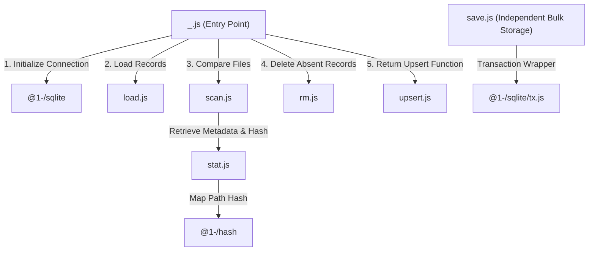
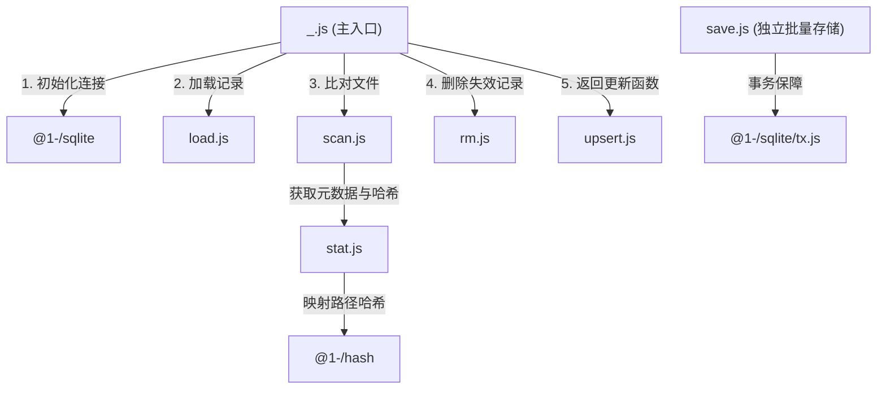

[English](#en) | [中文](#zh)

---

<a id="en"></a>
# @1-/scan : SQLite-backed incremental directory file scanner

- [@1-/scan : SQLite-backed incremental directory file scanner](#1-scan-sqlite-backed-incremental-directory-file-scanner)
  - [1. Features](#1-features)
  - [2. Usage](#2-usage)
    - [Basic Incremental Scan](#basic-incremental-scan)
    - [Bulk Storage Module](#bulk-storage-module)
  - [3. Design](#3-design)
  - [4. Tech Stack](#4-tech-stack)
  - [5. Code Structure](#5-code-structure)
  - [6. History](#6-history)
  - [About](#about)

Incrementally scans directory files, compares file sizes and modification times to detect changes, synchronizes metadata to SQLite database, and returns list of changed relative paths.

## 1. Features

- **Incremental Scan**: Compares size and modification time, filtering unchanged files to reduce disk I/O.
- **Key Length Optimization**: Stores raw bytes for paths up to 16 bytes. Converts longer paths into 16-byte MD5 hashes to optimize database index space and query performance.
- **Memory Optimization**: Uses BinMap and BinSet to store binary keys in memory, avoiding string decoding overhead and reducing memory footprint.
- **Transactional Integrity**: Performs metadata updates and deletions in database transactions to ensure consistency.
- **Auto Configuration**: Integrates @1-/sqlite to initialize database schema and manage database connections automatically, updating .gitignore when new database is detected.

## 2. Usage

### Basic Incremental Scan

```javascript
import scan from "@1-/scan";

const dir = "./data";
const db_path = "./scan_record.db";
const files = ["file1.txt", "file2.txt"];

// Scan file list, sync metadata to SQLite, return changed relative paths and upsert function
const [updated_paths, upsert] = await scan(dir, db_path, files);

// Close database automatically when exiting scope
using _ = upsert;

console.log("Updated files:", updated_paths);

// Update scanned file metadata in database
for (const rel_path of updated_paths) {
  await upsert(rel_path);
}
```

### Bulk Storage Module

```javascript
import save from "@1-/scan/save.js";
import sqlite from "@1-/sqlite";

const db = sqlite("./scan_record.db");

// Bulk update and delete metadata
save(db, [["file.txt", new Uint8Array([1, 2, 3]), 123, 1620000000]], [new Uint8Array([4, 5, 6])]);

db.close();
```

## 3. Design

Main entry orchestrates modules to scan directories and synchronize metadata.



1. **Initialize Connection**: Calls `@1-/sqlite` to open SQLite database. Updates `.gitignore` in the database directory if the database is newly created to prevent tracking.
2. **Load Records**: `load.js` checks and creates `scanMtimeLen` table. Reads stored hashes, sizes, and modification times to restore memory mappings inside `BinMap`.
3. **Compare Files**: `scan.js` iterates over input file list, calling `stat.js` for metadata and utilizing `@1-/hash` to map paths to 16-byte binary keys. Adds files with mismatched size or modification time to change list.
4. **Delete and Return**: `rm.js` deletes absent or unscanned records in transaction. Returns changed paths list and `upsert` function (provided by `upsert.js`) for persistence, supporting automatic resource disposal.

## 4. Tech Stack

- **Bun**: Runtime environment and test framework.
- **@1-/sqlite**: Database connection management and transaction wrapper.
- **@1-/hash**: Length-bounded MD5 hash utility.
- **@3-/vb**: Variable-length byte (Varint) encoder and decoder.
- **@3-/binmap / @3-/binset**: Rust and WebAssembly binary key containers.

## 5. Code Structure

```text
.
├── src
│   ├── _.js          # Core controller flow
│   ├── load.js       # Table initialization and loading
│   ├── rm.js         # Batch deletion of metadata
│   ├── save.js       # Batch storage and updates
│   ├── scan.js       # Scans and compares files
│   ├── stat.js       # Retrieves file metadata and path hash
│   └── upsert.js     # Single-record updates and auto-dispose
└── tests             # Unit tests
```

## 6. History

SQLite was created by D. Richard Hipp in 2000 while designing board software for guided-missile destroyers. The system originally depended on commercial database that required constant database administration; connection loss could stall the entire damage control application. Hipp designed serverless, zero-configuration embedded database that directly reads and writes local files, marking the birth of SQLite.

To conserve space and reduce latency, SQLite utilizes Varint (variable-length integer) encoding for metadata storage. Under this scheme, small integers consume only 1 byte, while larger numbers scale dynamically. This library inherits that design philosophy, compressing file metadata into varints for memory storage to ensure minimal footprint and high synchronization performance.

## About

This library is developed by [WebC.site](https://webc.site).

[WebC.site](https://webc.site): A new paradigm of web development for AI


---

<a id="zh"></a>
# @1-/scan : 基于 SQLite 的目录文件增量扫描器

- [@1-/scan : 基于 SQLite 的目录文件增量扫描器](#1-scan-基于-sqlite-的目录文件增量扫描器)
  - [1. 功能介绍](#1-功能介绍)
  - [2. 使用演示](#2-使用演示)
    - [基础增量扫描](#基础增量扫描)
    - [独立批量存储模块](#独立批量存储模块)
  - [3. 设计思路](#3-设计思路)
  - [4. 技术栈](#4-技术栈)
  - [5. 代码结构](#5-代码结构)
  - [6. 历史故事](#6-历史故事)
  - [关于](#关于)

增量扫描目录文件，比对文件大小与修改时间检测变更，同步元数据至 SQLite 数据库，返回已变更相对路径列表。

## 1. 功能介绍

- **增量扫描**：比对大小与修改时间，过滤未变更文件，减少磁盘读写。
- **键长优化**：路径长度不大于 16 字节时存储原始字节，超出 16 字节转换为 16 字节 MD5 值，优化索引空间与查询性能。
- **内存优化**：使用 BinMap 与 BinSet 存储二进制键，避免字符串解码，降低内存占用。
- **事务保障**：元数据变更与删除操作合并在数据库事务中执行，确保数据一致性。
- **自动配置**：集成 @1-/sqlite，自动初始化数据库表结构，并在检测到新数据库时自动更新 .gitignore。

## 2. 使用演示

### 基础增量扫描

```javascript
import scan from "@1-/scan";

const dir = "./data";
const db_path = "./scan_record.db";
const files = ["file1.txt", "file2.txt"];

// 扫描文件列表并同步至 SQLite，返回已变更的相对路径列表与更新函数
const [updated_paths, upsert] = await scan(dir, db_path, files);

// 退出作用域自动关闭数据库
using _ = upsert;

console.log("更新文件列表：", updated_paths);

// 更新已处理文件的元数据至数据库
for (const rel_path of updated_paths) {
  await upsert(rel_path);
}
```

### 独立批量存储模块

```javascript
import save from "@1-/scan/save.js";
import sqlite from "@1-/sqlite";

const db = sqlite("./scan_record.db");

// 批量更新与删除元数据
save(db, [["file.txt", new Uint8Array([1, 2, 3]), 123, 1620000000]], [new Uint8Array([4, 5, 6])]);

db.close();
```

## 3. 设计思路

主入口调度各模块，协作完成目录扫描与数据同步。



1. **初始化连接**：调用 `@1-/sqlite` 打开 SQLite 数据库。若数据库为新创建，自动更新所在目录的 `.gitignore` 阻断提交。
2. **加载记录**：`load.js` 检查并创建 `scanMtimeLen` 表。读取已记录的哈希、大小及修改时间，恢复至内存映射 `BinMap` 中。
3. **比对文件**：`scan.js` 遍历输入文件列表，调用 `stat.js` 获取元数据，并利用 `@1-/hash` 将路径映射为 16 字节二进制键。比对大小或修改时间，差异项归入变更列表。
4. **删除与返回**：`rm.js` 在事务中批量删除物理移除或不再扫描的记录。返回变更路径列表与 `upsert` 函数（`upsert.js` 提供），用以更新数据库，支持自动释放。

## 4. 技术栈

- **Bun**：JavaScript 运行时与测试框架。
- **@1-/sqlite**：SQLite 连接管理与事务封装。
- **@1-/hash**：长度限制的 MD5 哈希工具。
- **@3-/vb**：Varint 变长整型编码与解码器。
- **@3-/binmap / @3-/binset**：基于 Rust 与 WebAssembly 的高效二进制键容器。

## 5. 代码结构

```text
.
├── src
│   ├── _.js          # 核心控制流程
│   ├── load.js       # 元数据表初始化与加载
│   ├── rm.js         # 批量删除元数据
│   ├── save.js       # 批量存储元数据
│   ├── scan.js       # 扫描与比对文件
│   ├── stat.js       # 获取文件元数据及路径哈希
│   └── upsert.js     # 逐个更新与自动关闭
└── tests             # 单元测试
```

## 6. 历史故事

SQLite 的诞生源自导弹驱逐舰板载损害控制软件项目。2000 年，D. Richard Hipp 为美国海军设计该系统时，遭遇商业数据库因配置复杂、无法承受断连和崩溃之痛点。Hipp 随后设计出免服务器配置、直接读写本地文件之嵌入式数据库，即 SQLite。

为节省空间与降低读写延迟，SQLite 广泛应用了 Varint（可变字节整型）编码。在这种编码下，小整数仅占用 1 字节，只有大数值才占用更多字节。本项目在内存存储设计中对文件大小与修改时间采用同样的压缩设计，契合 SQLite 节省空间与高效之设计哲学。

## 关于

本库由 [WebC.site](https://webc.site) 开发。

[WebC.site](https://webc.site) : 面向人工智能的网站开发新范式

