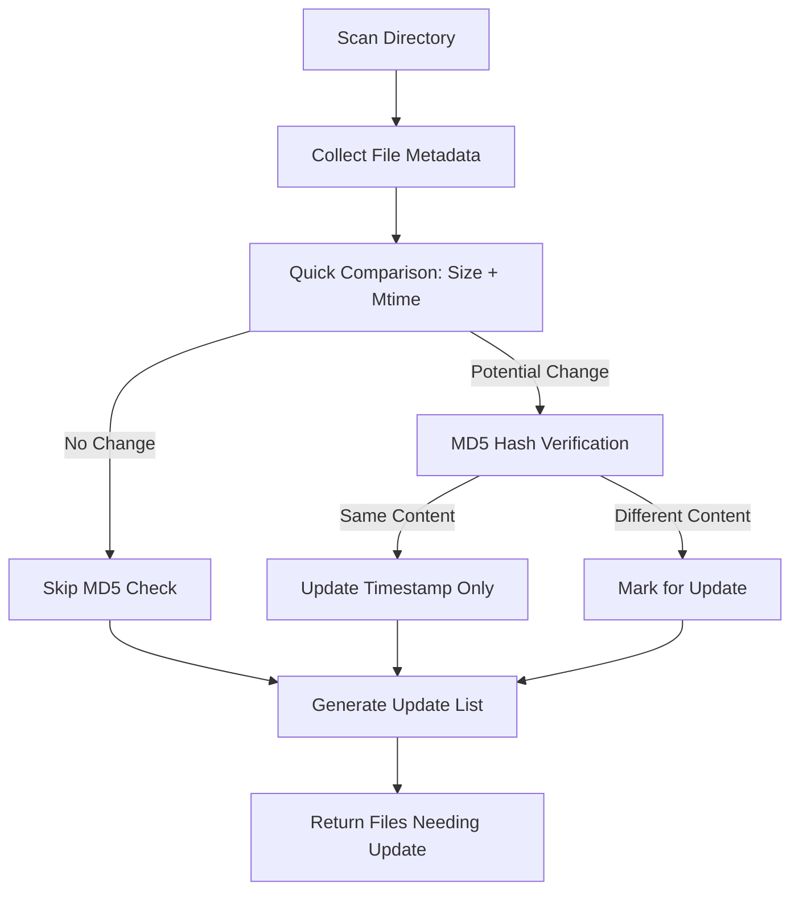
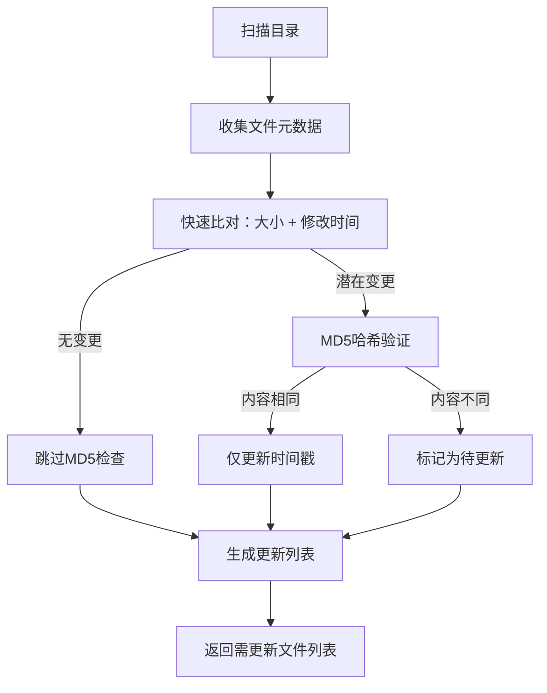

[English](#en) | [中文](#zh)

---

<a id="en"></a>
# scan : Efficient file system scanning and change detection

- [scan : Efficient file system scanning and change detection](#scan-efficient-file-system-scanning-and-change-detection)
  - [Functionality](#functionality)
  - [Usage demonstration](#usage-demonstration)
  - [Design rationale](#design-rationale)
  - [Technology stack](#technology-stack)
  - [Code structure](#code-structure)
  - [Historical context](#historical-context)
  - [About](#about)

## Functionality

This utility scans directories to detect file changes by comparing current file metadata against cached records. It tracks file size, modification time, and MD5 hashes to identify additions, modifications, and deletions efficiently.

The system uses binary data structures for memory efficiency and supports concurrent scanning with automatic parallelism adjustment based on available CPU cores.

## Usage demonstration

Install as a dependency:

```bash
npm install @1-/scan
```

Basic usage:

```javascript
import scan from "@1-/scan";

// Scan directory and get update list
const [updateFiles, upsert] = await scan("/path/to/dir", "/path/to/db_dir", [
  "file1.js",
  "file2.json",
]);

console.log("Files that need updating:", updateFiles);

// Save the updated metadata to database
await upsert();
```

## Design rationale

The architecture prioritizes efficiency through several key design decisions:

- Binary data structures (BinSet, BinMap) minimize memory overhead
- Base64url encoding for path keys enables compact storage
- Concurrent scanning with dynamic parallelism limits
- Two-phase comparison: quick metadata check followed by expensive MD5 verification only when needed
- CSV-based persistent storage for simplicity and portability



## Technology stack

- Node.js runtime with modern ES modules
- Binary data structures: `@3-/binset`, `@3-/binmap`
- Base64url encoding: `@3-/base64url`
- File hashing: `@1-/md5`
- CSV processing: `@1-/csv`
- Gitignore management: `@1-/upsert_gitignore`
- Concurrency control: `@3-/plimit`
- Integer handling: `@3-/int`
- Variable byte encoding: `@3-/vb`

## Code structure

```
src/
├── _.js          # Main entry point and exports
├── const.js      # Constants (database filenames)
├── dbInit.js     # Database initialization and loading
├── rm.js         # File removal from database
├── scan.js       # Core scanning logic
├── stat.js       # File system statistics collection
├── upsert.js     # Database persistence logic
└── test/         # Test files
```

## Historical context

File scanning utilities trace their origins to early Unix tools like `find` and `diff`. Modern implementations face new challenges with massive file systems and cloud storage. This implementation draws inspiration from incremental backup systems developed in the 1990s, which pioneered the two-phase comparison approach (quick metadata check followed by content verification) to balance speed and accuracy. The use of binary data structures reflects contemporary optimizations for memory-constrained environments and high-performance computing scenarios.

## About

This library is developed by [WebC.site](https://webc.site).

[WebC.site](https://webc.site): A new paradigm of web development for AI


---

<a id="zh"></a>
# scan : 高效的文件系统扫描与变更检测

- [scan : 高效的文件系统扫描与变更检测](#scan-高效的文件系统扫描与变更检测)
  - [功能介绍](#功能介绍)
  - [使用演示](#使用演示)
  - [设计思路](#设计思路)
  - [技术栈](#技术栈)
  - [代码结构](#代码结构)
  - [历史故事](#历史故事)
  - [关于](#关于)

## 功能介绍

本工具通过比对当前文件元数据与缓存记录，扫描目录以检测文件变更。系统跟踪文件大小、修改时间及MD5哈希值，高效识别新增、修改和删除操作。

采用二进制数据结构实现内存效率优化，并支持基于可用CPU核心数自动调整的并发扫描。

## 使用演示

安装为依赖项：

```bash
npm install @1-/scan
```

基础用法：

```javascript
import scan from "@1-/scan";

// 扫描目录并获取更新列表
const [updateFiles, upsert] = await scan("/path/to/dir", "/path/to/db_dir", [
  "file1.js",
  "file2.json",
]);

console.log("需要更新的文件:", updateFiles);

// 将更新后的元数据保存至数据库
await upsert();
```

## 设计思路

架构设计优先考虑效率，关键决策包括：

- 二进制数据结构（BinSet、BinMap）最小化内存开销
- 路径键使用base64url编码实现紧凑存储
- 并发扫描配合动态并行度限制
- 两阶段比对：快速元数据检查后仅在必要时执行耗时MD5验证
- 基于CSV的持久化存储确保简单性和可移植性



## 技术栈

- Node.js运行时，支持现代ES模块
- 二进制数据结构：`@3-/binset`、`@3-/binmap`
- Base64url编码：`@3-/base64url`
- 文件哈希：`@1-/md5`
- CSV处理：`@1-/csv`
- Gitignore管理：`@1-/upsert_gitignore`
- 并发控制：`@3-/plimit`
- 整数处理：`@3-/int`
- 可变字节编码：`@3-/vb`

## 代码结构

```
src/
├── _.js          # 主入口点及导出
├── const.js      # 常量定义（数据库文件名）
├── dbInit.js     # 数据库初始化与加载
├── rm.js         # 从数据库移除文件
├── scan.js       # 核心扫描逻辑
├── stat.js       # 文件系统统计信息收集
├── upsert.js     # 数据库持久化逻辑
└── test/         # 测试文件
```

## 历史故事

文件扫描工具源于早期Unix命令如`find`和`diff`。现代实现面临海量文件系统和云存储的新挑战。本实现借鉴了20世纪90年代开发的增量备份系统，该系统首创两阶段比对方法（先快速元数据检查，再按需内容验证），在速度与准确性间取得平衡。二进制数据结构的采用反映了当代针对内存受限环境和高性能计算场景的优化趋势。

## 关于

本库由 [WebC.site](https://webc.site) 开发。

[WebC.site](https://webc.site) : 面向人工智能的网站开发新范式

