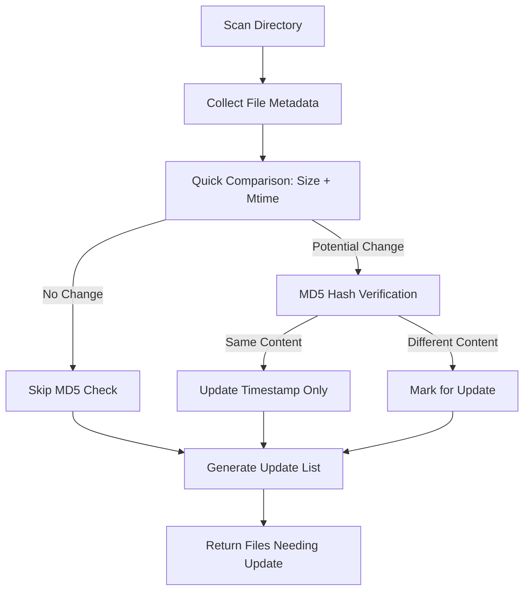

# scan : Efficient file system scanning and change detection

## Functionality

This utility scans directories to detect file changes by comparing current file metadata against cached records. It tracks file size, modification time, and MD5 hashes to identify additions, modifications, and deletions efficiently.

The system uses binary data structures for memory efficiency and supports concurrent scanning with automatic parallelism adjustment based on available CPU cores.

## Usage demonstration

Install as a dependency:

```bash
npm install @1-/scan
```

Basic usage:

```javascript
import scan from "@1-/scan";

// Scan directory and get update list
const [updateFiles, upsert] = await scan("/path/to/dir", "/path/to/db_dir", [
  "file1.js",
  "file2.json"
]);

console.log("Files that need updating:", updateFiles);

// Save the updated metadata to database
await upsert();
```

## Design rationale

The architecture prioritizes efficiency through several key design decisions:

- Binary data structures (BinSet, BinMap) minimize memory overhead
- Base64url encoding for path keys enables compact storage
- Concurrent scanning with dynamic parallelism limits
- Two-phase comparison: quick metadata check followed by expensive MD5 verification only when needed
- CSV-based persistent storage for simplicity and portability



## Technology stack

- Node.js runtime with modern ES modules
- Binary data structures: `@3-/binset`, `@3-/binmap`
- Base64url encoding: `@3-/base64url`
- File hashing: `@1-/md5`, `@1-/hash`
- CSV processing: `@1-/csv`
- Gitignore management: `@1-/upsert_gitignore`
- Concurrency control: `@3-/plimit`
- Integer handling: `@3-/int`
- Variable byte encoding: `@3-/vb`
- Byte comparison: `@3-/u8`

## Code structure

```
src/
├── _.js          # Main entry point and exports
├── const.js      # Constants (database filenames)
├── dbInit.js     # Database initialization and loading
├── rm.js         # File removal from database
├── scan.js       # Core scanning logic
├── stat.js       # File system statistics collection
├── upsert.js     # Database persistence logic
```

## Historical context

File scanning utilities trace their origins to early Unix tools like `find` and `diff`. Modern implementations face new challenges with massive file systems and cloud storage. This implementation draws inspiration from incremental backup systems developed in the 1990s, which pioneered the two-phase comparison approach (quick metadata check followed by content verification) to balance speed and accuracy. The use of binary data structures reflects contemporary optimizations for memory-constrained environments and high-performance computing scenarios.
