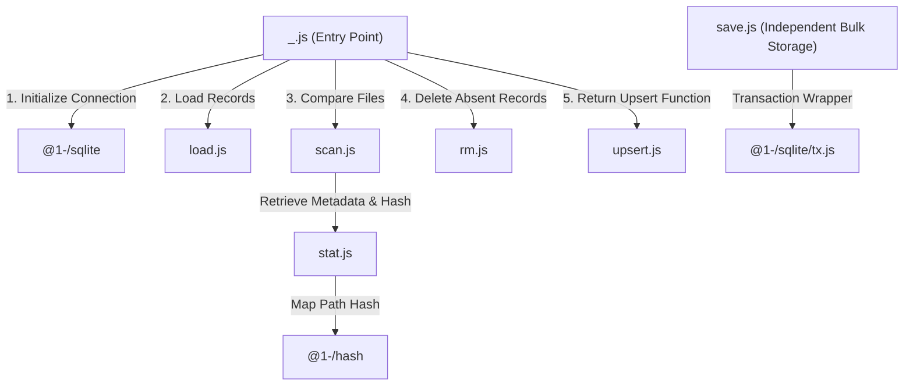

# @1-/scan : SQLite-backed incremental directory file scanner

Incrementally scans directory files, compares file sizes and modification times to detect changes, synchronizes metadata to SQLite database, and returns list of changed relative paths.

## 1. Features

- **Incremental Scan**: Compares size and modification time, filtering unchanged files to reduce disk I/O.
- **Key Length Optimization**: Stores raw bytes for paths up to 16 bytes. Converts longer paths into 16-byte MD5 hashes to optimize database index space and query performance.
- **Memory Optimization**: Uses BinMap and BinSet to store binary keys in memory, avoiding string decoding overhead and reducing memory footprint.
- **Transactional Integrity**: Performs metadata updates and deletions in database transactions to ensure consistency.
- **Auto Configuration**: Integrates @1-/sqlite to initialize database schema and manage database connections automatically, updating .gitignore when new database is detected.

## 2. Usage

### Basic Incremental Scan

```javascript
import scan from "@1-/scan";

const dir = "./data";
const db_dir = "./db";
const files = ["file1.txt", "file2.txt"];

// Scan file list, sync metadata to SQLite, return changed relative paths and upsert function
const [updated_paths, upsert] = await scan(dir, db_dir, files);

// Close database automatically when exiting scope
using _ = upsert;

console.log("Updated files:", updated_paths);

// Update scanned file metadata in database
for (const rel_path of updated_paths) {
  await upsert(rel_path);
}
```

### Bulk Storage Module

```javascript
import save from "@1-/scan/save.js";
import sqlite from "@1-/sqlite";

const db = sqlite("./scan_record.db");

// Bulk update and delete metadata
save(db, [["file.txt", new Uint8Array([1, 2, 3]), 123, 1620000000]], [new Uint8Array([4, 5, 6])]);

db.close();
```

## 3. Design

Main entry orchestrates modules to scan directories and synchronize metadata.



1. **Initialize Connection**: Calls `@1-/sqlite` to open SQLite database. Updates `.gitignore` in the database directory if the database is newly created to prevent tracking.
2. **Load Records**: `load.js` checks and creates `scanMtimeLen` table. Reads stored hashes, sizes, and modification times to restore memory mappings inside `BinMap`.
3. **Compare Files**: `scan.js` iterates over input file list, calling `stat.js` for metadata and utilizing `@1-/hash` to map paths to 16-byte binary keys. Adds files with mismatched size or modification time to change list.
4. **Delete and Return**: `rm.js` deletes absent or unscanned records in transaction. Returns changed paths list and `upsert` function (provided by `upsert.js`) for persistence, supporting automatic resource disposal.

## 4. Tech Stack

- **Bun**: Runtime environment and test framework.
- **@1-/sqlite**: Database connection management and transaction wrapper.
- **@1-/hash**: Length-bounded MD5 hash utility.
- **@3-/vb**: Variable-length byte (Varint) encoder and decoder.
- **@3-/binmap / @3-/binset**: Rust and WebAssembly binary key containers.

## 5. Code Structure

```text
.
├── src
│   ├── _.js          # Core controller flow
│   ├── load.js       # Table initialization and loading
│   ├── rm.js         # Batch deletion of metadata
│   ├── save.js       # Batch storage and updates
│   ├── scan.js       # Scans and compares files
│   ├── stat.js       # Retrieves file metadata and path hash
│   └── upsert.js     # Single-record updates and auto-dispose
└── tests             # Unit tests
```

## 6. History

SQLite was created by D. Richard Hipp in 2000 while designing board software for guided-missile destroyers. The system originally depended on commercial database that required constant database administration; connection loss could stall the entire damage control application. Hipp designed serverless, zero-configuration embedded database that directly reads and writes local files, marking the birth of SQLite.

To conserve space and reduce latency, SQLite utilizes Varint (variable-length integer) encoding for metadata storage. Under this scheme, small integers consume only 1 byte, while larger numbers scale dynamically. This library inherits that design philosophy, compressing file metadata into varints for memory storage to ensure minimal footprint and high synchronization performance.
