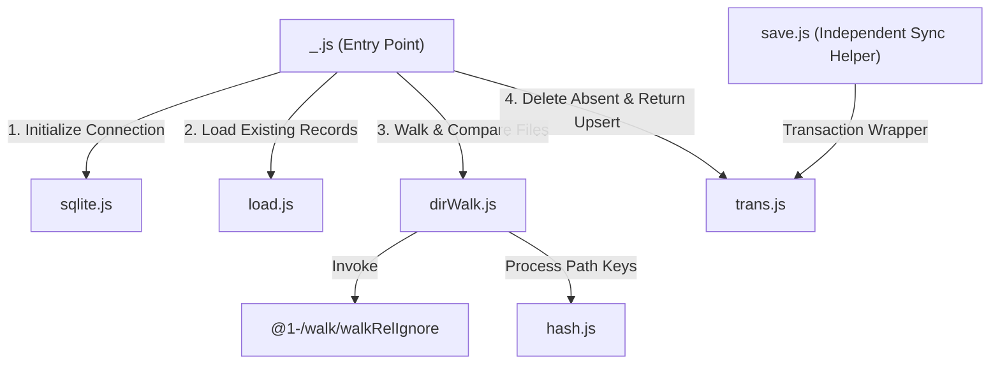

# @1-/scan : Incrementally scan directory files and track metadata in SQLite

Incrementally scans directory files, compares file sizes and modification times to detect changes, synchronizes metadata to SQLite database, and returns updated relative paths.

## Features

- **Incremental Scanning**: Detects and processes only new, modified, or deleted files, avoiding redundant file system operations.
- **Key Optimization**: Stores relative paths within 16 bytes directly as raw bytes; hashes longer paths to 16-byte MD5 digests to optimize database index space and query performance.
- **Metadata Compression**: Compresses file sizes and modification times using Varint (variable-length byte) encoding.
- **Transactional Integrity**: Packages updates and deletions in a single database transaction to guarantee consistency.
- **Flexible Filtering**: Supports custom ignore callback functions to filter specific files and directories.
- **Native Database**: Integrates Bun native `bun:sqlite` module, eliminating external database driver dependencies.

## Usage

### Basic Incremental Scan

```javascript
import scan from "@1-/scan";

const dir = "./data";
const db_path = "./scan_record.db";

// Scan directory and sync metadata to SQLite, returning modified relative paths and upsert function
const [updated_paths, upsert] = await scan(dir, db_path);

// Auto-close database when exiting scope
using _upsert = upsert;

console.log("Updated files:", updated_paths);

// Update scanned file metadata in database
for (const rel_path of updated_paths) {
  await upsert(rel_path);
}
```

### Scan with Ignore Filter

```javascript
import scan from "@1-/scan";

const dir = "./data";
const db_path = "./scan_record.db";

// Ignore temporary files and specific configurations
const ignore = (kind, rel_path) => {
  return rel_path.startsWith("temp/") || rel_path === "config.json";
};

const [updated_paths, upsert] = await scan(dir, db_path, ignore);
using _upsert = upsert;

console.log("Synced. Updated files:", updated_paths);

for (const rel_path of updated_paths) {
  await upsert(rel_path);
}
```

## Design Ideas

The main entry orchestrates independent modules to execute the incremental scanning and synchronization flow.



1. **Initialize Connection (`sqlite.js`)**: Opens SQLite database connection and configures automatic connection disposal.
2. **Load Records (`load.js`)**: Automatically creates schema if missing, retrieves existing file hashes, sizes, and modification times, and reconstructs reference set in memory.
3. **Walk & Compare (`dirWalk.js`)**: Traverses directory structure recursively. Paths are transformed into 16-byte keys via `hash.js`. File attributes are encoded using `@3-/vb` and compared against database records to identify additions and modifications.
4. **Delete & Return Upsert**: Uses `trans.js` to execute transaction-safe deletions for deleted files, and returns modified relative paths and an `upsert` function so that caller can update database records.
5. **Independent Sync Helper (`save.js`)**: Exported independent module to execute bulk inserts and deletions in a single transaction.

## Tech Stack

- **Bun**: Runtime environment and test framework.
- **Bun SQLite**: Native high-performance SQLite engine built into Bun.
- **@1-/walk**: Directory walker with ignore support.
- **@3-/vb**: Variable-length byte (Varint) encoder and decoder.
- **@3-/binmap / @3-/binset**: Memory-efficient collections designed for binary keys.

## Directory Structure

```
.
├── src
│   ├── _.js          # Entry point coordinating scanning and returning upsert helper
│   ├── dirWalk.js    # Directory traverser comparing file metadata
│   ├── hash.js       # Hashing helper mapping paths to 16-byte keys
│   ├── load.js       # Database loader initializing schema and loading records
│   ├── save.js       # Independent helper executing bulk updates and deletions
│   ├── sqlite.js     # Connection manager instantiating SQLite database
│   └── trans.js      # Transaction wrapper providing rollback mechanism
└── tests             # Test suites
```

## History

SQLite was created by D. Richard Hipp in 2000 while designing board software for US Navy guided-missile destroyers. The system originally depended on a commercial database that required constant database administration; a connection loss could stall the entire damage control application. To resolve this vulnerability, Hipp designed a serverless, zero-configuration embedded database that directly reads and writes local files—marking the birth of SQLite.

To conserve disk space and reduce I/O overhead, SQLite utilizes Varint (variable-length integer) encoding for metadata storage. Under this scheme, small integers consume only 1 byte, while larger numbers scale dynamically. This library inherits that design philosophy, compressing file metadata into varints before storing it, ensuring minimal footprint and high sync performance.
