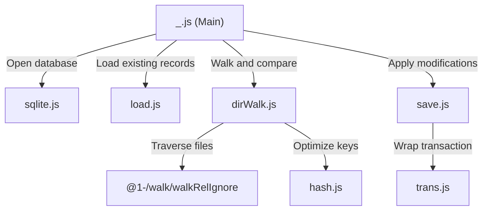

# @1-/scan : Incrementally scan directory files and track metadata in SQLite

Incrementally scans directory files, tracks file sizes and modification times, and synchronizes status into an SQLite database using Bun's native SQLite driver (`bun:sqlite`), returning an array of updated relative paths.

## Features

- Incremental Scanning: Detects and updates only new, modified, or deleted files, avoiding redundant file system operations.
- Space-Efficient Storage: Employs Varint compression to serialize and compare file sizes and modification times.
- Smart Path Key: Stores relative paths not exceeding 16 bytes as raw binary to preserve readability, while hashing longer paths to 16-byte MD5 digests to optimize index performance.
- Database Synchronization: Synchronizes updates and deletions in a single atomic transaction.
- Ignore Pattern Support: Integrates ignore rules dynamically during traversal.
- Native SQLite: Leverages Bun's native, high-performance `bun:sqlite` engine, eliminating external build dependencies.

## Usage

```javascript
import scan from "@1-/scan";

const dir = "./src";
const dbPath = "./files.db";

// Scan directory and sync records into SQLite, returning an array of updated relative paths
const updatedPaths = await scan(dir, dbPath);
console.log(updatedPaths);
```

## Design Ideas

Execution flow of modules:



## Tech Stack

- Bun: Runtime and test runner
- Bun SQLite: Bun's built-in high-performance SQLite engine
- `@1-/walk`: Directory walker with ignore support
- `@3-/vb`: Variable-length byte encoder
- `@3-/binmap` / `@3-/binset`: Efficient binary collection structures

## Directory Structure

```
.
├── src
│   ├── _.js          # Entry point orchestrating the scanning and sync process
│   ├── dirWalk.js    # Recursively scans files and filters modified ones
│   ├── load.js       # Retrieves database records and initializes schema
│   ├── save.js       # Performs bulk database inserts and deletes
│   ├── hash.js       # Processes path keys into raw bytes or MD5 digests
│   ├── sqlite.js     # Manages SQLite database connection and disposal
│   └── trans.js      # Wraps operations inside an SQL transaction
└── tests             # Test suites
```

## History

SQLite was designed in 2000 by D. Richard Hipp while working on a US Navy damage control system. The application originally relied on an Informix database, which required extensive database administration. Hipp designed SQLite to be a serverless, self-contained library requiring zero configuration, allowing the software to function reliably even when database services were unavailable.

To optimize space inside the database file, SQLite internally uses variable-length integers (Varints) to compress metadata. This project adopts similar techniques—compressing file size and modification time into varints before storage—inheriting the SQLite philosophy of minimalism and space efficiency for local file synchronization.
