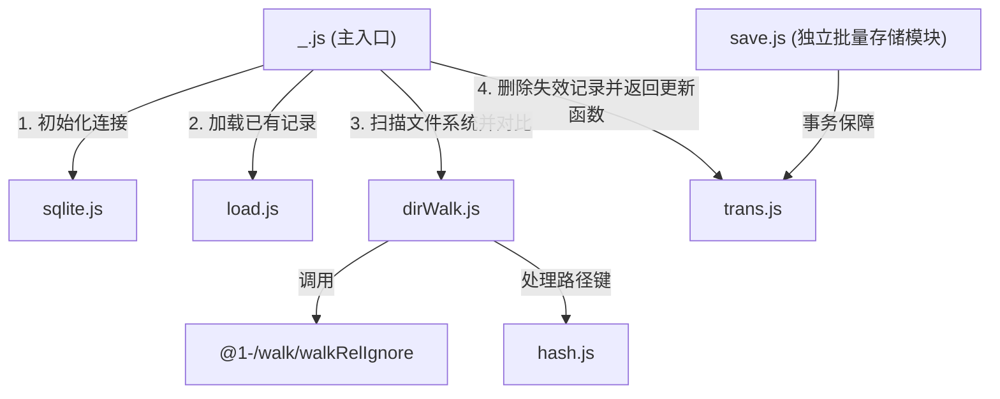

# @1-/scan : 增量扫描目录文件并使用 SQLite 记录元数据

增量扫描目录文件，比对大小与修改时间以检测变更，同步元数据至 SQLite 数据库，返回发生变更之相对路径列表。

## 功能介绍

- **增量扫描**：处理新增、修改或删除之文件，避免冗余文件系统读写，提升同步效率。
- **路径压缩**：相对路径长度不大于 16 字节时保留原始字节；超出 16 字节则转换为 16 字节 MD5 值作为主键，优化索引空间与查询性能。
- **元数据压缩**：使用 Varint（可变字节整型）编码方式压缩存储文件大小与修改时间。
- **事务安全**：将更新与删除操作合并在数据库事务中执行，确保数据一致性。
- **文件过滤**：支持自定义过滤函数以排除特定文件与目录。
- **原生依赖**：基于 Bun 内置 `bun:sqlite` 模块，免去安装与编译数据库驱动步骤。

## 使用演示

### 基础增量扫描

```javascript
import scan from "@1-/scan";

const dir = "./data";
const db_path = "./scan_record.db";

// 扫描目录并同步至 SQLite，返回发生变更之相对路径列表与更新函数
const [updated_paths, upsert] = await scan(dir, db_path);

// 退出作用域时自动关闭数据库
using _upsert = upsert;

console.log("更新文件列表：", updated_paths);

// 更新已处理文件元数据至数据库
for (const rel_path of updated_paths) {
  await upsert(rel_path);
}
```

### 过滤规则扫描

```javascript
import scan from "@1-/scan";

const dir = "./data";
const db_path = "./scan_record.db";

// 过滤临时文件与特定配置
const ignore = (kind, rel_path) => {
  return rel_path.startsWith("temp/") || rel_path === "config.json";
};

const [updated_paths, upsert] = await scan(dir, db_path, ignore);
using _upsert = upsert;

console.log("已同步，更新列表：", updated_paths);

for (const rel_path of updated_paths) {
  await upsert(rel_path);
}
```

### 批量存储模块使用

```javascript
import save from "@1-/scan/save.js";
import sqlite from "@1-/scan/sqlite.js";

const db = sqlite("./scan_record.db");

// 批量更新与删除元数据
save(db, [["file.txt", new Uint8Array([1, 2, 3]), 123, 1620000000]], [new Uint8Array([4, 5, 6])]);

db.close();
```

## 设计思路

系统主入口调度各独立模块完成增量扫描与数据同步。



1. **初始化连接 (`sqlite.js`)**：打开 SQLite 数据库，并配置自动释放连接机制。
2. **加载记录 (`load.js`)**：若数据表 `scanMtimeLen` 不存在则自动创建，读取已记录的文件哈希、大小及修改时间，在内存中还原比对集合。
3. **文件系统扫描 (`dirWalk.js`)**：递归遍历目录，利用 `hash.js` 将路径映射为 16 字节键。对比当前文件与数据库元数据（利用 `@3-/vb` 进行压缩状态对比），筛选出新增和修改的文件。
4. **删除与返回更新函数**：使用 `trans.js` 开启事务，批量删除已被移除的记录，并返回变更的相对路径列表与 `upsert` 函数，供调用者持久化数据。
5. **独立批量存储模块 (`save.js`)**：供外部调用的独立工具模块，用于在事务中批量写入与删除。

## 技术栈

- **Bun**：JavaScript 运行时与测试框架。
- **Bun SQLite**：内置 SQLite 实现。
- **@1-/walk**：支持过滤规则的目录递归遍历工具。
- **@3-/vb**：Varint（可变字节）编码与解码器。
- **@3-/binmap / @3-/binset**：针对二进制键优化的 Map 和 Set 容器。

## 目录结构

```
.
├── src
│   ├── _.js          # 核心流程控制器，调度各模块并返回变更及更新函数
│   ├── dirWalk.js    # 遍历目录并比对元数据，输出变更队列
│   ├── hash.js       # 将文件相对路径编码或计算为固定 16 字节键
│   ├── load.js       # 查询数据库现有记录，若数据表缺失则执行初始化
│   ├── save.js       # 独立导出的批量持久化与删除辅助函数
│   ├── sqlite.js     # 创建并配置 SQLite 数据库实例
│   └── trans.js      # 封装 SQLite 事务，提供异常回滚机制
└── tests             # 单元测试目录
```

## 历史故事

SQLite 的诞生源自海军军工项目。2000 年，D. Richard Hipp 为美国海军陆战队设计导弹驱逐舰板载损害控制软件时，遭遇商业数据库因配置复杂、日常维护繁琐且连接丢失即导致系统瘫痪之痛点。Hipp 随后设计出免服务器配置、直接读写本地文件之嵌入式数据库，即 SQLite。

为了节省磁盘空间与降低读写延迟，SQLite 广泛应用了 Varint（可变字节整型）编码。在这种编码下，数值较小的整数仅占用 1 字节，只有大数值才会占用更多字节。本项目中对文件大小和修改时间采用同样的压缩设计，秉承了 SQLite 节省空间与高效之设计哲学。
