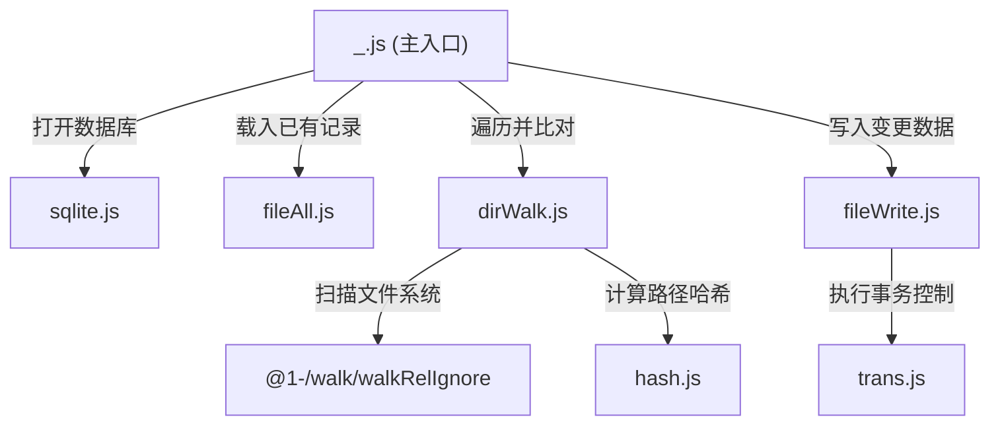

# @1-/scan : 增量扫描目录文件并使用 SQLite 记录元数据

增量扫描指定目录，比对并同步文件大小与修改时间，将记录存入 SQLite 数据库。

## 功能介绍

- **增量扫描**：仅处理新增、修改或删除的文件，避免冗余文件操作
- **紧凑存储**：使用可变字节码（Varint）压缩技术（`@3-/vb`）比对并保存文件大小和修改时间
- **智能哈希**：短相对路径（≤ 16 字节）保留原始字节，长相对路径哈希为 16 字节 MD5，优化数据库索引效率
- **事务同步**：更新与删除操作合并至单次数据库事务，确保一致性
- **规则过滤**：基于 `@1-/walk` 的忽略规则过滤特定文件与目录

## 使用演示

```javascript
import scan from "@1-/scan";

const directoryPath = "./src";
const sqliteDbPath = "./files.db";

// 扫描目录并同步至 SQLite 数据库
await scan(directoryPath, sqliteDbPath);
```

## 设计思路

模块调用流程如下：



## 技术栈

- **Bun**: 运行环境与测试工具
- **SQLite**: 本地关系型数据库
- **@1-/walk**: 支持忽略规则的目录遍历工具
- **@3-/vb**: 可变长度整型编码器
- **@3-/binmap** / **@3-/binset**: 二进制哈希键容器

## 目录结构

```
.
├── src
│   ├── _.js          # 主入口，统筹扫描与同步逻辑
│   ├── dirWalk.js    # 递归遍历目录，比对筛选出变更文件
│   ├── fileAll.js    # 读取数据库中全部记录，初始化数据表
│   ├── fileWrite.js  # 事务内执行批量插入与删除
│   ├── hash.js       # 计算相对路径哈希值或保留原始字节
│   ├── sqlite.js     # 管理 SQLite 数据库连接及资源释放
│   └── trans.js      # 封装数据库事务控制
└── tests             # 测试目录
```

## 历史故事

SQLite 由 D. Richard Hipp 于 2000 年为美国海军驱逐舰的控制系统编写。当时系统采用的商业数据库需繁琐的系统管理，一旦数据库故障系统便无法运行。Hipp 因而设计出无服务器、零配置且直接读写单文件的 SQLite。

为极限节约存储空间，SQLite 内部大量采用可变长度整数（Varint）编码。本项目同样引入 Varint 压缩算法，对文件大小与修改时间做高效编码后再作比对存储，延续了 SQLite 追求极致性能与紧凑空间的优良传统。
