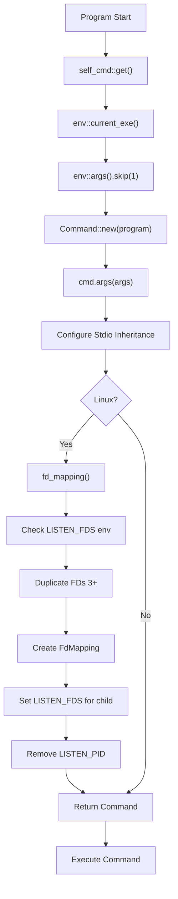

# self_cmd: Self-Executing Command Builder

- [Overview](#overview)
- [Features](#features)
- [Usage](#usage)
- [Design Philosophy](#design-philosophy)
- [Technical Stack](#technical-stack)
- [Project Structure](#project-structure)
- [API Reference](#api-reference)
- [Error Handling](#error-handling)

## Overview

`self_cmd` is a Rust library that creates Command instances for re-executing the current program with identical arguments and stdio inheritance. On Linux, it provides additional support for systemd socket activation by preserving file descriptor mappings through the `LISTEN_FDS` protocol.

## Features

- **Self-Replication**: Generate Command objects that execute the current program
- **Argument Preservation**: Automatically captures and forwards command-line arguments
- **Stdio Inheritance**: Maintains stdin, stdout, and stderr connections
- **Socket Activation Support**: Linux-specific file descriptor mapping for systemd integration
- **Robust Error Handling**: Custom error types with proper error propagation
- **Logging Integration**: Built-in logging support for debugging and monitoring

## Usage

Add to your `Cargo.toml`:

```toml
[dependencies]
self_cmd = "0.1.7"
```

```rust
use self_cmd;

fn main() -> self_cmd::Result<()> {
    // Create and execute a command that re-runs this program
    // Automatically handles stdio inheritance and Linux FD mappings for systemd socket activation
    let mut cmd = self_cmd::get()?;
    let status = cmd.status()?;
    println!("Child process exited with: {status}");

    Ok(())
}
```

On Linux systems, the library automatically handles systemd socket activation by checking `LISTEN_FDS`, duplicating file descriptors starting from FD 3, and configuring the child process environment. This makes it seamless for services that need to restart while maintaining their listening sockets.

## Design Philosophy

The library follows a minimalist approach with a single public function that encapsulates the complexity of self-execution:



The design ensures:

- **Simplicity**: Single function interface
- **Reliability**: Proper error handling without panics
- **Flexibility**: Returns Command for further customization
- **Performance**: Minimal overhead with lazy evaluation

## Technical Stack

- **Language**: Rust 2024 Edition
- **Core Dependencies**:
  - `log` for logging functionality
  - `thiserror` for structured error handling
- **Linux Dependencies**:
  - `command-fds` for file descriptor mapping
  - `libc` for low-level system calls
- **Error Handling**: Custom `Error` type with `thiserror` integration
- **Process Management**: `std::process::Command` with FD mapping extensions
- **Environment Access**: `std::env` for executable path and arguments

## Project Structure

```
self_cmd/
├── src/
│   ├── lib.rs          # Core implementation and public API
│   ├── error.rs        # Error types and handling
│   └── fd_mapping.rs   # Linux-specific FD mapping (conditional)
├── tests/
│   └── main.rs         # Integration tests
├── readme/
│   ├── en.md          # English documentation
│   └── zh.md          # Chinese documentation
├── Cargo.toml         # Project configuration
└── test.sh           # Test runner script
```

## API Reference

### `get() -> Result<Command>`

Creates a Command instance configured to re-execute the current program with full context preservation.

**Returns:**

- `Ok(Command)`: Configured command ready for execution
- `Err(Error)`: If unable to determine executable path or configure FD mappings

**Behavior:**

- Captures current executable path via `env::current_exe()`
- Preserves all command-line arguments except program name
- Configures stdio inheritance (stdin, stdout, stderr)
- **Linux only**: Handles systemd socket activation FD mapping
- Returns Command for further customization before execution

**Example:**

```rust
match self_cmd::get() {
    Ok(mut cmd) => {
        // Command is ready to use with full context preservation
        cmd.status()?;
    }
    Err(e) => {
        eprintln!("Failed to create self command: {e}");
    }
}
```

### `fd_mapping() -> Result<Vec<FdMapping>>` (Linux only)

**Available on Linux only** - Creates file descriptor mappings for systemd socket activation.

**Returns:**

- `Ok(Vec<FdMapping>)`: List of FD mappings for socket activation
- `Err(Error)`: If FD duplication or validation fails

This function is automatically called by `get()` on Linux systems and typically doesn't need to be used directly.

## Error Handling

The library uses a custom `Error` type built with `thiserror` for comprehensive error handling:

```rust
use self_cmd::{Error, Result};

#[derive(Error, Debug)]
pub enum Error {
    #[error("IO error: {0}")]
    Io(#[from] std::io::Error),

    #[error("FD mapping collision: {0}")]
    FdMappingCollision(#[from] command_fds::FdMappingCollision),
}
```

All public functions return `Result<T>` which is an alias for `std::result::Result<T, Error>`. This provides:

- **Structured Errors**: Clear error types for different failure modes
- **Error Chaining**: Automatic conversion from underlying error types
- **Debugging Support**: Rich error messages with context
- **Integration**: Seamless integration with `?` operator and error handling patterns
