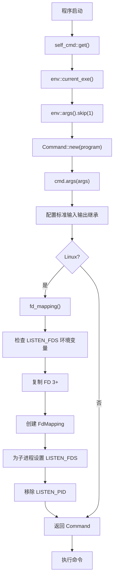

# self_cmd: 自执行命令构建器

- [概述](#概述)
- [功能特性](#功能特性)
- [使用方法](#使用方法)
- [设计理念](#设计理念)
- [技术栈](#技术栈)
- [项目结构](#项目结构)
- [API 参考](#api-参考)
- [错误处理](#错误处理)

## 概述

`self_cmd` 是 Rust 库，用于创建重新执行当前程序的 Command 实例，保持相同参数和标准输入输出继承。在 Linux 系统上，通过 `LISTEN_FDS` 协议保持文件描述符映射，提供对 systemd 套接字激活的额外支持。

## 功能特性

- **自我复制**: 生成执行当前程序的 Command 对象
- **参数保持**: 自动捕获并转发命令行参数
- **标准输入输出继承**: 维持 stdin、stdout、stderr 连接
- **套接字激活支持**: Linux 特定的文件描述符映射，用于 systemd 集成
- **健壮的错误处理**: 自定义错误类型与正确的错误传播
- **日志集成**: 内置日志支持，用于调试和监控

## 使用方法

添加到 `Cargo.toml`:

```toml
[dependencies]
self_cmd = "0.1.7"
```

```rust
use self_cmd;

fn main() -> self_cmd::Result<()> {
    // 创建并执行重新运行此程序的命令
    // 自动处理标准输入输出继承和 Linux systemd 套接字激活的 FD 映射
    let mut cmd = self_cmd::get()?;
    let status = cmd.status()?;
    println!("子进程退出状态: {status}");

    Ok(())
}
```

在 Linux 系统上，库自动处理 systemd 套接字激活，通过检查 `LISTEN_FDS`、从 FD 3 开始复制文件描述符并配置子进程环境。使需要重启但保持监听套接字的服务变得无缝。

## 设计理念

库采用极简主义方法，通过单个公共函数封装自执行的复杂性:



设计确保:

- **简洁性**: 单函数接口
- **可靠性**: 无恐慌的错误处理
- **灵活性**: 返回 Command 供进一步定制
- **性能**: 惰性求值的最小开销

## 技术栈

- **语言**: Rust 2024 版本
- **核心依赖**:
  - `log` 用于日志功能
  - `thiserror` 用于结构化错误处理
- **Linux 依赖**:
  - `command-fds` 用于文件描述符映射
  - `libc` 用于底层系统调用
- **错误处理**: 自定义 `Error` 类型与 `thiserror` 集成
- **进程管理**: `std::process::Command` 与 FD 映射扩展
- **环境访问**: `std::env` 获取可执行文件路径和参数

## 项目结构

```
self_cmd/
├── src/
│   ├── lib.rs          # 核心实现和公共 API
│   ├── error.rs        # 错误类型和处理
│   └── fd_mapping.rs   # Linux 特定的 FD 映射（条件编译）
├── tests/
│   └── main.rs         # 集成测试
├── readme/
│   ├── en.md          # 英文文档
│   └── zh.md          # 中文文档
├── Cargo.toml         # 项目配置
└── test.sh           # 测试运行脚本
```

## API 参考

### `get() -> Result<Command>`

创建配置为重新执行当前程序的 Command 实例，完整保持上下文。

**返回值:**

- `Ok(Command)`: 配置好的命令，可直接执行
- `Err(Error)`: 无法确定可执行文件路径或配置 FD 映射时

**行为:**

- 通过 `env::current_exe()` 捕获当前可执行文件路径
- 保留除程序名外的所有命令行参数
- 配置标准输入输出继承 (stdin, stdout, stderr)
- **仅 Linux**: 处理 systemd 套接字激活 FD 映射
- 返回 Command 供执行前进一步定制

**示例:**

```rust
match self_cmd::get() {
    Ok(mut cmd) => {
        // 命令已准备就绪，完整保持上下文
        cmd.status()?;
    }
    Err(e) => {
        eprintln!("创建自执行命令失败: {e}");
    }
}
```

### `fd_mapping() -> Result<Vec<FdMapping>>` (仅 Linux)

**仅在 Linux 上可用** - 为 systemd 套接字激活创建文件描述符映射。

**返回值:**

- `Ok(Vec<FdMapping>)`: 套接字激活的 FD 映射列表
- `Err(Error)`: FD 复制或验证失败时

此函数在 Linux 系统上由 `get()` 自动调用，通常不需要直接使用。

## 错误处理

库使用基于 `thiserror` 构建的自定义 `Error` 类型进行全面的错误处理:

```rust
use self_cmd::{Error, Result};

#[derive(Error, Debug)]
pub enum Error {
    #[error("IO error: {0} / IO 错误: {0}")]
    Io(#[from] std::io::Error),

    #[error("FD mapping collision: {0} / FD 映射冲突: {0}")]
    FdMappingCollision(#[from] command_fds::FdMappingCollision),
}
```

所有公共函数返回 `Result<T>`，这是 `std::result::Result<T, Error>` 的别名。这提供了:

- **结构化错误**: 不同失败模式的清晰错误类型
- **错误链**: 从底层错误类型的自动转换
- **调试支持**: 带有上下文的丰富错误消息
- **集成**: 与 `?` 操作符和错误处理模式的无缝集成
