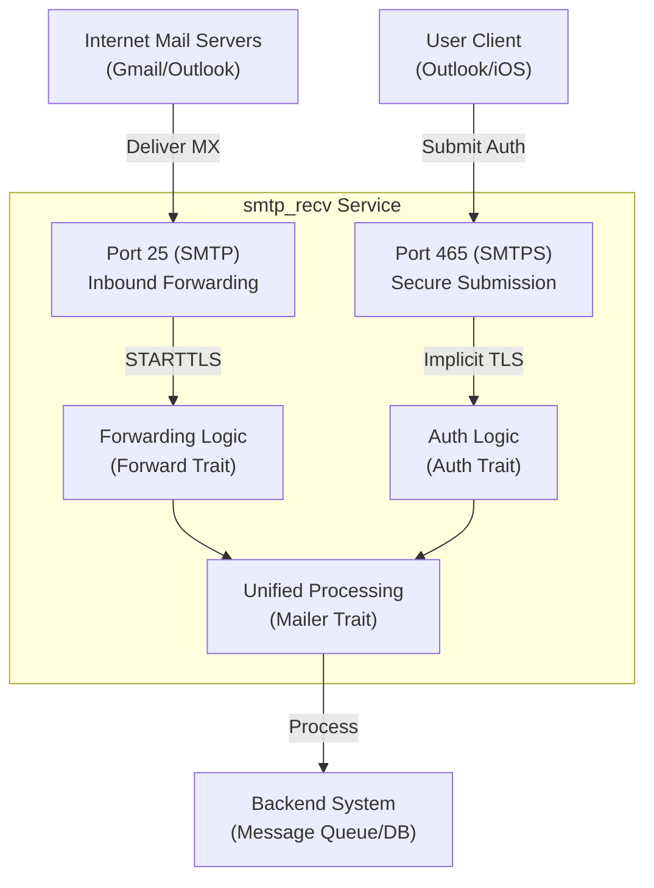

# smtp_recv: Dual-Port Secure SMTP Server

**smtp_recv** is a secure-by-default, high-performance SMTP server implementation in Rust, featuring a **Dual-Port Strategy** that simultaneously handles **Inbound Email Forwarding** and **Authenticated Outbound Submission**.

Designed for modern email architectures, it enforces strict security standards, leverages `tokio` for asynchronous I/O, and integrates seamlessly with your existing infrastructure via simple Traits.

## Table of Contents

- [Core Architecture](#core-architecture)
- [Features](#features)
- [Installation & Integration](#installation--integration)
- [How It Works](#how-it-works)
- [Tech Stack](#tech-stack)
- [Directory Structure](#directory-structure)
- [API Reference](#api-reference)
- [Historical Context](#historical-context)

## Core Architecture

**smtp_recv** employs a unique dual-port approach to handle distinct email flows securely and efficiently:

### 1. Port 25: Inbound Forwarding (MX)

- **Role**: Acts as a public MX server receiving email from the internet.
- **Security**: Supports `STARTTLS` for opportunistic encryption. If the client provides a valid SNI matching your certificate, the connection upgrades to TLS. In plaintext mode, it defaults to `localhost`.
- **Workflow**:
  1.  Accept TCP connection.
  2.  Perform STARTTLS upgrade if requested/possible.
  3.  Validate recipient addresses via the `Forward` trait (e.g., check user existence, query routing rules).
  4.  If valid, receive the email and hand it off to the `Mailer` trait (e.g., for storage or relay). If invalid, reject with `550 No such user`.
- **Use Case**: Receiving `contact@yourdomain.com` and forwarding it to your backend or personal inbox.

### 2. Port 465: Outbound Submission

- **Role**: Serves as a secure gateway for authenticated user clients (Outlook, Thunderbird, Apple Mail).
- **Security**: **Enforces Implicit TLS (SMTPS)**. The TLS handshake begins immediately upon connection setup. Any non-encrypted traffic is instantly rejected, strictly preventing downgrade attacks.
- **Workflow**:
  1.  Accept TCP connection.
  2.  **Immediately** complete TLS handshake (SNI required).
  3.  Enforce SMTP Authentication (AUTH PLAIN/LOGIN) via the `Auth` trait.
  4.  Receive the email and queue it for delivery via the `Mailer` trait.
- **Use Case**: allowing your users to send email through your infrastructure securely.

### Architecture Diagram



## Features

- **Dual-Mode Concurrency**: Runs Inbound (Port 25) and Outbound (Port 465) services simultaneously.
- **Security First**:
  - **Implicit TLS**: Port 465 enforces encryption from byte zero.
  - **SNI Support**: Automatically serves the correct certificate based on the client's requested hostname.
  - **Strict State Machine**: Enforces correct SMTP command sequences (`MAIL` -> `RCPT` -> `DATA`).
- **High Performance**:
  - **Async I/O**: Built on the robust `tokio` runtime.
  - **SMTP Pipelining**: Fully supports RFC 2920, allowing clients to batch commands and reduce latency.
- **Extensible Design**:
  - **Trait-Based**: Plug in your own Authentication, Forwarding, and Mail handling logic.
  - **Error Handling**: Comprehensive error types and friendly SMTP response codes.

## Installation & Integration

Add `smtp_recv` to your `Cargo.toml`. You will typically implement the required traits to bridge the server with your application's logic.

### 1. Implement Traits

You need to provide implementations for three key components:

1.  **`Auth`** (Port 465): Verifies username/password.
2.  **`Forward`** (Port 25): Validates recipients and determines forwarding targets.
3.  **`Mailer`**: The final destination for all valid emails (e.g., save to disk, push to Redis).
4.  **`CertByHost`**: Provides SSL certificates based on SNI.

### 2. Run the Server

See `tests/main.rs` for a complete runnable example. Here is a simplified version:

```rust
use smtp_recv::run;
use tokio_util::sync::CancellationToken;

#[tokio::main]
async fn main() -> anyhow::Result<()> {
  let cancel = CancellationToken::new();

  // The 'run' function automatically binds to both ports 25 and 465
  // and starts handling traffic.
  run(
    my_forward_impl, // impl mail_forward::Forward
    my_auth_impl,    // impl auth_trait::Auth
    my_mailer_impl,  // impl smtp_recv::Mailer
    my_cert_impl,    // impl ssl_trait::CertByHost
    cancel
  ).await?;

  Ok(())
}
```

## How It Works

The system is designed around a unified `Session` model. Whether a connection comes from Port 25 or 465, it is eventually handled by a shared command processing loop (`session::run_loop`), ensuring consistent behavior.

1.  **Connection**: The server accepts a TCP connection.
2.  **Handshake**:
    - **Port 465**: Performs immediate TLS handshake.
    - **Port 25**: Starts in plaintext, advertises `STARTTLS` in the EHLO response.
3.  **Command Loop**: The server reads SMTP commands. RFC 2920 Pipelining is supported, allowing the parser to handle batched commands efficiently.
4.  **Validation**:
    - `MAIL FROM`: Validates the sender. on Port 465, ensures the user is authenticated.
    - `RCPT TO`: On Port 25, calls `forward.forward_set()` to validate and rewrite recipients.
5.  **Data**: Upon receiving the `DATA` command and content, the full email object is constructed and passed to `mailer.send()`.

## Tech Stack

- **Runtime**: `tokio` (Async I/O)
- **TLS**: `rustls`, `tokio-rustls` (Modern, secure TLS implementation)
- **Protocol**: Custom SMTP parser with Pipelining support
- **Error Handling**: `anyhow`, `thiserror`

## Directory Structure

```
src/
├── lib.rs       # Library entry point, exports run/bind
├── bind.rs      # Generic socket binding logic
├── accept/      # Connection acceptance and TLS handling
│   ├── mod.rs
│   ├── forward.rs # Port 25 specific logic
│   └── send.rs    # Port 465 specific logic
├── error.rs     # Error type definitions
├── mailer.rs    # Mailer trait definition
├── session.rs   # Core SMTP session state machine
├── forward/     # Forwarding session specific logic
└── send/        # Sending session specific logic
```

## API Reference

### `smtp_recv::run`

```rust
pub async fn run(
  forward: impl mail_forward::Forward,
  auth: impl auth_trait::Auth,
  mailer: impl Mailer,
  ssl: impl CertByHost,
  cancel_token: CancellationToken,
) -> Result<()>
```

Starts the server. This functions returns a Future that resolves only when the server is shut down via the `cancel_token`.

### `smtp_recv::Mailer`

```rust
pub trait Mailer: Clone + Send + Sync + 'static {
    fn send(&self, mail: UserMail) -> impl Future<Output = Result<()>> + Send;
}
```

Implementation logic for processing received emails.

## Historical Context

**The Tale of Port 465**

In the late 1990s, as email security became a concern, **Port 465** was originally designated for "SMTPS" - SMTP over SSL. The idea was simple: encrypted from the very first byte. However, IANA and IETF standards bodies favored a different approach called `STARTTLS` (which reuses Port 25 or 587 and upgrades the connection later), leading to Port 465 being formally "deprecated" for a time.

Despite this, the real world often disagrees with standards committees. `STARTTLS` proved vulnerable to "stripping attacks" where a malicious intermediary could remove the encryption capability from the handshake, forcing a fallback to plaintext.

Because of this specific vulnerability, major providers like Gmail and Outlook continued to support Port 465. Its "implicit TLS" model offers no opportunity for downgrade attacks—if you can't speak TLS, you can't talk at all. Today, Port 465 has seen a massive resurgence and is now the recommended best practice for secure email submission ("JMAP" and modern RFCs have since acknowledged its validity), proving that sometimes, the simple, secure-by-default option wins in the long run.

```

```
