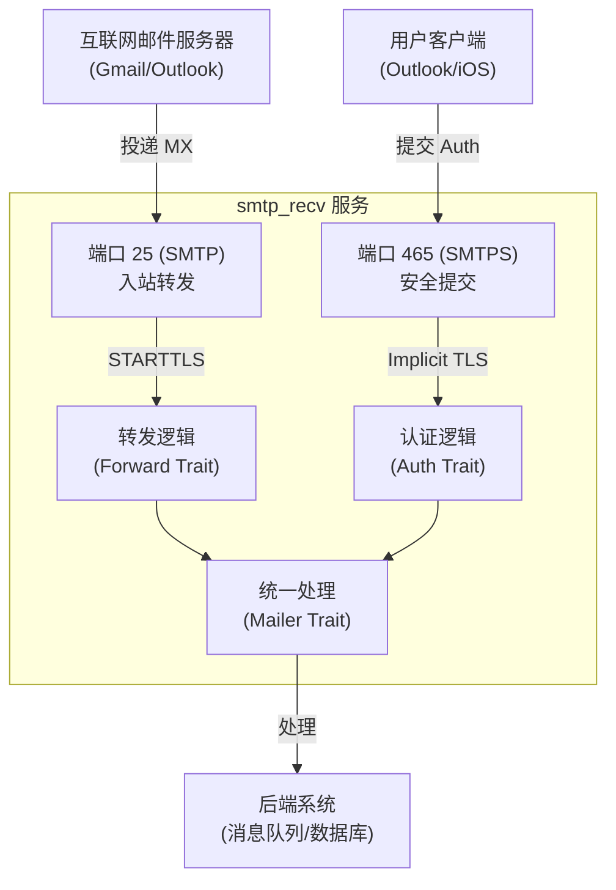

# smtp_recv: 双端口安全 SMTP 服务器

**smtp_recv** 是一个基于 Rust 实现的安全优先、高性能 SMTP 服务器，采用**双端口策略**，同时支持**端口 25 的入站邮件转发**和**端口 465 的出站邮件安全提交**。

即使是在高并发环境下，也能保持极低的资源占用。通过强制的安全默认设置（如 Implicit TLS 和 SNI），它为现代邮件架构提供了坚实的基础设施。

## 目录

- [核心架构](#核心架构)
- [功能特性](#功能特性)
- [安装与集成](#安装与集成)
- [工作原理](#工作原理)
- [技术堆栈](#技术堆栈)
- [目录结构](#目录结构)
- [API 参考](#api-参考)
- [历史背景](#历史背景)

## 核心架构

**smtp_recv** 将不同的邮件流量隔离在两个专用的端口上，各自执行不同的安全和业务逻辑：

### 1. 25 端口: 入站转发 (MX)

- **角色**: 作为对外的 MX 服务器，接收处理来自互联网的邮件投递。
- **安全**: 支持 `STARTTLS` 扩展。如果客户端握手时的 SNI 与服务器证书匹配，连接将自动升级为加密通道；否则（如纯文本连接）默认使用 `localhost` 作为主机名，兼容旧式服务器。
- **流程**:
  1.  建立 TCP 连接。
  2.  协商 STARTTLS（如支持）。
  3.  在 `RCPT TO` 阶段调用 `Forward` trait 验证收件人（查询用户是否存在、路由规则）。
  4.  验证通过后，接收完整邮件并通过 `Mailer` trait 将其交付（例如转发到后端服务或存储）。若用户不存在，直接返回 `550 No such user`。
- **场景**: 接收发往 `user@yourdomain.com` 的邮件，并将其转发到 Gmail 或内部处理系统。

### 2. 465 端口: 出站提交 (Submission)

- **角色**: 专为 authenticated user（受信任的客户端，如 Outlook、Thunderbird、手机邮件App）设计的安全网关。
- **安全**: **强制隐式 TLS (Implicit TLS)**。连接建立的瞬间即开始 TLS 握手。任何非加密数据包都会被立即拒绝，从根本上杜绝了中间人降级攻击（Downgrade Attack）。
- **流程**:
  1.  建立 TCP 连接。
  2.  **立即**完成 TLS 握手（必须提供 SNI）。
  3.  强制 SMTP 认证 (AUTH PLAIN/LOGIN)，通过 `Auth` trait 验证凭据。
  4.  接收邮件并放入发送队列（通过 `Mailer` trait）。
- **场景**: 为您的用户提供安全可靠的邮件发送服务。

### 架构示意图



## 功能特性

- **双模并发**: 单个进程同时处理端口 25 的转发业务和端口 465 的提交业务，资源复用率高。
- **安全核心**:
  - **Implicit TLS**: 465 端口拒绝任何明文通信，安全不留死角。
  - **SNI 支持**: 动态加载证书，支持多域名托管。
  - **状态机严谨**: 严格遵循 SMTP 协议状态流转 (`MAIL` -> `RCPT` -> `DATA`)，有效防御协议层面的攻击。
- **高性能**:
  - **异步 I/O**: 基于 `tokio` 运行时，轻松应对高并发连接。
  - **Pipeline**: 完整支持 RFC 2920 流水线扩展，大幅降低高延迟网络下的传输时间。
- **从设计上解耦**:
  - **Trait 驱动**: 业务逻辑（认证、转发、存储）与协议实现完全分离，通过 trait 注入。
  - **错误友好**: 提供详细且符合规范的 SMTP 响应码。

## 安装与集成

在 `Cargo.toml` 中添加依赖后，您只需实现几个核心 traits 即可启动服务器。

### 1. 实现 Traits

您需要定义三个核心组件的行为：

1.  **`Auth`** (465 端口): 负责验证用户名和密码。
2.  **`Forward`** (25 端口): 负责验证收件人是否有效，并返回实际的转发目标地址。
3.  **`Mailer`**: 整个系统的终点。无论是转发进来的邮件，还是用户发出的邮件，最终都汇聚于此进行处理（如写入 Redis 队列、存储到 S3 等）。
4.  **`CertByHost`**: 根据 SNI 提供证书。

### 2. 启动服务

完整代码请参考 `tests/main.rs`。最简启动示例如下：

```rust
use smtp_recv::run;
use tokio_util::sync::CancellationToken;

#[tokio::main]
async fn main() -> anyhow::Result<()> {
  let cancel = CancellationToken::new();

  // run 函数会自动同时监听 25 和 465 端口
  // 并开始处理请求
  run(
    my_forward_impl, // impl mail_forward::Forward
    my_auth_impl,    // impl auth_trait::Auth
    my_mailer_impl,  // impl smtp_recv::Mailer
    my_cert_impl,    // impl ssl_trait::CertByHost
    cancel
  ).await?;

  Ok(())
}
```

## 工作原理

项目内部采用了统一的 `Session` 抽象。无论连接来自端口 25 还是 465，最终都由一个共享的命令处理循环 (`session::run_loop`) 驱动，确保了一致的行为和稳定性。

1.  **连接**: 接受 TCP 连接。
2.  **握手**:
    - **465**: 立即执行 TLS 握手。
    - **25**: 以明文开始，在 EHLO 响应中通告 `STARTTLS`。
3.  **命令循环**: 服务器读取 SMTP 命令。得益于对 RFC 2920 的支持，解析器可以高效处理客户端批量发送的命令。
4.  **业务验证**:
    - `MAIL FROM`: 验证发件人。465 端口在此处检查是否已认证。
    - `RCPT TO`: 25 端口在此处调用 `forward.forward_set()`，对收件人进行清洗和重写。
5.  **数据接收**: 收到 `DATA` 指令及内容后，构建完整的邮件对象，交给 `mailer.send()` 处理。

## 技术堆栈

- **运行时**: `tokio` (全异步非阻塞)
- **TLS**: `rustls`, `tokio-rustls` (内存安全、高性能的现代 TLS 实现)
- **协议**: 自研 SMTP 解析器，深度优化的 Pipeline 支持
- **错误处理**: `anyhow`, `thiserror`

## 目录结构

```
src/
├── lib.rs       # 库入口，导出 run/bind
├── bind.rs      # 通用的 TCP 绑定与监听逻辑
├── accept/      # 连接接收器
│   ├── mod.rs
│   ├── forward.rs # 25 端口专用逻辑
│   └── send.rs    # 465 端口专用逻辑
├── error.rs     # 错误类型定义
├── mailer.rs    # Mailer trait 定义
├── session.rs   # 核心 SMTP 会话状态机
├── forward/     # 转发模式会话实现
└── send/        # 发送模式会话实现
```

## API 参考

### `smtp_recv::run`

```rust
pub async fn run(
  forward: impl mail_forward::Forward,
  auth: impl auth_trait::Auth,
  mailer: impl Mailer,
  ssl: impl CertByHost,
  cancel_token: CancellationToken,
) -> Result<()>
```

启动服务器。该函数返回一个 Future，仅在通过 `cancel_token` 触发停机时才会结束。

### `smtp_recv::Mailer`

```rust
pub trait Mailer: Clone + Send + Sync + 'static {
    fn send(&self, mail: UserMail) -> impl Future<Output = Result<()>> + Send;
}
```

实现邮件落地的具体业务逻辑。

## 历史背景

**465 端口的前世今生**

上世纪 90 年代末，随着电子邮件安全日益受到重视，**465 端口**最初被分配给 "SMTPS" —— 即基于 SSL 的 SMTP。其理念非常简单直接：从连接建立的第一个字节开始就进行加密。然而，IANA 和 IETF 标准组织后来倾向于使用 `STARTTLS` 机制（复用 25 或 587 端口，通过命令升级连接），这导致 465 端口一度被正式标记为"已废弃"。

尽管标准如此，真实世界的需求却给出了不同的答案。`STARTTLS` 被证明存在"剥离攻击"（Stripping Attack）的风险：恶意的中间人可以拦截并移除 STARTTLS 通告，迫使客户端回退到明文传输，而用户往往毫无察觉。

正因为这种无法根除的中间人风险，Gmail、Outlook 等主流服务商始终坚持支持 465 端口。它的 "Implicit TLS" 模式不给降级攻击留任何机会——如果不加密，就无法通信。时至今日，465 端口经历了重大的复兴，已重新成为安全提交邮件的推荐实践（JMAP 等现代标准已承认其地位），这证明了有时"默认安全"的简单设计才是经得起时间考验的真理。
