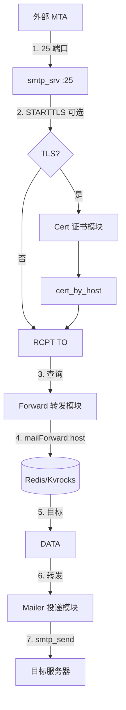
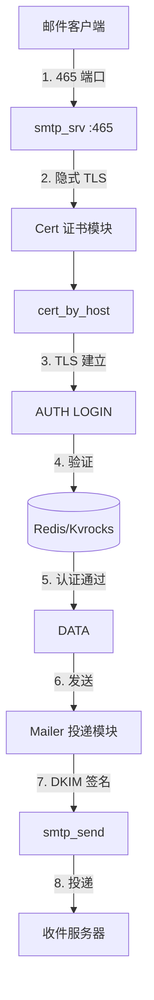

# smtp_srv : 高性能自动热更新证书的 SMTPS 服务器

## 目录

- [简介](#简介)
- [功能特性](#功能特性)
- [架构设计](#架构设计)
- [使用演示](#使用演示)
- [API 接口](#api-接口)
- [技术栈](#技术栈)
- [目录结构](#目录结构)
- [历史趣闻](#历史趣闻)

## 简介

`smtp_srv` 是基于 Rust 构建的异步 SMTPS 服务器，使用 Redis/Kvrocks 作为后端存储，专为高性能邮件处理设计。

核心能力：

- 25 端口：接收外部 MTA 邮件，按规则转发
- 465 端口：用户通过隐式 TLS 认证登录后发送邮件

服务器根据主机名 TLD 自动刷新 TLS 证书，确保服务安全且不中断。

## 功能特性

- **证书自动热更新**：根据主机名 TLD 自动获取和更新证书
- **双端口架构**：25 端口收信/转发，465 端口认证发信
- **动态转发规则**：从 Redis/Kvrocks 实时查询转发配置
- **DKIM 签名**：集成发件 DKIM 签名支持
- **优雅停机**：监听系统信号，安全终止服务
- **高吞吐量**：基于 Tokio 异步运行时

## 架构设计

### 25 端口 - 收信与转发

外部 MTA 连接 25 端口投递邮件，STARTTLS 可选。服务器从 Redis 查询转发规则后路由邮件。



### 465 端口 - 用户认证与发信

用户通过 465 端口隐式 TLS 连接，经 SMTP AUTH 认证后发送邮件。



### 转发规则查询

Redis 以 Hash 格式存储转发规则：

- Key：`mailForward:<域名>`
- Field：用户名或 `*`（通配符）
- Value：目标邮箱地址

Lua 脚本（`mailForward`、`mailForwardSet`）处理单条和批量查询，支持通配符回退。

### 数据库设计 (Schema)

所有配置使用二进制平铺 String (GET/SET/MGET) 结构在 Redis/Kvrocks 中存储：

1. **域名与 Host ID 映射**
   - Key: `smtpDomainHost:<domain>`
   - Value: 二进制 `host_id` (u64 大端，即 `intbin::to_bin(host_id)`)

2. **租户账号映射 (Argon2id)**
   - Key: `smtpUser:<domain>:<prefix>`
   - Value: `[16 字节 Salt] + [32 字节 Argon2id Hash]` (共 48 字节)

3. **租户/主机 DKIM Selector 配置**
   - Key: `smtpHostDkim:<host_id>`
   - Value: `selector` 字符串 (例如 `js0-rsa`)

4. **全局 DKIM 种子配置**
   - Key: `smtpDkimSk`
   - Value: 32 字节全局 DKIM 种子 (底层使用 `sk_dkim` 派生具体域名 RSA 私钥进行签名)

## 使用演示

添加依赖：

```toml
[dependencies]
smtp_srv = "0.2.24"
```

入口文件：

```rust
use aok::{OK, Void};
use mimalloc::MiMalloc;

#[global_allocator]
static GLOBAL: MiMalloc = MiMalloc;

#[static_init::constructor(0)]
extern "C" fn _init() {
  log_init::init();
}

#[tokio::main]
async fn main() -> Void {
  xboot::init().await?;
  let _ = rustls::crypto::ring::default_provider().install_default();
  smtp_srv::run().await;
  OK
}
```

运行：

```bash
cargo run --release
```

发信测试（需设置环境变量 `SMTP_USER` 和 `SMTP_PASSWORD`）：

```javascript
import nodemailer from "nodemailer";

const SMTP = nodemailer.createTransport({
  host: "127.0.0.1",
  port: 465,
  secure: true,
  auth: {
    user: process.env.SMTP_USER,
    pass: process.env.SMTP_PASSWORD
  },
  tls: {
    servername: "smtp.example.com"
  }
});

await SMTP.sendMail({
  from: '"发件人" <sender@example.com>',
  to: "recipient@example.com",
  subject: "测试",
  text: "你好"
});
```

### 辅助管理脚本 (examples)

在 `examples` 目录下提供了几个脚本，用于管理域名 DKIM、用户认证账号以及测试邮件发送。运行这些脚本需要安装 `bun` 运行时。

#### 1. DKIM 密钥配置脚本 (`examples/dkim.js`)

用于为指定域名自动生成并配置 DKIM 密钥对，并将公钥/私钥保存到 Kvrocks 中，同时输出需要配置的 DNS TXT 记录。

- **使用方法**：
  ```bash
  ./examples/dkim.js <域名>
  ```
  例如：
  ```bash
  ./examples/dkim.js example.com
  ```
- **主要逻辑**：
  1. 检测并生成全局 DKIM 种子（若没有 `smtpDkimSk`）。
  2. 获取/为域名自动分配递增的 `host_id`，并记录域名与 `host_id` 的映射。
  3. 如果未配置，自动生成 2048 位的 RSASSA-PKCS1-v1_5 密钥对，私钥保存至 `smtpHostDkimKey:<host_id>`，公钥保存至 `smtpHostDkimPub:<host_id>`，Selector（默认值为 `rsa`）保存至 `smtpHostDkim:<host_id>`。
  4. 终端输出你需要添加到 DNS 记录中的 DKIM TXT 记录内容（如主机记录 `rsa._domainkey` 及对应的 `v=DKIM1; k=rsa; p=...` 记录值）。

#### 2. Cloudflare DNS 自动配置 DKIM 脚本 (`examples/dkim.cf.js`)

功能参数与 `dkim.js` 类似，但它在生成密钥后，会自动连接 Cloudflare API 将 DKIM TXT 记录配置到对应的域名 Zone 中。如果已存在旧的记录，会先进行删除。

- **使用条件**：
  - 需要在 `examples/conf/CF.js` 中配置您的 Cloudflare API Token。
- **使用方法**：
  ```bash
  ./examples/dkim.cf.js <域名>
  ```
  例如：
  ```bash
  ./examples/dkim.cf.js example.com
  ```

#### 3. 用户邮箱账户配置脚本 (`examples/smtp_user.js`)

用于创建或修改用户邮箱的密码。密码将在经过 Argon2id 加密（带有随机盐）后存储在 Kvrocks 中，用于 465 端口的 SMTP 登录验证。

- **使用方法**：
  ```bash
  ./examples/smtp_user.js <邮箱地址> <密码>
  ```
  例如：
  ```bash
  ./examples/smtp_user.js test@example.com mysecurepassword
  ```
- **主要逻辑**：
  1. 验证邮箱格式，提取前缀与域名。
  2. 检查或自动为域名在数据库中创建并记录递增的 `host_id`。
  3. 生成 16 字节随机盐，使用 Argon2id 算法（内存开销 65536，时间开销 3）对密码进行哈希。
  4. 将盐与哈希值拼接（共 48 字节）写入 `smtpUser:<domain>:<prefix>`。

#### 4. 邮件发送测试脚本 (`examples/mailSend.js`)

使用 nodemailer 向指定邮箱（通常是自己）发送一封测试邮件，用来检验 SMTP 认证发信功能。

- **使用方法**：
  ```bash
  ./examples/mailSend.js <邮箱地址> <密码>
  ```
  例如：
  ```bash
  ./examples/mailSend.js test@example.com mysecurepassword
  ```

## API 接口

### 函数

- `run()`：异步入口函数。使用 `Forward`、`AuthKvrocks`、`Mailer`、`Cert` 实现初始化服务器，等待停机信号。

### 数据结构

- `Cert`：实现 `ssl_trait::CertByHost`。将主机名规范化为 TLD 后解析证书。

- `Mailer`：实现 `smtp_recv::Mailer`。通过 `smtp_send` 处理邮件投递，支持 DKIM 签名。提供 `send()` 处理认证用户发信，`forward()` 处理转发邮件。

### 模块

- `r`：Redis 函数名常量（`MAIL_FORWARD`、`MAIL_FORWARD_SET`）。

## 技术栈

| 组件         | 技术                                              |
| ------------ | ------------------------------------------------- |
| 运行时       | [Tokio](https://tokio.rs/)                        |
| 编程语言     | Rust (Edition 2024)                               |
| 数据库       | Redis / [Kvrocks](https://kvrocks.apache.org/)    |
| TLS          | [rustls](https://github.com/rustls/rustls)        |
| Redis 客户端 | [fred](https://github.com/aembke/fred.rs)         |
| 内存分配器   | [mimalloc](https://github.com/microsoft/mimalloc) |
| 核心组件     | `smtp_recv`, `smtp_send`, `cert_by_host`          |

## 目录结构

```
smtp_srv/
├── src/
│   ├── lib.rs        # 库导出，run()
│   ├── main.rs       # 应用入口
│   ├── cert.rs       # TLS 证书解析
│   ├── forward.rs    # 邮件转发逻辑
│   ├── mailer.rs     # DKIM 签名发信
│   └── r.rs          # Redis 函数常量
├── lua/
│   └── mailForward.lua  # Redis Lua 脚本
└── test/
    └── test_smtp.js     # SMTP 客户端测试
```

## 历史趣闻

电子邮件中的 `@` 符号由 Ray Tomlinson 于 1971 年选定，当时他在 ARPANET 上发送了第一封网络邮件。他需要找到能区分用户名和主机名的字符，且不会出现在人名中。看着 Model 33 电传打字机键盘，他选中了 `@` —— 当时鲜少使用的符号。那封邮件的内容可能只是 "QWERTYUIOP" 之类的测试字符。这个简单的选择成为了数字通信的通用标识。

SMTP 协议由 Jonathan Postel 在 RFC 821（1982）中正式定义。协议历经多次 RFC 演进，465 端口最初于 1997 年分配给 SMTPS，后被废弃，又在 RFC 8314（2018）中重新标准化为隐式 TLS 提交端口。
