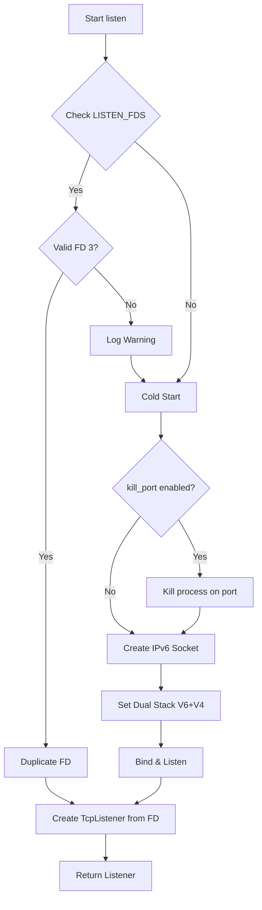

# socket_port : Zero-downtime hot restart TCP listener

Seamlessly create TCP listeners with systemd socket activation support, enabling hot restarts and dual-stack networking without service interruption.

## Table of Contents

- [Features](#features)
- [Installation](#installation)
- [Usage Examples](#usage-examples)
- [Design Architecture](#design-architecture)
- [Technology Stack](#technology-stack)
- [Directory Structure](#directory-structure)
- [API Reference](#api-reference)
- [Optional Features: kill_port](#optional-features-kill_port)
- [Historical Context](#historical-context)

## Features

- **Zero-Downtime Hot Restart**: Inherit listening sockets via `LISTEN_FDS`, maintaining connections during service updates.
- **Dual-Stack Networking**: Auto-configured IPv6 sockets with `IPV6_V6ONLY=false` to handle both IPv4 and IPv6 traffic.
- **Smart FD Management**: Safe file descriptor duplication ensures systemd socket longevity across restarts.
- **Async Runtime Ready**: Non-blocking configuration optimized for event loops like Tokio.
- **Cross-Platform Fallback**: Automatic standard socket creation on non-Linux systems or when systemd is inactive.
- **Development Convenience**: Tools to handle port conflicts automatically during local iterations.

## Installation

Add to `Cargo.toml`:

```toml
[dependencies]
socket_port = "0.1.17"
```

## Usage Examples

### Basic Listen

Bind to a port or inherit from systemd:

```rust
use socket_port::listen;

fn main() -> std::io::Result<()> {
  // Listen on port 8080 (or inherit matching request)
  let listener = listen(8080)?;
  println!("Listening on: {}", listener.local_addr()?);
  Ok(())
}
```

### Async Integration (Tokio)

Convert to Tokio `TcpListener` for async workflows:

```rust
use socket_port::listen;
use tokio::net::TcpListener;

#[tokio::main]
async fn main() -> std::io::Result<()> {
  let std_listener = listen(8080)?;
  let listener = TcpListener::from_std(std_listener)?;

  loop {
    let (socket, _) = listener.accept().await?;
    tokio::spawn(async move {
      // Handle connection
    });
  }
}
```

## Design Architecture

Module interaction and logic flow for socket creation:



### Key Mechanisms

1.  **FD Duplication**: Rust objects manage resource lifecycles. To prevent closing the original systemd-managed file descriptor (FD 3) when the Rust `TcpListener` drops, `libc::dup()` creates a distinct copy for the application to own.
2.  **Dual Stack**: By creating an IPv6 socket and disabling `IPV6_V6ONLY`, the listener accepts traffic from both protocol versions, simplifying network logic.

## Technology Stack

- **Rust**: Core logic and safety guarantees.
- **socket2**: Advanced socket configuration and detailed control.
- **libc**: Direct system call access for file descriptor operations.
- **log**: Structured diagnostic output.

## Directory Structure

```text
socket_port/
├── Cargo.toml      # Project configuration
├── src/
│   ├── lib.rs      # Public API and implementation
│   └── listen_fd.rs # Systemd integration (Linux)
├── tests/
│   └── main.rs     # Integration and behavior tests
└── readme/
    ├── en.md       # English documentation
    └── zh.md       # Chinese documentation
```

## API Reference

### `listen(port: u16) -> Result<TcpListener>`

Primary entry point for creating listeners.

**Parameters:**

- `port`:
  - **Cold Start**: Binds to this port.
  - **Hot Restart (Systemd)**:
    - If `LISTEN_FDS == 1`: Inherits FD 3 directly (assumes match).
    - If `LISTEN_FDS > 1`: Iterates through all inherited FDs, checking their bound ports via `getsockname`, and automatically selects the FD matching this `port`.

**Returns:**

- `Result<TcpListener>`: Non-blocking TCP listener ready for async runtimes

**Behavior:**

1. **Linux Systems**: Checks `LISTEN_FDS`.
   - **Smart Matching**: Automatically matches the correct FD by port when multiple sockets are passed.
2. **Fallback**: Creates new IPv6 dual-stack socket if no suitable inherited socket is found.
3. **Configuration**: Non-blocking mode, backlog=1024, dual-stack enabled.

### `listen_fd(port: u16) -> Result<Option<TcpListener>>`

_Linux-only._ Low-level access to systemd socket inheritance logic.

## Optional Features: kill_port

Solve "Address already in use" errors during local development.

Enable in `Cargo.toml`:

```toml
[dependencies]
socket_port = { version = "0.1.17", features = ["kill_port"] }
```

When enabled, `listen()` attempts to terminate any process currently holding the target port before binding.

> **Note**: Use with caution. Recommended for development environments, not production.

## Historical Context

**From inetd to systemd**

Socket activation originated with `inetd` (Internet Super-Server) in 1986's 4.3BSD. Designed to conserve resources, `inetd` listened for network connections and launched corresponding services only upon demand.

While efficient for resources, early `inetd` spawned new processes for every connection, limiting performance. Modern implementations like **systemd** evolved this concept: the service manager creates the listening socket once and passes it to the long-running service daemon. This architecture permits seamless binary updates—the socket remains open in the manager while the service implementation restarts, resulting in zero connection loss.
