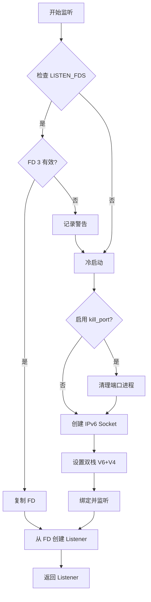

# socket_port : 零停机热重启 TCP 监听器

创建支持 systemd 套接字激活的 TCP 监听器，实现无缝热重启与双栈网络支持，确保服务零中断。

## 目录

- [功能特性](#功能特性)
- [安装](#安装)
- [使用示例](#使用示例)
- [设计架构](#设计架构)
- [技术堆栈](#技术堆栈)
- [目录结构](#目录结构)
- [API 参考](#api-参考)
- [可选特性：kill_port](#可选特性kill_port)
- [历史背景](#历史背景)

## 功能特性

- **零停机热重启**：通过 `LISTEN_FDS` 环境变量继承 systemd 监听套接字，更新服务时不中断连接。
- **双栈网络支持**：配置 IPv6 套接字 `IPV6_V6ONLY=false`，同时处理 IPv4 和 IPv6 流量。
- **智能 FD 管理**：使用 `libc::dup()` 复制文件描述符，保护 systemd 套接字生命周期。
- **异步运行时就绪**：非阻塞模式配置，通过 Tokio 等异步框架无缝集成。
- **跨平台回退**：Linux 环境启用 systemd 集成，其他平台自动回退至标准套接字创建。
- **开发辅助**：提供端口冲突自动清理工具，提升本地开发体验。

## 安装

在 `Cargo.toml` 中添加依赖：

```toml
[dependencies]
socket_port = "0.1.17"
```

## 使用示例

### 基础监听

绑定端口或从 systemd 继承：

```rust
use socket_port::listen;

fn main() -> std::io::Result<()> {
  // 监听 8080 端口（或从 systemd 继承）
  let listener = listen(8080)?;
  println!("监听地址: {}", listener.local_addr()?);
  Ok(())
}
```

### 异步集成 (Tokio)

转换为 Tokio `TcpListener` 以适配异步工作流：

```rust
use socket_port::listen;
use tokio::net::TcpListener;

#[tokio::main]
async fn main() -> std::io::Result<()> {
  let std_listener = listen(8080)?;
  let listener = TcpListener::from_std(std_listener)?;

  loop {
    let (socket, _) = listener.accept().await?;
    tokio::spawn(async move {
      // 处理连接
    });
  }
}
```

## 设计架构

模块交互与套接字创建逻辑流程：



### 核心机制

1.  **FD 复制 (FD Duplication)**：Rust 对象管理资源生命周期。为防止 `TcpListener` 释放时关闭原始 systemd 托管的文件描述符 (FD 3)，使用 `libc::dup()` 创建独立副本供应用层使用。
2.  **双栈支持 (Dual Stack)**：通过创建 IPv6 套接字并禁用 `IPV6_V6ONLY`，监听器可同时接受 IPv6 和映射后的 IPv4 连接，简化网络层逻辑。

## 技术堆栈

- **Rust**: 核心逻辑与安全保证。
- **socket2**: 高级套接字配置与底层控制。
- **libc**: 直接系统调用，用于文件描述符操作。
- **log**: 结构化日志输出。

## 目录结构

```text
socket_port/
├── Cargo.toml      # 项目配置
├── src/
│   ├── lib.rs      # 公共 API 与实现
│   └── listen_fd.rs # Systemd 集成 (Linux)
├── tests/
│   └── main.rs     # 集成测试与示例
└── readme/
    ├── en.md       # 英文文档
    └── zh.md       # 中文文档
```

## API 参考

### `listen(port: u16) -> Result<TcpListener>`

创建一个绑定到指定端口的 TCP 监听器。

- **参数**:
  - `port`:
    - **冷启动**: 绑定到此端口。
    - **热重启 (Systemd)**:
      - 若 `LISTEN_FDS == 1`: 直接继承 FD 3 (忽略端口号匹配)。
      - 若 `LISTEN_FDS > 1`: 遍历所有继承的 FD，通过 `getsockname` 检查其绑定端口，自动选择与参数 `port` 一致的 FD。
- **返回**: 标准的 `std::net::TcpListener`。
- **行为**:
  1. 检查 `LISTEN_FDS`。
  2. **智能匹配**: 单个 FD 直接使用；多个 FD 自动匹配端口。
  3. 如果未找到或未继承，创建一个新的 IPv6 双栈套接字并绑定到 `[::]:port`。

### `listen_fd(port: u16) -> Result<Option<TcpListener>>`

_仅限 Linux_。用于 systemd 套接字继承的底层接口。

## 可选特性：kill_port

解决本地开发时的“地址已被使用”错误。

在 `Cargo.toml` 中开启：

```toml
[dependencies]
socket_port = { version = "0.1.17", features = ["kill_port"] }
```

启用后，`listen()` 在绑定前会尝试终止占用目标端口的进程。

> **注意**：建议仅在开发环境使用，慎用于生产环境。

## 历史趣闻

**从 inetd 到 systemd：套接字激活的演变**

`socket_port` 中实现的“套接字激活”（Socket Activation）概念可以追溯到 1986 年随 4.3BSD 发布的 `inetd`（即“互联网超级服务器”）。`inetd` 的设计初衷是为了节省系统资源，它代表各项服务监听端口，并且仅在连接到达时才启动实际的守护进程。

然而，`inetd` 会为**每个**连接启动一个新的进程，这对于高流量服务来说效率较低。现代实现（如 **systemd**）改进了这一点，它将监听的套接字本身传递给服务守护进程。这使得服务能够高效地处理所有后续连接，同时仍然享受按需启动和零停机重启的好处（因为在服务二进制文件更新期间，套接字在主管进程中保持打开状态）。
