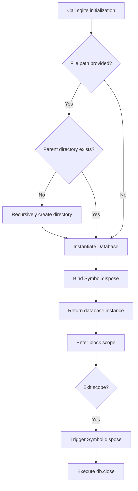
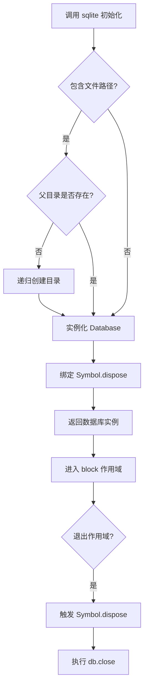

[English](#en) | [中文](#zh)

---

<a id="en"></a>
# @1-/sqlite : Automatic resource management and transaction wrapper for Bun:SQLite

- [@1-/sqlite : Automatic resource management and transaction wrapper for Bun:SQLite](#1-sqlite-automatic-resource-management-and-transaction-wrapper-for-bunsqlite)
  - [1. Features](#1-features)
  - [2. Usage](#2-usage)
    - [Auto Directory Creation and Resource Cleanup](#auto-directory-creation-and-resource-cleanup)
    - [Transaction Control](#transaction-control)
  - [3. Design](#3-design)
  - [4. Tech Stack](#4-tech-stack)
  - [5. Code Structure](#5-code-structure)
  - [6. History](#6-history)
  - [About](#about)

## 1. Features

A database wrapper based on `bun:sqlite` providing the following core capabilities:

- **Automatic Resource Cleanup**: Fully supports the JavaScript `using` declaration (TC39 Stage 3 Explicit Resource Management) to automatically close database connections upon exiting block scope.
- **Automatic Directory Creation**: Automatically verifies and recursively creates parent directories if they do not exist when initializing with a file path.
- **Declarative Transactions**: Simplifies database transactions with the `tx` function, executing automatic commits on success and automatic rollbacks on exception.

## 2. Usage

### Auto Directory Creation and Resource Cleanup

```javascript
import sqlite from "@1-/sqlite";

{
  // Automatically creates the directory ./data/db/ and initializes the database
  using db = sqlite("./data/db/local.db");

  db.query("SELECT 1").all();
  // Exiting the scope automatically closes db and releases the connection
}
```

### Transaction Control

```javascript
import sqlite from "@1-/sqlite";
import tx from "@1-/sqlite/tx";

using db = sqlite(":memory:");
db.exec("CREATE TABLE users (id INTEGER PRIMARY KEY, name TEXT)");

// Auto-commit on success
tx(db, () => {
  db.prepare("INSERT INTO users (name) VALUES (?)").run("Alice");
});

// Auto-rollback on exception
try {
  tx(db, () => {
    db.prepare("INSERT INTO users (name) VALUES (?)").run("Bob");
    throw new Error("failed");
  });
} catch (e) {
  // Insertion of Bob is rolled back, database remains unaffected
}
```

## 3. Design

Binds the `Symbol.dispose` hook to the database instance to integrate with the Explicit Resource Management protocol of modern JavaScript runtimes.
Transactions wrap client callbacks in a try-catch pattern to guarantee cleanup and command safety.



## 4. Tech Stack

- **Bun**: JavaScript runtime environment and package manager
- **bun:sqlite**: High-performance SQLite engine built into Bun
- **ES Module**: Standard JavaScript module system

## 5. Code Structure

```text
src/
├── _.js      # Database initialization and lifecycle binding
└── tx.js     # Transaction wrapper
tests/
└── _.test.js # Integration test cases
```

## 6. History

SQLite originated in 2000.
D. Richard Hipp was designing software for US Navy guided-missile destroyers, where database servers frequently suffered downtime due to network drops or setup conflicts.
To build a database that required no installation, no administration, did not depend on any server process, and stored data in a single file, he developed SQLite.
This design revolutionized local data storage.
Today, SQLite is the most widely deployed database engine, running on billions of devices, smartphones, and web browsers.


## About

This library is developed by [WebC.site](https://webc.site).

[WebC.site](https://webc.site): A new paradigm of web development for AI


---

<a id="zh"></a>
# @1-/sqlite : 支持自动资源管理与事务的 Bun:SQLite 封装

- [@1-/sqlite : 支持自动资源管理与事务的 Bun:SQLite 封装](#1-sqlite-支持自动资源管理与事务的-bunsqlite-封装)
  - [1. 功能介绍](#1-功能介绍)
  - [2. 使用演示](#2-使用演示)
    - [自动创建目录与释放资源](#自动创建目录与释放资源)
    - [事务控制](#事务控制)
  - [3. 设计思路](#3-设计思路)
  - [4. 技术栈](#4-技术栈)
  - [5. 代码结构](#5-代码结构)
  - [6. 历史故事](#6-历史故事)
  - [关于](#关于)

## 1. 功能介绍

基于 `bun:sqlite` 构建的数据库包装器，提供以下核心特性：

- **自动资源释放**：支持 JS `using` 声明（TC39 Stage 3 显式资源管理规范），离开块级作用域时自动关闭数据库，防止资源泄漏。
- **自动创建目录**：传入文件路径时，自动检测并递归创建不存在的父级目录，避免因路径不存在导致初始化失败。
- **声明式事务**：封装 `tx` 函数，支持事务自动提交（COMMIT）与异常回滚（ROLLBACK）。

## 2. 使用演示

### 自动创建目录与释放资源

```javascript
import sqlite from "@1-/sqlite";

{
  // 自动创建 ./data/db/ 目录并初始化数据库
  using db = sqlite("./data/db/local.db");

  db.query("SELECT 1").all();
  // 离开作用域，db 自动关闭并释放连接
}
```

### 事务控制

```javascript
import sqlite from "@1-/sqlite";
import tx from "@1-/sqlite/tx";

using db = sqlite(":memory:");
db.exec("CREATE TABLE users (id INTEGER PRIMARY KEY, name TEXT)");

// 正常执行自动提交
tx(db, () => {
  db.prepare("INSERT INTO users (name) VALUES (?)").run("Alice");
});

// 抛出异常自动回滚
try {
  tx(db, () => {
    db.prepare("INSERT INTO users (name) VALUES (?)").run("Bob");
    throw new Error("failed");
  });
} catch (e) {
  // Bob 写入被回滚，数据库中无此记录
}
```

## 3. 设计思路

通过为数据库实例绑定 `Symbol.dispose` 钩子，对接现代 JS 运行时的显式资源管理协议。
事务逻辑采用高阶函数包裹，捕获回调内的异常并执行回滚。



## 4. 技术栈

- **Bun**：JS 运行环境与包管理器
- **bun:sqlite**：Bun 内置的原生 SQLite 高性能引擎
- **ES Module**：标准 JavaScript 模块规范

## 5. 代码结构

```text
src/
├── _.js      # 数据库初始化与生命周期绑定
└── tx.js     # 事务控制封装
tests/
└── _.test.js # 功能测试用例
```

## 6. 历史故事

SQLite 的诞生源自于 2000 年。
当时，D. Richard Hipp 在为美国海军导弹驱逐舰编写系统软件，其使用的数据库经常因为网络中断或配置错误导致不可用。
为了实现一个无需安装、无需配置、不依赖独立服务器进程且能直接读写磁盘文件的本地数据库，他着手开发了 SQLite。
这一设计彻底改变了嵌入式与本地存储的游戏规则。
如今，SQLite 已经是全球部署量最大的数据库，运行在数十亿台设备、手机以及现代浏览器中。


## 关于

本库由 [WebC.site](https://webc.site) 开发。

[WebC.site](https://webc.site) : 面向人工智能的网站开发新范式

