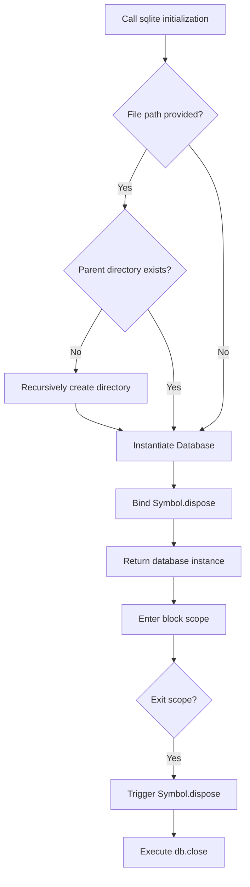

# @1-/sqlite : Automatic resource management and transaction wrapper for Bun:SQLite

## 1. Features

A database wrapper based on `bun:sqlite` providing the following core capabilities:

- **Automatic Resource Cleanup**: Fully supports the JavaScript `using` declaration (TC39 Stage 3 Explicit Resource Management) to automatically close database connections upon exiting block scope.
- **Automatic Directory Creation**: Automatically verifies and recursively creates parent directories if they do not exist when initializing with a file path.
- **Declarative Transactions**: Simplifies database transactions with the `tx` function, executing automatic commits on success and automatic rollbacks on exception.

## 2. Usage

### Auto Directory Creation and Resource Cleanup

```javascript
import sqlite from "@1-/sqlite";

{
  // Automatically creates the directory ./data/db/ and initializes the database
  using db = sqlite("./data/db/local.db");

  db.query("SELECT 1").all();
  // Exiting the scope automatically closes db and releases the connection
}
```

### Transaction Control

```javascript
import sqlite from "@1-/sqlite";
import tx from "@1-/sqlite/tx";

using db = sqlite(":memory:");
db.exec("CREATE TABLE users (id INTEGER PRIMARY KEY, name TEXT)");

// Auto-commit on success
tx(db, () => {
  db.prepare("INSERT INTO users (name) VALUES (?)").run("Alice");
});

// Auto-rollback on exception
try {
  tx(db, () => {
    db.prepare("INSERT INTO users (name) VALUES (?)").run("Bob");
    throw new Error("failed");
  });
} catch (e) {
  // Insertion of Bob is rolled back, database remains unaffected
}
```

## 3. Design

Binds the `Symbol.dispose` hook to the database instance to integrate with the Explicit Resource Management protocol of modern JavaScript runtimes.
Transactions wrap client callbacks in a try-catch pattern to guarantee cleanup and command safety.



## 4. Tech Stack

- **Bun**: JavaScript runtime environment and package manager
- **bun:sqlite**: High-performance SQLite engine built into Bun
- **ES Module**: Standard JavaScript module system

## 5. Code Structure

```text
src/
├── _.js      # Database initialization and lifecycle binding
└── tx.js     # Transaction wrapper
tests/
└── _.test.js # Integration test cases
```

## 6. History

SQLite originated in 2000.
D. Richard Hipp was designing software for US Navy guided-missile destroyers, where database servers frequently suffered downtime due to network drops or setup conflicts.
To build a database that required no installation, no administration, did not depend on any server process, and stored data in a single file, he developed SQLite.
This design revolutionized local data storage.
Today, SQLite is the most widely deployed database engine, running on billions of devices, smartphones, and web browsers.
