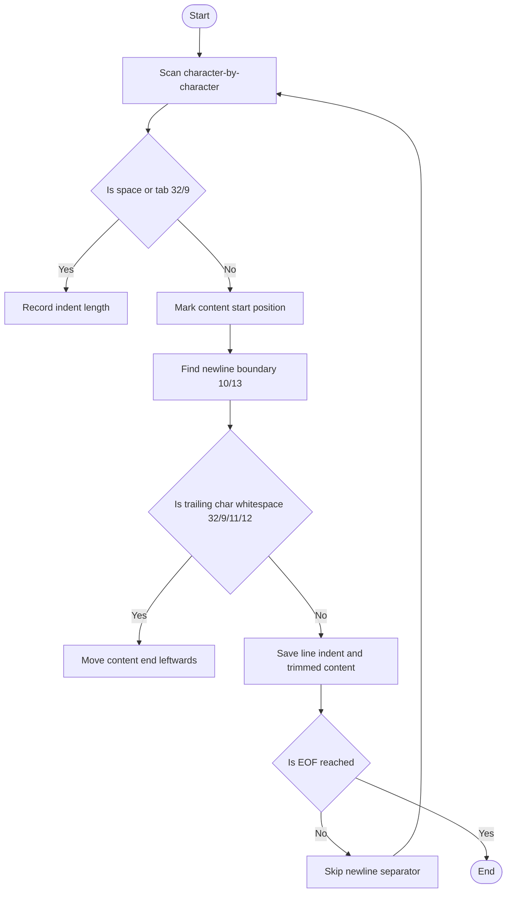
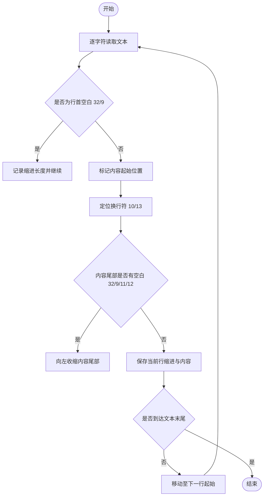

[English](#en) | [中文](#zh)

---

<a id="en"></a>
# @1-/str : A minimalist and high-performance parser for indented text lists

- [@1-/str : A minimalist and high-performance parser for indented text lists](#1-str-a-minimalist-and-high-performance-parser-for-indented-text-lists)
  - [Features](#features)
  - [Usage](#usage)
  - [Design](#design)
  - [Tech Stack](#tech-stack)
  - [Directory Structure](#directory-structure)
  - [History](#history)
  - [About](#about)

## Features

- Parses indented text lines, separating leading indents and raw text contents.
- Automatically trims trailing spaces, tabs, vertical tabs, and form feeds.
- Supports diverse line-endings (`\n`, `\r\n`, `\r`) and boundary cases.
- Returns structured tuples `[ [indent, content], ... ]` to preserve hierarchy.

## Usage

```javascript
import indentTxtLi from "@1-/str";

const text = `
  - Option A
    - Sub-option A1
  - Option B
`;

const result = indentTxtLi(text);
console.log(result);
/*
Output:
[
  ['', ''],
  ['  ', '- Option A'],
  ['    ', '- Sub-option A1'],
  ['  ', '- Option B'],
  ['', '']
]
*/
```

## Design

Uses single-pass character scanning with character code comparison to instantly detect indent boundaries and trailing whitespaces. Avoids costly regular expressions for optimal performance.



## Tech Stack

- Runtime: [Bun](https://bun.sh/)
- Language: Vanilla JavaScript (ES Module)

## Directory Structure

- [src/indentTxtLi.js](file:///Users/z/git/npm/str/src/indentTxtLi.js): Core algorithm parsing indentation and content.
- [test/\_.test.js](file:///Users/z/git/npm/str/test/_.test.js): Comprehensive test suite covering various newline formats and boundary cases.

## History

The "Off-side rule" (syntactic indentation) was first introduced in Algol-58 in the 1960s and popularized by Python, YAML, and Markdown. Structuring documents and configurations via indentation became a modern standard. `@1-/str` provides a fast and robust base parser for extracting indent-hierarchy, serving as a building block for Markdown lists and outline processors.


## About

This library is developed by [WebC.site](https://webc.site).

[WebC.site](https://webc.site): A new paradigm of web development for AI


---

<a id="zh"></a>
# @1-/str : 极简高效的带缩进文本列表解析工具

- [@1-/str : 极简高效的带缩进文本列表解析工具](#1-str-极简高效的带缩进文本列表解析工具)
  - [功能介绍](#功能介绍)
  - [使用演示](#使用演示)
  - [设计思路](#设计思路)
  - [技术栈](#技术栈)
  - [代码结构](#代码结构)
  - [历史故事](#历史故事)
  - [关于](#关于)

## 功能介绍

- 解析带有缩进的文本行列表，剥离每行的行首缩进与内容。
- 自动过滤行尾的空白字符（如空格、制表符、垂直制表符和换页符）。
- 兼容多种换行符（`\n`、`\r\n`、`\r`），处理空行与边界情况。
- 返回结构化元组数组 `[ [indent, content], ... ]`，保留原始层级关系。

## 使用演示

```javascript
import indentTxtLi from "@1-/str";

const text = `
  - 选项 A
    - 子选项 A1
  - 选项 B
`;

const result = indentTxtLi(text);
console.log(result);
/*
输出:
[
  ['', ''],
  ['  ', '- 选项 A'],
  ['    ', '- 子选项 A1'],
  ['  ', '- 选项 B'],
  ['', '']
]
*/
```

## 设计思路

利用高效的单次字符扫描，结合字符编码（ASCII code）判别，快速定位缩进起止与行尾空白，避免使用复杂的正则表达式，确保极高的解析性能。



## 技术栈

- 运行环境: [Bun](https://bun.sh/)
- 语言标准: Vanilla JavaScript (ES Module)

## 代码结构

- [src/indentTxtLi.js](file:///Users/z/git/npm/str/src/indentTxtLi.js) : 核心算法实现，按字符编码精确切分缩进和内容。
- [test/\_.test.js](file:///Users/z/git/npm/str/test/_.test.js) : 单元测试用例，覆盖多种换行符、空白字符以及边界情况。

## 历史故事

关于“缩进文本”的设计史，最著名的莫过于 Python 的 Off-side rule（越位规则）。在 1960 年代，Algol-58 首次提出了基于缩进的代码结构设想，而直到 Python、YAML 和 Markdown 的兴起，基于缩进的结构化文本才被广泛应用于配置与富文本表示。本库专注于提供纯净、快速的缩进和内容剥离算法，为后续更复杂的 Markdown 列表或树形缩进解析奠定基础。


## 关于

本库由 [WebC.site](https://webc.site) 开发。

[WebC.site](https://webc.site) : 面向人工智能的网站开发新范式

