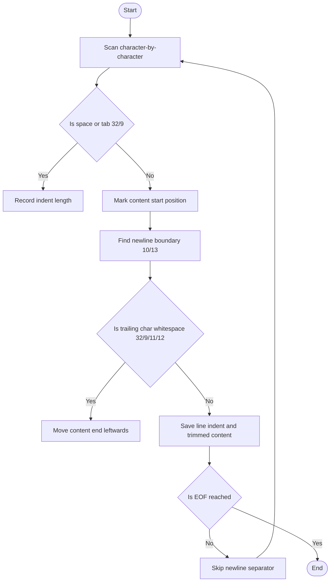

# @1-/str : A minimalist and high-performance parser for indented text lists

## Features

- Parses indented text lines, separating leading indents and raw text contents.
- Automatically trims trailing spaces, tabs, vertical tabs, and form feeds.
- Supports diverse line-endings (`\n`, `\r\n`, `\r`) and boundary cases.
- Returns structured tuples `[ [indent, content], ... ]` to preserve hierarchy.

## Usage

```javascript
import indentTxtLi from "@1-/str";

const text = `
  - Option A
    - Sub-option A1
  - Option B
`;

const result = indentTxtLi(text);
console.log(result);
/*
Output:
[
  ['', ''],
  ['  ', '- Option A'],
  ['    ', '- Sub-option A1'],
  ['  ', '- Option B'],
  ['', '']
]
*/
```

## Design

Uses single-pass character scanning with character code comparison to instantly detect indent boundaries and trailing whitespaces. Avoids costly regular expressions for optimal performance.



## Tech Stack

- Runtime: [Bun](https://bun.sh/)
- Language: Vanilla JavaScript (ES Module)

## Directory Structure

- [src/indentTxtLi.js](file:///Users/z/git/npm/str/src/indentTxtLi.js): Core algorithm parsing indentation and content.
- [tests/\_.test.js](file:///Users/z/git/npm/str/tests/_.test.js): Comprehensive test suite covering various newline formats and boundary cases.

## History

The "Off-side rule" (syntactic indentation) was first introduced in Algol-58 in the 1960s and popularized by Python, YAML, and Markdown. Structuring documents and configurations via indentation became a modern standard. `@1-/str` provides a fast and robust base parser for extracting indent-hierarchy, serving as a building block for Markdown lists and outline processors.
