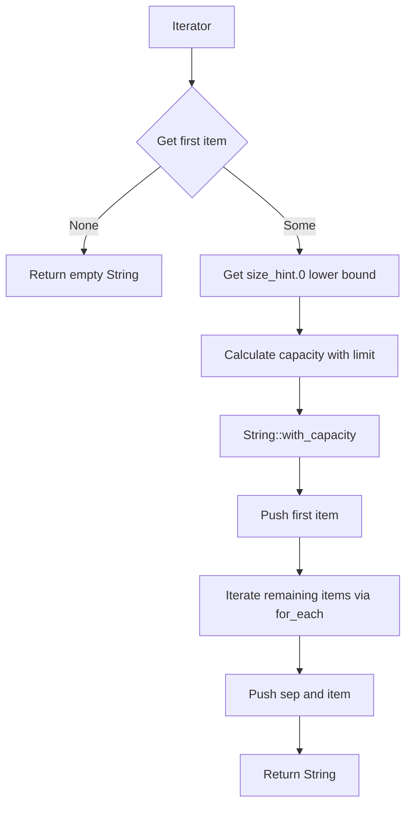
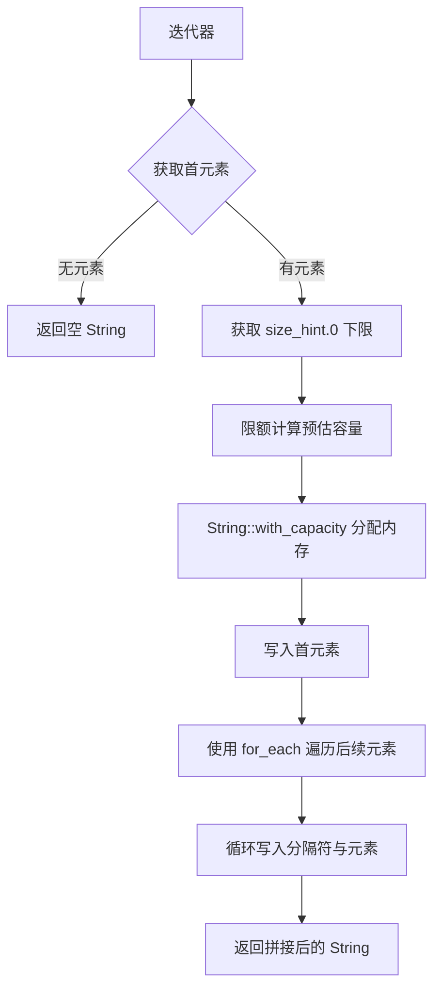

[English](#en) | [中文](#zh)

---

<a id="en"></a>

# strjoin : High-performance zero-allocation string join extension for Rust iterators

- [strjoin : High-performance zero-allocation string join extension for Rust iterators](#strjoin-high-performance-zero-allocation-string-join-extension-for-rust-iterators)
  - [Features](#features)
  - [Design](#design)
  - [Technical Stack](#technical-stack)
  - [Directory Structure](#directory-structure)
  - [Usage](#usage)
  - [API](#api)
    - [`Join`](#join)
      - [`fn join(self, sep: impl AsRef<str>) -> String`](#fn-joinself-sep-impl-asrefstr-string)
  - [History](#history)
  - [About](#about)

High-performance string join extension trait for Rust iterators. It eliminates the need for temporary `Vec` allocations during string slice joining.

## Features

- **Zero-allocation**: Avoids temporary heap allocations like `collect::<Vec<_>>()`
- **Bounded Homogeneous Estimation**: Dynamically allocates target string memory in a single step using iterator `size_hint` and first element length, bounding pre-allocation to prevent memory spikes
- **Internal Iteration Optimization**: Leverages `for_each` to prompt compiler loop unrolling and optimization
- **Zero-cost Abstraction**: Uses generics with `AsRef<str>` to monomerize at compile time, retaining maximum performance

## Design



## Technical Stack

- Rust 2024 edition

## Directory Structure

```text
.
├── Cargo.toml
├── README.md
├── README.mdt
├── readme
│   ├── en.md
│   └── zh.md
├── src
│   └── lib.rs
├── test.sh
└── tests
    └── main.rs
```

## Usage

```rust
use strjoin::Join;

let items = ["hello", "world"];
let joined = items.into_iter().join("\n");
assert_eq!(joined, "hello\nworld");

// Works directly on mapped iterators without collecting into Vec
let nums = [1, 2, 3];
let joined_nums = nums.iter().map(|n| n.to_string()).join(", ");
assert_eq!(joined_nums, "1, 2, 3");
```

## API

### `Join`

Extension trait implemented for any `Iterator` where the item type implements `AsRef<str>`.

#### `fn join(self, sep: impl AsRef<str>) -> String`

Concatenates the iterator elements with the specified separator.

- `self`: Consumes the iterator.
- `sep`: The separator which can be any type implementing `AsRef<str>`.
- Returns: A new `String` containing the joined elements.

## History

In early versions of Rust (prior to 1.3.0), the method for joining slices was named `connect`. It was later renamed to `join` to align with the conventions of other modern languages. While standard Rust provides `[T].join` for slices, it lacks a direct `join` on general iterators, forcing developers to write `.collect::<Vec<_>>().join(...)` which incurs redundant memory allocations. `strjoin` resolves this limitation, delivering optimal performance by executing string joining directly on the iterator stream with bounded pre-allocation.

## About

This library is developed by [WebC.site](https://webc.site).

[WebC.site](https://webc.site): A new paradigm of web development for AI

---

<a id="zh"></a>

# strjoin : 针对 Rust 迭代器的高性能零临时分配字符串拼接扩展

- [strjoin : 针对 Rust 迭代器的高性能零临时分配字符串拼接扩展](#strjoin-针对-rust-迭代器的高性能零临时分配字符串拼接扩展)
  - [项目功能介绍](#项目功能介绍)
  - [使用演示](#使用演示)
  - [特性介绍](#特性介绍)
  - [设计思路](#设计思路)
  - [技术堆栈](#技术堆栈)
  - [目录结构](#目录结构)
  - [API 说明](#api-说明)
    - [`Join`](#join)
      - [`fn join(self, sep: impl AsRef<str>) -> String`](#fn-joinself-sep-impl-asrefstr-string)
  - [历史故事](#历史故事)
  - [关于](#关于)

针对 Rust 迭代器的高性能字符串拼接扩展。无需通过 `collect::<Vec<_>>()` 进行临时内存分配即可实现高效拼接。

## 项目功能介绍

本库提供 `Join` 扩展特征。允许在任何迭代器上直接调用 `join` 方法，彻底免除拼接过程中产生的临时容器堆内存分配。

## 使用演示

```rust
use strjoin::Join;

let items = ["hello", "world"];
let joined = items.into_iter().join("\n");
assert_eq!(joined, "hello\nworld");

// 适用于 map 后的迭代器，无需额外 collect 转换为 Vec
let nums = [1, 2, 3];
let joined_nums = nums.iter().map(|n| n.to_string()).join(", ");
assert_eq!(joined_nums, "1, 2, 3");
```

## 特性介绍

- **零临时分配**：避免使用 `collect::<Vec<_>>()` 产生的堆内存申请与数据拷贝
- **限额同质预估**：利用迭代器 `size_hint` 及首元素长度计算初始容量，设置上限防范内存异常暴涨，实现单次内存分配
- **内迭代优化**：采用 `for_each` 机制，触发编译器循环展开与分支优化
- **零成本抽象**：使用泛型与 `AsRef<str>` 约束，在编译期完成单态化，保障运行速度

## 设计思路



## 技术堆栈

- Rust 2024 edition

## 目录结构

```text
.
├── Cargo.toml
├── README.md
├── README.mdt
├── readme
│   ├── en.md
│   └── zh.md
├── src
│   └── lib.rs
├── test.sh
└── tests
    └── main.rs
```

## API 说明

### `Join`

针对所有 `Item` 类型满足 `AsRef<str>` 的 `Iterator` 实现的扩展特征。

#### `fn join(self, sep: impl AsRef<str>) -> String`

使用指定分隔符拼接迭代器元素。

- `self`：消费该迭代器。
- `sep`：分隔符，支持任何实现 `AsRef<str>` 的类型。
- 返回值：拼接完成后的新 `String`。

## 历史故事

在 Rust 1.3.0 之前，切片的拼接方法曾被称为 `connect`。为契合现代主流编程语言的习惯，官方随后将其重命名为 `join`。然而，Rust 标准库仅为切片 `[T]` 提供了高效的 `join` 接口，并未对通用迭代器开放。这促使开发者通常需要先编写 `.collect::<Vec<_>>().join(...)`，造成了冗余的临时内存分配。`strjoin` 填补了此空白，通过引入限额同质预估策略，使得在迭代器流上直接进行高性能拼接成为可能。

## 关于

本库由 [WebC.site](https://webc.site) 开发。

[WebC.site](https://webc.site) : 面向人工智能的网站开发新范式
