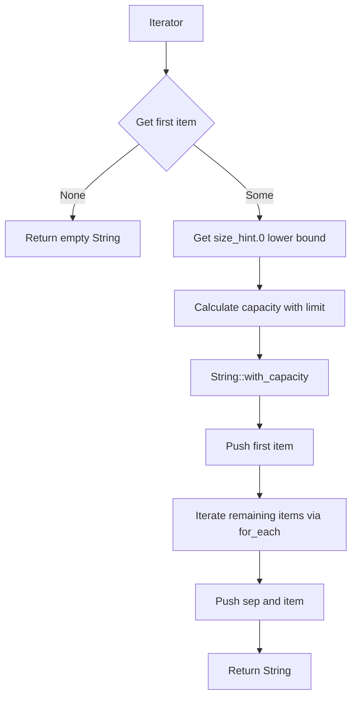

# strjoin : High-performance zero-allocation string join extension for Rust iterators

High-performance string join extension trait for Rust iterators. It eliminates the need for temporary `Vec` allocations during string slice joining.

## Features

- **Zero-allocation**: Avoids temporary heap allocations like `collect::<Vec<_>>()`
- **Bounded Homogeneous Estimation**: Dynamically allocates target string memory in a single step using iterator `size_hint` and first element length, bounding pre-allocation to prevent memory spikes
- **Internal Iteration Optimization**: Leverages `for_each` to prompt compiler loop unrolling and optimization
- **Zero-cost Abstraction**: Uses generics with `AsRef<str>` to monomerize at compile time, retaining maximum performance

## Design



## Technical Stack

- Rust 2024 edition

## Directory Structure

```text
.
├── Cargo.toml
├── README.md
├── README.mdt
├── readme
│   ├── en.md
│   └── zh.md
├── src
│   └── lib.rs
├── test.sh
└── tests
    └── main.rs
```

## Usage

```rust
use strjoin::Join;

let items = ["hello", "world"];
let joined = items.into_iter().join("\n");
assert_eq!(joined, "hello\nworld");

// Works directly on mapped iterators without collecting into Vec
let nums = [1, 2, 3];
let joined_nums = nums.iter().map(|n| n.to_string()).join(", ");
assert_eq!(joined_nums, "1, 2, 3");
```

## API

### `Join`

Extension trait implemented for any `Iterator` where the item type implements `AsRef<str>`.

#### `fn join(self, sep: impl AsRef<str>) -> String`

Concatenates the iterator elements with the specified separator.

- `self`: Consumes the iterator.
- `sep`: The separator which can be any type implementing `AsRef<str>`.
- Returns: A new `String` containing the joined elements.

## History

In early versions of Rust (prior to 1.3.0), the method for joining slices was named `connect`. It was later renamed to `join` to align with the conventions of other modern languages. While standard Rust provides `[T].join` for slices, it lacks a direct `join` on general iterators, forcing developers to write `.collect::<Vec<_>>().join(...)` which incurs redundant memory allocations. `strjoin` resolves this limitation, delivering optimal performance by executing string joining directly on the iterator stream with bounded pre-allocation.
