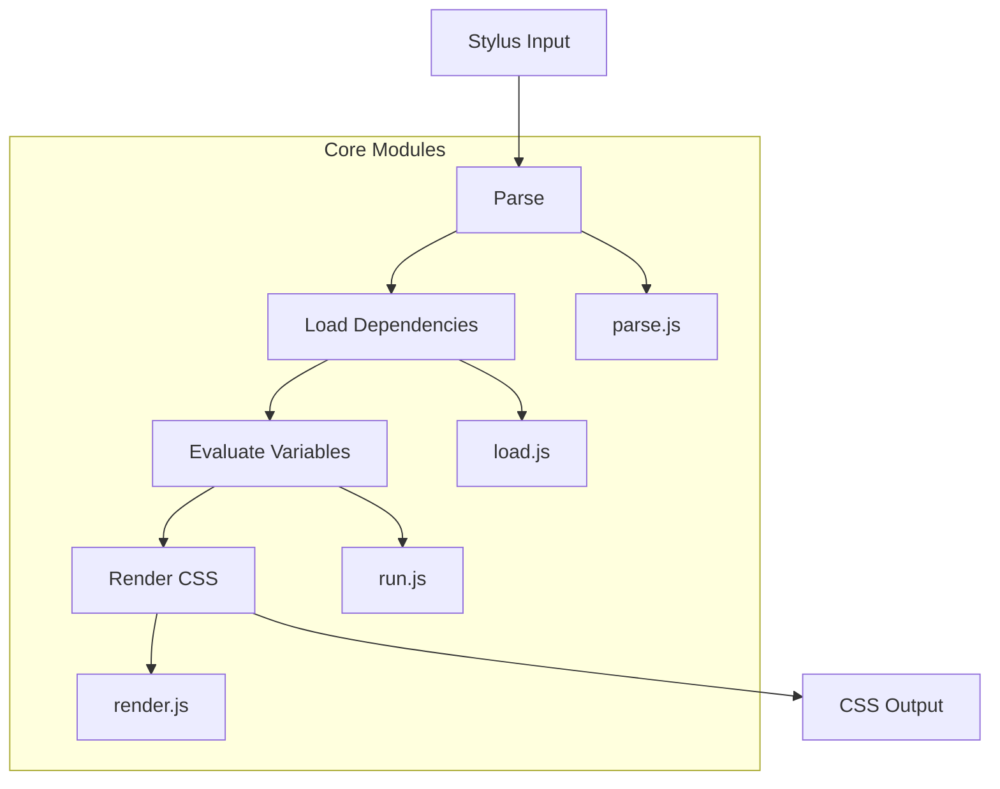
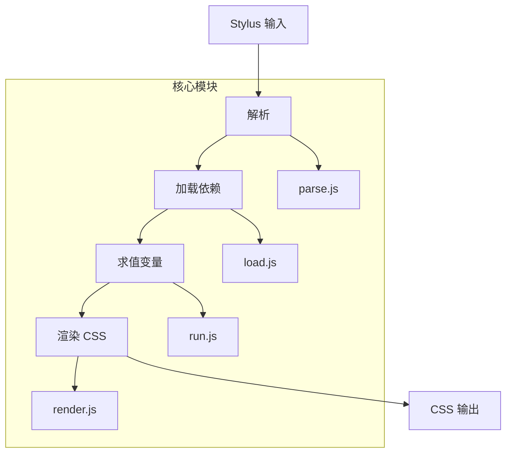

[English](#en) | [中文](#zh)

---

<a id="en"></a>
# @1-/stylus : Lightweight modular Stylus CSS preprocessor

- [@1-/stylus : Lightweight modular Stylus CSS preprocessor](#1-stylus-lightweight-modular-stylus-css-preprocessor)
  - [Functionality](#functionality)
  - [Usage demonstration](#usage-demonstration)
  - [Design rationale](#design-rationale)
  - [Technology stack](#technology-stack)
  - [Code structure](#code-structure)
  - [Historical context](#historical-context)
  - [About](#about)

## Functionality

Modern lightweight Stylus CSS preprocessor implementation with modular architecture and tree-shaking capability. Supports Stylus and CSS syntax parsing, variable scoping, property computation, dependency loading, circular import detection, and source map generation. Compatible with the official Stylus API, serving as a modern replacement for existing Stylus projects.

## Usage demonstration

Install as a dependency:

```bash
npm install @1-/stylus
```

Basic usage in JavaScript:

```javascript
import stylus from "@1-/stylus";

// Compile Stylus string
const css = stylus("body\n  color: red").set("filename", "index.styl").render();

// Compile file
import compile from "@1-/stylus/src/compile.js";
const [css, map] = compile("./styles/index.styl", true);
```

## Design rationale

Adopts a clear pipeline architecture with separated responsibilities:



Key implementation features:
- AST nodes use numeric type identifiers (0=variable, 1=property, 2=rule, 3=import)
- Circular import detection via file state machine (INIT/LOADING/DONE)
- Variable scoping implemented with prototype chain inheritance (Object.create(parent))
- Source map support with precise line/column mapping
- CSS property validation integrated with known-css-properties library

## Technology stack

- Node.js runtime
- ES modules for tree-shaking
- `@3-/log` for logging
- `@3-/read` for file operations
- `@jridgewell/gen-mapping` for source maps
- `known-css-properties` for CSS property validation

## Code structure

```
src/
├── _.js          # Main export entry point
├── compile.js    # Core compilation orchestration
├── load.js       # Dependency loading and AST expansion
├── run.js        # Variable evaluation and AST transformation
├── render.js     # CSS generation from evaluated AST
├── parse.js      # Stylus syntax parsing
├── stylus.js     # Official API compatibility wrapper
├── const.js      # AST node type constants
├── ERR.js        # Error code definitions
├── resolve.js    # Path resolution utilities
├── pathResolve.js # Dependency path resolution
├── errCloneable.js # Error cloning utilities
```

## Historical context

Stylus was created by TJ Holowaychuk in 2010 as part of the early Node.js ecosystem. Designed as a more expressive alternative to Sass and Less, it introduced innovative concepts like optional braces and semicolons, powerful variable scoping, and flexible mixin systems. This implementation continues that legacy with modern JavaScript practices while maintaining compatibility with the established Stylus ecosystem.

## About

This library is developed by [WebC.site](https://webc.site).

[WebC.site](https://webc.site): A new paradigm of web development for AI


---

<a id="zh"></a>
# @1-/stylus : 轻量级模块化 Stylus CSS 预处理器

- [@1-/stylus : 轻量级模块化 Stylus CSS 预处理器](#1-stylus-轻量级模块化-stylus-css-预处理器)
  - [功能介绍](#功能介绍)
  - [使用演示](#使用演示)
  - [设计思路](#设计思路)
  - [技术栈](#技术栈)
  - [代码结构](#代码结构)
  - [历史故事](#历史故事)
  - [关于](#关于)

## 功能介绍

现代轻量级 Stylus CSS 预处理器实现，提供模块化架构与树摇优化能力。支持 Stylus 和 CSS 语法解析、变量作用域管理、属性计算、依赖加载、循环导入检测和源码映射生成。兼容官方 Stylus API，可作为现有 Stylus 项目的现代化替代方案。

## 使用演示

安装为依赖项：

```bash
npm install @1-/stylus
```

JavaScript 基础用法：

```javascript
import stylus from "@1-/stylus";

// 编译 Stylus 字符串
const css = stylus("body\n  color: red").set("filename", "index.styl").render();

// 编译文件
import compile from "@1-/stylus/src/compile.js";
const [css, map] = compile("./styles/index.styl", true);
```

## 设计思路

采用清晰的流水线架构，各模块职责分离：



关键实现特性：
- AST 节点使用数字类型标识（0=变量, 1=属性, 2=规则, 3=导入）
- 循环导入检测通过文件状态机（INIT/LOADING/DONE）实现
- 变量作用域采用原型链继承（Object.create(parent)）
- 源码映射支持精确的行/列定位
- CSS 属性验证集成 known-css-properties 库

## 技术栈

- Node.js 运行时
- ES 模块支持树摇优化
- `@3-/log` 日志工具
- `@3-/read` 文件操作工具
- `@jridgewell/gen-mapping` 源码映射支持
- `known-css-properties` CSS 属性验证

## 代码结构

```
src/
├── _.js          # 主导出入口文件
├── compile.js    # 核心编译流程协调
├── load.js       # 依赖加载与 AST 扩展
├── run.js        # 变量求值与 AST 转换
├── render.js     # 从求值后 AST 生成 CSS
├── parse.js      # Stylus 语法解析
├── stylus.js     # 官方 API 兼容包装器
├── const.js      # AST 节点类型常量
├── ERR.js        # 错误码定义
├── resolve.js    # 路径解析工具
├── pathResolve.js # 依赖路径解析
├── errCloneable.js # 错误克隆工具
```

## 历史故事

Stylus 由 TJ Holowaychuk 于 2010 年创建，是早期 Node.js 生态系统的重要组成部分。作为 Sass 和 Less 的更具表现力的替代方案，它引入了创新概念，如可选的大括号和分号、强大的变量作用域以及灵活的混合系统。本实现延续这一传统，采用现代 JavaScript 实践，同时保持与现有 Stylus 生态系统的兼容性。

## 关于

本库由 [WebC.site](https://webc.site) 开发。

[WebC.site](https://webc.site) : 面向人工智能的网站开发新范式

