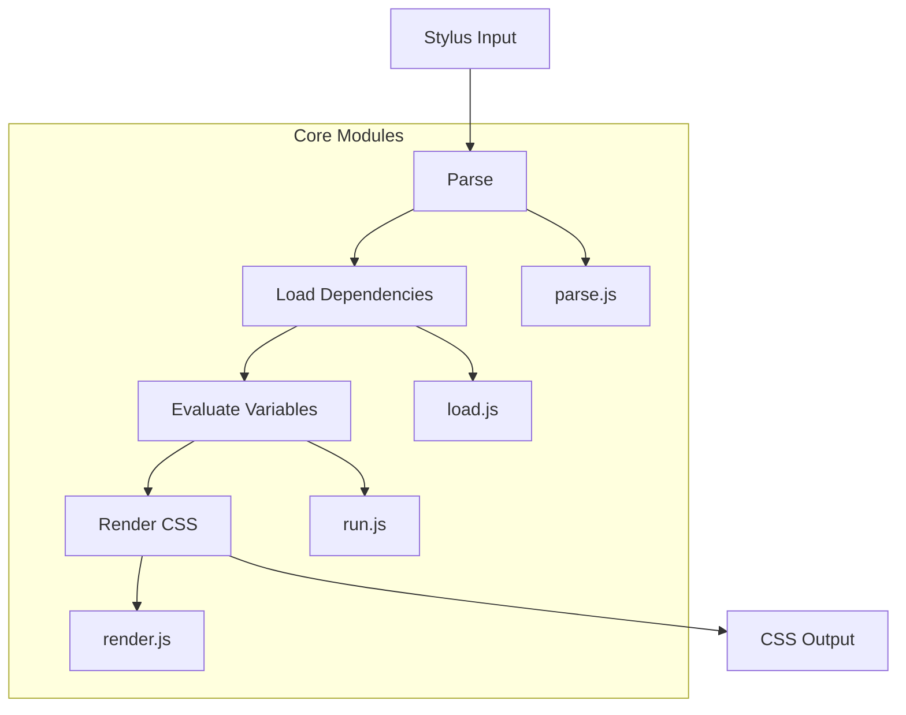

# @1-/stylus : Lightweight modular Stylus CSS preprocessor

## Functionality

Lightweight Stylus CSS preprocessor with modular architecture and dependency tracking capability. Supports Stylus syntax parsing, variable scoping, property computation, dependency loading, circular import detection, and source map generation. Fully compatible with the official Stylus API, serving as a modern replacement for existing Stylus projects.

## Usage demonstration

Install as a dependency:

```bash
npm install @1-/stylus
```

JavaScript usage:

```javascript
import stylus from "@1-/stylus";

// Compile Stylus string
const css = stylus("body\n  color: red").set("filename", "index.styl").render();

// Compile file
import compile from "@1-/stylus/src/compile.js";
const [css, map] = compile("./styles/index.styl", true);
```

## Design rationale

Adopts a clear vertical pipeline architecture with separated responsibilities:



Key implementation features:

- AST nodes use numeric type identifiers (0=variable, 1=property, 2=rule, 3=import, 4=comment) defined in `const.js`
- Circular import detection via file state machine (INIT/LOADING/DONE), with warning output when detected
- Variable scoping implemented with prototype chain inheritance (`Object.create(parent)`), supporting nested scopes
- Source map support with precise line/column mapping using `@jridgewell/gen-mapping` library
- CSS property validation integrated with `known-css-properties` library, supporting standard CSS properties and custom properties
- Path resolution supports URLs, absolute paths, relative paths, and `node_modules` lookup with intelligent caching
- Error handling uses `ERR.js` error code system and `errCloneable.js` for robust error serialization
- External import mode generates CSS `@import` statements from Stylus `@import` directives
- File state caching prevents redundant parsing and enables circular import detection

## Technology stack

- Node.js runtime
- ES modules for dependency analysis
- `@3-/log` for logging
- `@3-/read` for file operations
- `@jridgewell/gen-mapping` for source maps
- `known-css-properties` for CSS property validation

## Code structure

```
src/
├── _.js          # Main export entry point (re-exports stylus.js)
├── compile.js    # Core compilation orchestration
├── const.js      # AST node type constants
├── ERR.js        # Error code definitions
├── errCloneable.js # Error cloning utilities
├── fmt.js        # AST formatting utilities
├── load.js       # Dependency loading and AST expansion
├── parse.js      # Stylus syntax parsing
├── pathResolve.js # Dependency path resolution
├── render.js     # CSS generation from evaluated AST
├── resolve.js    # Path resolution utilities
├── run.js        # Variable evaluation and AST transformation
├── stylus.js     # Official API compatibility wrapper
```

## Historical context

Stylus was created by TJ Holowaychuk in 2010 as part of the early Node.js ecosystem. Designed as a more expressive alternative to Sass and Less, it introduced innovative concepts like optional braces and semicolons, powerful variable scoping, and flexible mixin systems. This implementation continues that legacy with modern JavaScript practices while maintaining compatibility with the established Stylus ecosystem.
