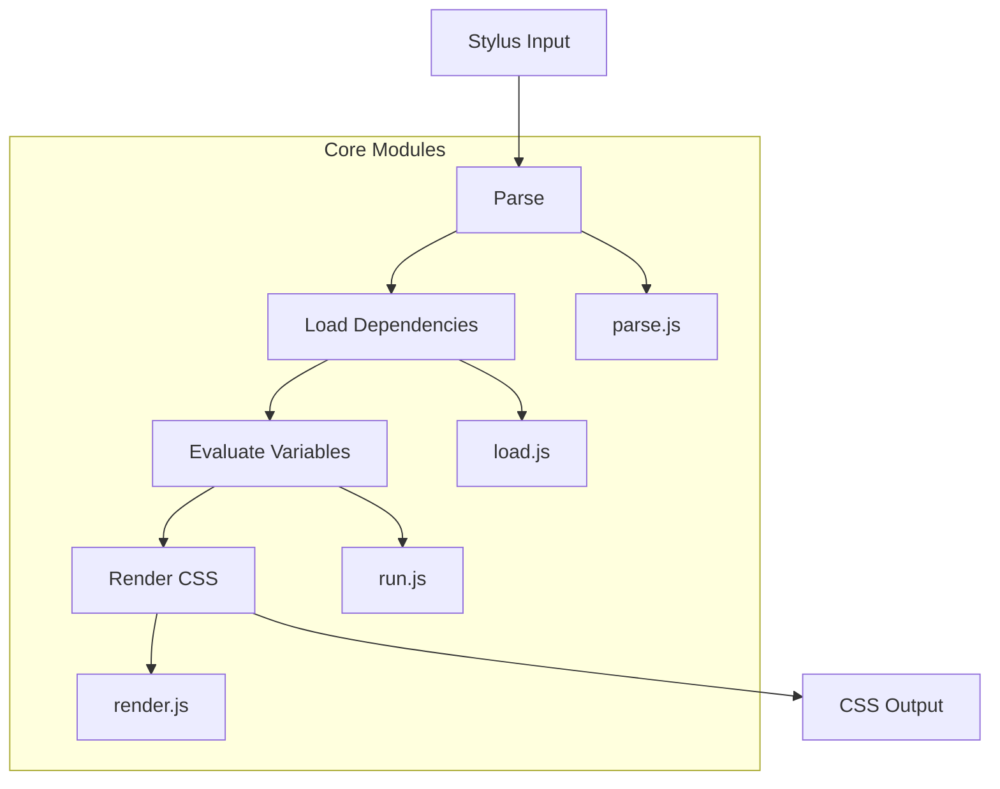

# @1-/stylus : Lightweight modular Stylus CSS preprocessor

## Functionality

Modern lightweight Stylus CSS preprocessor implementation with modular architecture and tree-shaking capability. Supports Stylus and CSS syntax parsing, variable scoping, property computation, dependency loading, circular import detection, and source map generation. Compatible with the official Stylus API, serving as a modern replacement for existing Stylus projects.

## Usage demonstration

Install as a dependency:

```bash
npm install @1-/stylus
```

Basic usage in JavaScript:

```javascript
import stylus from "@1-/stylus";

// Compile Stylus string
const css = stylus("body\n  color: red").set("filename", "index.styl").render();

// Compile file
import compile from "@1-/stylus/src/compile.js";
const [css, map] = compile("./styles/index.styl", true);
```

## Design rationale

Adopts a clear pipeline architecture with separated responsibilities:



Key implementation features:
- AST nodes use numeric type identifiers (0=variable, 1=property, 2=rule, 3=import)
- Circular import detection via file state machine (INIT/LOADING/DONE)
- Variable scoping implemented with prototype chain inheritance (Object.create(parent))
- Source map support with precise line/column mapping
- CSS property validation integrated with known-css-properties library

## Technology stack

- Node.js runtime
- ES modules for tree-shaking
- `@3-/log` for logging
- `@3-/read` for file operations
- `@jridgewell/gen-mapping` for source maps
- `known-css-properties` for CSS property validation

## Code structure

```
src/
├── _.js          # Main export entry point
├── compile.js    # Core compilation orchestration
├── load.js       # Dependency loading and AST expansion
├── run.js        # Variable evaluation and AST transformation
├── render.js     # CSS generation from evaluated AST
├── parse.js      # Stylus syntax parsing
├── stylus.js     # Official API compatibility wrapper
├── const.js      # AST node type constants
├── ERR.js        # Error code definitions
├── resolve.js    # Path resolution utilities
├── pathResolve.js # Dependency path resolution
├── errCloneable.js # Error cloning utilities
```

## Historical context

Stylus was created by TJ Holowaychuk in 2010 as part of the early Node.js ecosystem. Designed as a more expressive alternative to Sass and Less, it introduced innovative concepts like optional braces and semicolons, powerful variable scoping, and flexible mixin systems. This implementation continues that legacy with modern JavaScript practices while maintaining compatibility with the established Stylus ecosystem.