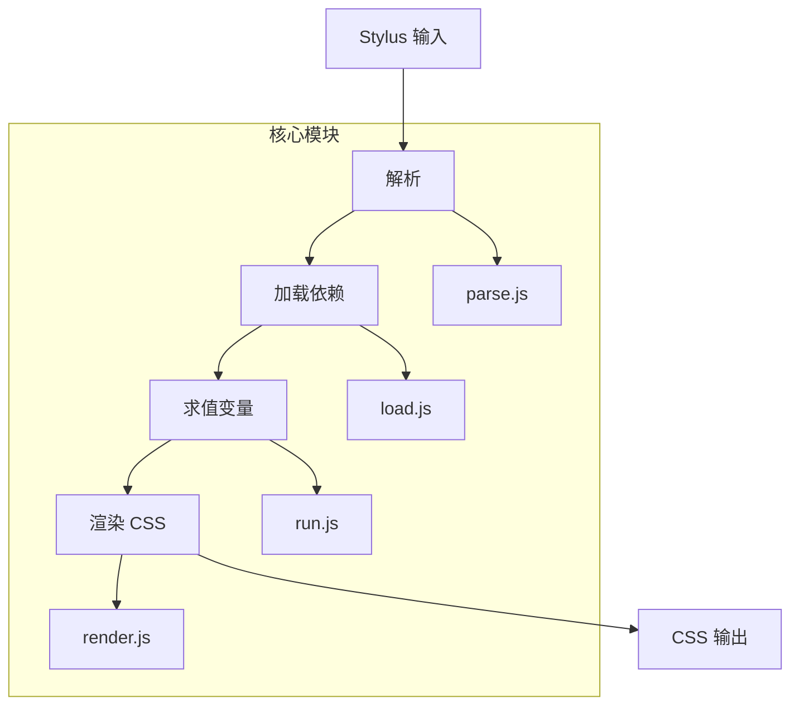

# @1-/stylus : 轻量级模块化 Stylus CSS 预处理器

## 功能介绍

轻量级 Stylus CSS 预处理器，提供模块化架构与依赖跟踪能力。支持 Stylus 语法解析、变量作用域管理、属性计算、依赖加载、循环导入检测和源码映射生成。完全兼容官方 Stylus API，可作为现有 Stylus 项目的现代化替代方案。

## 使用演示

安装为依赖项：

```bash
npm install @1-/stylus
```

JavaScript 基础用法：

```javascript
import stylus from "@1-/stylus";

// 编译 Stylus 字符串
const css = stylus("body\n  color: red").set("filename", "index.styl").render();

// 编译文件
import compile from "@1-/stylus/src/compile.js";
const [css, map] = compile("./styles/index.styl", true);
```

## 设计思路

采用清晰的垂直流水线架构，各模块职责分离：



关键实现特性：

- AST 节点使用数字类型标识（0=变量, 1=属性, 2=规则, 3=导入, 4=注释）定义在 `const.js` 中
- 循环导入检测通过文件状态机（INIT/LOADING/DONE）实现，检测到时输出警告
- 变量作用域采用原型链继承（`Object.create(parent)`），支持嵌套作用域
- 源码映射支持精确的行/列定位，使用 `@jridgewell/gen-mapping` 库
- CSS 属性验证集成 `known-css-properties` 库，支持标准 CSS 属性和自定义属性
- 路径解析支持 URL、绝对路径、相对路径和 `node_modules` 查找，具备智能缓存机制
- 错误处理使用 `ERR.js` 错误码系统和 `errCloneable.js` 错误序列化支持
- 外部导入模式可将 Stylus `@import` 指令转换为 CSS `@import` 语句
- 文件状态缓存防止重复解析，支持循环导入检测

## 技术栈

- Node.js 运行时
- ES 模块支持依赖分析
- `@3-/log` 日志工具
- `@3-/read` 文件操作工具
- `@jridgewell/gen-mapping` 源码映射支持
- `known-css-properties` CSS 属性验证

## 代码结构

```
src/
├── _.js          # 主导出入口文件（重新导出 stylus.js）
├── compile.js    # 核心编译流程协调
├── const.js      # AST 节点类型常量
├── ERR.js        # 错误码定义
├── errCloneable.js # 错误克隆工具
├── fmt.js        # AST 格式化工具
├── load.js       # 依赖加载与 AST 扩展
├── parse.js      # Stylus 语法解析
├── pathResolve.js # 依赖路径解析
├── render.js     # 从求值后 AST 生成 CSS
├── resolve.js    # 路径解析工具
├── run.js        # 变量求值与 AST 转换
├── stylus.js     # 官方 API 兼容包装器
```

## 历史故事

Stylus 由 TJ Holowaychuk 于 2010 年创建，是早期 Node.js 生态系统的重要组成部分。作为 Sass 和 Less 的更具表现力的替代方案，它引入了创新概念，如可选的大括号和分号、强大的变量作用域以及灵活的混合系统。本实现延续这一传统，采用现代 JavaScript 实践，同时保持与现有 Stylus 生态系统的兼容性。
