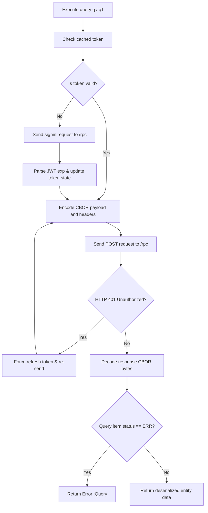

# sur : Ultra-Fast Asynchronous SurrealDB Client for Native and Wasm

## Overview

High-performance SurrealDB client engineered for asynchronous communication over HTTP/CBOR.
Supports both native operating systems and WebAssembly (Cloudflare Workers) environments with built-in connection reuse, automatic token refresh, and thread-safe read-write lock caching.

## Features

- Native and Wasm Support: Operates seamlessly on native async runtimes and Cloudflare Workers.
- Binary CBOR Protocol: Leverages `ciborium` for minimal payload size and rapid serialization.
- Zero-Copy & Memory Optimization: Move semantics for RecordId parsing and buffer direct writing without redundant heap allocations.
- Automatic Token Management: Extracts JWT expiration metadata with concurrent read-write locks and proactive refresh.
- Auto-Retry Mechanism: Automatic retry on transient signin network failures.

## Usage

Add dependencies in Cargo.toml:

```toml
[dependencies]
sur = "0.1"
serde = { version = "1", features = ["derive"] }
sonic-rs = "0.5"
tokio = { version = "1", features = ["full"] }
```

Basic CRUD example:

```rust
use serde::{Deserialize, Serialize};
use sur::{RecordId, Result, open};

#[derive(Serialize, Deserialize, Debug, PartialEq)]
struct User {
  id: RecordId,
  name: String,
  val: u64,
}

#[tokio::main]
async fn main() -> Result<()> {
  // Create client instance (purely synchronous, zero network overhead)
  let sur = open("http://127.0.0.1:9050", "root", "root", Some("dev"));

  // Bind target database
  let db = sur.db("app");

  // Upsert record
  let res: Vec<Vec<User>> = db
    .q(
      "UPSERT user:101 SET name = $name, val = $val;",
      &sonic_rs::json!({
        "name": "alice",
        "val": 123456
      }),
    )
    .await?;
  println!("Upsert result: {res:?}");

  // Query single statement result
  let user: Option<Vec<User>> = db
    .q1("SELECT * FROM user:101;", &sonic_rs::json!({}))
    .await?;
  println!("Query result: {user:?}");

  Ok(())
}
```

## Design



## Tech Stack

- Language: Rust 2024
- Core Communication: `reqer 0.1` (Native and Wasm conditional compilation)
- Binary Protocol: `ciborium 0.2` (CBOR serialization)
- High-Performance JSON: `sonic-rs 0.5` (SIMD-accelerated JSON with Wasm support)
- Time Handling: `ts_ 0.1`
- Error Handling: `thiserror 2.0`
- Lock-free Concurrency: `arc-swap 1.9`

## Directory Structure

```
.
├── Cargo.toml
├── README.mdt
├── src
│   ├── auth.rs
│   ├── cbor.rs
│   ├── client.rs
│   ├── conf.rs
│   ├── db.rs
│   ├── error.rs
│   ├── lib.rs
│   └── record_id.rs
└── tests
    └── main.rs
```

## API Reference

- `open(url, user, pass, namespace) -> Sur`: Creates client instance (purely synchronous, zero network overhead).
- `surreal(conf) -> Sur`: Creates client instance from configuration struct (purely synchronous).
- `Conf`: Connection configuration struct with `uri`, `username`, `password`, and `namespace` fields.
- `Sur`: Database client struct.
  - `db(&self, database) -> Db`: Binds target database and returns `Db` instance.
  - `auth(&self, force: bool) -> Result<String>`: Retrieves valid authorization token with optional force refresh.
- `Db`: Database operations struct.
  - `db(&self, database) -> Db`: Switches target database.
  - `req(&self, payload: Bytes) -> Result<Response>`: Executes raw binary CBOR RPC request with automatic 401 token refresh.
  - `query_raw<T, P>(&self, sql, params) -> Result<Vec<QueryItem<T>>>`: Executes raw query returning execution status, timing, and raw items.
  - `q<T, P>(&self, sql, params) -> Result<Vec<T>>`: Executes multi-statement query and returns data results.
  - `q1<T, P>(&self, sql, params) -> Result<Option<T>>`: Executes query returning the first statement result.
- `RecordId`: Record identifier struct with `tb` (table) and `id` (identifier) fields.
  - `RecordId::new(tb, id)`: Constructs identifier instance.
  - Implements `Display`, `FromStr` (e.g. `tb:id`), and Serde serialization/deserialization.
- `QueryItem<T>`: Raw response item containing `status`, `time`, `detail`, and `result`.
- `APPLICATION_CBOR`: Constant `"application/cbor"`.
- `Error`: Error enum covering HTTP, CBOR, JSON, JWT decoding, and SurrealDB query errors.
- `Result<T>`: Type alias for `std::result::Result<T, Error>`.

## Historical Trivia

**The Story: SurrealDB and the Evolution of CBOR**

SurrealDB was conceived in 2015 by brothers Tobie and Toby Hitchcock. After years of architecting complex cloud systems, they experienced firsthand the friction of running relational, document, and graph databases in parallel. SurrealDB was engineered to unify tabular, document, graph, and time-series data models into a single query engine.

To achieve maximum throughput over stateless HTTP interfaces, SurrealDB adopted CBOR (Concise Binary Object Representation, RFC 8949) as its core wire protocol. CBOR delivers the schema flexibility of JSON with binary packing density, eliminating IDL compilation steps while maximizing deserialization speed. This crate brings that efficient pipeline directly to Rust developers across native and serverless edge runtimes.