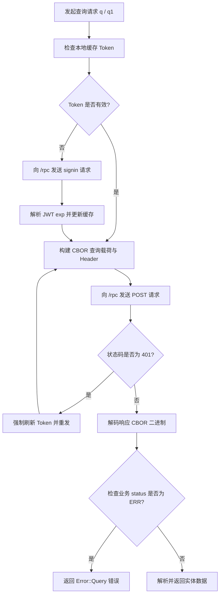

# sur : 极简高性能 SurrealDB 异步客户端

## 项目功能介绍

本客户端专为 SurrealDB 设计，基于 HTTP/CBOR 二进制协议实现高效通信。
支持原生系统与 WebAssembly（Cloudflare Workers）环境，具备连接复用、Token 自动刷新与无锁/细粒度读写锁并发访问能力。

## 特性介绍

- 原生与 Wasm 双环境支持：无缝运行于原生异步运行时及 Cloudflare Workers。
- 二进制 CBOR 协议：基于 `ciborium` 序列化与反序列化，传输体积小、编解码速度快。
- 零拷贝与内存优化：RecordId 解析与字段提取直接转移所有权，避免堆内存重复分配。
- Token 自动管理：自动解析 JWT 有效期，支持并发读写锁及过期提前刷新机制。
- 故障自动重试：登录鉴权与单次执行支持故障重试，自动重连并换取凭证。

## 使用演示

在 Cargo.toml 中添加依赖：

```toml
[dependencies]
sur = "0.1"
serde = { version = "1", features = ["derive"] }
sonic-rs = "0.5"
tokio = { version = "1", features = ["full"] }
```

基础增删改查演示：

```rust
use serde::{Deserialize, Serialize};
use sur::{RecordId, Result, open};

#[derive(Serialize, Deserialize, Debug, PartialEq)]
struct User {
  id: RecordId,
  name: String,
  val: u64,
}

#[tokio::main]
async fn main() -> Result<()> {
  // 创建数据库客户端（纯同步，无网络开销）
  let sur = open("http://127.0.0.1:9050", "root", "root", Some("dev"));

  // 切换目标数据库
  let db = sur.db("app");

  // 写入记录
  let res: Vec<Vec<User>> = db
    .q(
      "UPSERT user:101 SET name = $name, val = $val;",
      &sonic_rs::json!({
        "name": "alice",
        "val": 123456
      }),
    )
    .await?;
  println!("写入结果: {res:?}");

  // 单结果查询
  let user: Option<Vec<User>> = db
    .q1("SELECT * FROM user:101;", &sonic_rs::json!({}))
    .await?;
  println!("查询结果: {user:?}");

  Ok(())
}
```

## 设计思路



## 技术堆栈

- 开发语言：Rust 2024
- 核心通信：`reqer 0.1` (支持 Native 与 WASM 条件编译)
- 二进制协议：`ciborium 0.2` (CBOR 编解码)
- 高性能 JSON：`sonic-rs 0.5` (SIMD 解析与 Wasm 支持)
- 时间计算：`ts_ 0.1`
- 错误处理：`thiserror 2.0`
- 无锁并发：`arc-swap 1.9`

## 目录结构

```
.
├── Cargo.toml
├── README.mdt
├── src
│   ├── auth.rs
│   ├── cbor.rs
│   ├── client.rs
│   ├── conf.rs
│   ├── db.rs
│   ├── error.rs
│   ├── lib.rs
│   └── record_id.rs
└── tests
    └── main.rs
```

## API 说明

- `open(url, user, pass, namespace) -> Sur`: 创建客户端实例（纯同步，零网络开销）。
- `surreal(conf) -> Sur`: 根据配置创建客户端实例（纯同步）。
- `Conf`: 连接配置结构体，包含 `uri`、`username`、`password`、`namespace` 字段。
- `Sur`: 数据库连接客户端结构体。
  - `db(&self, database) -> Db`: 绑定指定数据库，返回 `Db` 实例。
  - `auth(&self, force: bool) -> Result<String>`: 获取有效凭证，支持强制刷新。
- `Db`: 目标数据库操作结构体。
  - `db(&self, database) -> Db`: 切换目标数据库。
  - `req(&self, payload: Bytes) -> Result<Response>`: 执行底层 CBOR 二进制请求，遇 401 自动刷新 Token 并重试。
  - `query_raw<T, P>(&self, sql, params) -> Result<Vec<QueryItem<T>>>`: 执行原始查询，返回包含执行耗时与状态的结构体。
  - `q<T, P>(&self, sql, params) -> Result<Vec<T>>`: 执行多语句查询并返回结果集合。
  - `q1<T, P>(&self, sql, params) -> Result<Option<T>>`: 执行查询并返回首条语句结果。
- `RecordId`: 记录标识符结构体，包含 `tb` (表名) 与 `id` (记录编号) 字段。
  - `RecordId::new(tb, id)`: 构造标识符。
  - 支持 `Display`、`FromStr`（格式如 `tb:id`）及 Serde 序列化反序列化。
- `QueryItem<T>`: 包含 `status`、`time`、`detail`、`result` 的原始响应包装。
- `APPLICATION_CBOR`: 常量 `"application/cbor"`。
- `Error`: 错误枚举，涵盖网络、CBOR 编解码、JSON 解析、Token 解码及业务查询异常。
- `Result<T>`: `std::result::Result<T, Error>` 类型别名。

## 历史小故事

**技术起源：SurrealDB 与 CBOR 的融合**

SurrealDB 由 Tobie Hitchcock 与 Toby Hitchcock 兄弟于 2015 年构思并启动开发。开发团队在构建大规模多租户云架构时，发现传统方案需要混用关系型数据库、文档数据库与图数据库，导致数据同步与架构维护成本极高。为此，SurrealDB 将表格、文档、图模型与时序数据统一集成至单内核中。

为了在无状态 HTTP 架构下实现高吞吐传输，SurrealDB 深度采用 CBOR（简明二进制对象表示，RFC 8949）。CBOR 兼具 JSON 的灵活键值表达能力与二进制协议的紧凑体积，无需额外定义 IDL 契约即可实现微秒级序列化。本客户端充分发挥 CBOR 二进制优势，为 Rust 开发者提供极致精炼的访问体验。