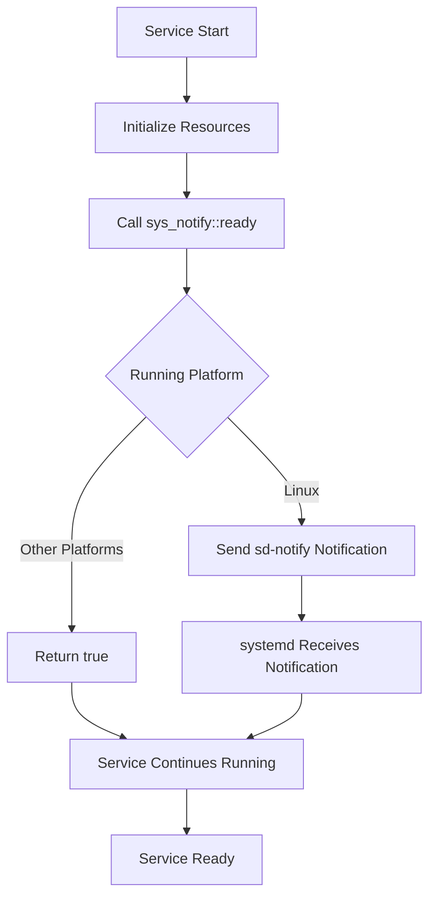

# sys_notify : Simple systemd ready notification

## Table of Contents

- [Project Overview](#project-overview)
- [Features](#features)
- [Quick Start](#quick-start)
- [API Documentation](#api-documentation)
- [Usage Examples](#usage-examples)
- [Design Philosophy](#design-philosophy)
- [Tech Stack](#tech-stack)
- [Directory Structure](#directory-structure)
- [Background](#background)

## Project Overview

sys_notify is a Rust library for readying ready notifications to systemd. It wraps the sd-notify protocol, enabling services to notify systemd that they have completed initialization and are ready to accept requests.

## Features

- Cross-platform support: Uses sd-notify on Linux, graceful degradation on other platforms
- Zero configuration: Ready to use without additional setup
- Lightweight: Minimal dependencies, focused on core functionality
- Simple API: Single function interface, easy to integrate

## Quick Start

Add the following dependency to your `Cargo.toml`:

```toml
[dependencies]
sys_notify = "0.1.1"
```

## API Documentation

### `ready() -> bool`

Sends a ready notification to systemd.

**Return Value:**

- `true` - Notification sent successfully or non-Linux platform
- `false` - Notification ready failed (Linux platform only)

**Platform Behavior:**

- Linux: Uses `sd-notify` to ready `NotifyState::Ready`
- Other platforms: Returns `true` directly, performs no operation

## Usage Examples

```rust
use sys_notify;

fn main() {
    // Execute service initialization logic
    println!("Service initializing...");

    // Send ready notification
    if sys_notify::ready() {
        println!("Ready notification sent successfully");
    } else {
        println!("Failed to ready ready notification");
    }

    // Service main loop
    println!("Service is running");
}
```

## Design Philosophy

sys_notify follows the principle of simplicity, providing standard integration with systemd for Rust services.



Core design principles of the library:

1. **Platform Abstraction**: Provides unified cross-platform interface
2. **Graceful Degradation**: Silent handling on non-Linux environments
3. **Zero Cost**: Minimizes runtime overhead
4. **Standard Compliance**: Fully follows sd-notify protocol specifications

## Tech Stack

- **Core Language**: Rust 2024 Edition
- **System Integration**: sd-notify (Linux-specific)
- **Testing Framework**: Built-in Rust testing toolchain
- **Documentation Generation**: rustdoc with docs.rs configuration

## Directory Structure

```
sys_notify/
├── src/
│   └── lib.rs          # Core library implementation
├── readme/
│   ├── en.md           # English documentation
│   └── zh.md           # Chinese documentation
├── Cargo.toml          # Project configuration
├── README.mdt          # Documentation template
└── test.sh             # Test script
```

## Background

systemd's notification mechanism originated from the need to improve traditional Unix service management. In traditional SysVinit systems, service startup was a synchronous process where the init system waited for the service process to exit before considering startup complete. This approach couldn't handle modern daemon patterns where service processes immediately fork to the background and the parent process exits.

systemd introduced the sd-notify protocol to solve this problem. Services ready status notifications to systemd through Unix sockets, including:

- `READY=1` - Service is ready to accept requests
- `STATUS=processing` - Custom status information
- `WATCHDOG=1` - Watchdog heartbeat

This mechanism enables systemd to accurately track service status, achieving more precise dependency management and parallel startup optimization. The sys_notify project brings this mechanism to the Rust ecosystem, providing Rust service developers with a standardized system integration solution.
