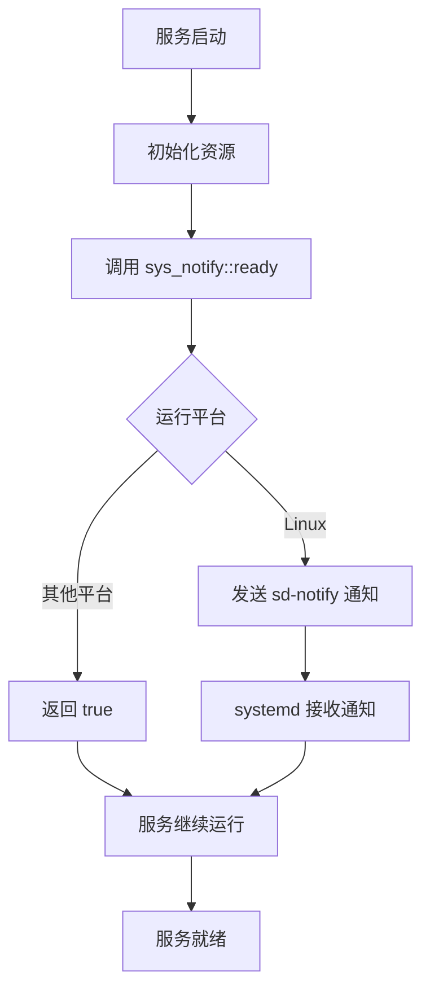

# sys_notify : 简洁的 systemd 就绪通知库

## 目录

- [项目简介](#项目简介)
- [功能特性](#功能特性)
- [快速开始](#快速开始)
- [API 文档](#api-文档)
- [使用示例](#使用示例)
- [设计思路](#设计思路)
- [技术堆栈](#技术堆栈)
- [目录结构](#目录结构)
- [相关历史](#相关历史)

## 项目简介

sys_notify 是用于向 systemd 发送准备就绪通知的 Rust 库。它封装了 sd-notify 协议，使服务能够通知 systemd 它们已完成初始化并准备好接收请求。

## 功能特性

- 跨平台支持：Linux 上使用 sd-notify，其他平台优雅降级
- 零配置：无需额外设置即可使用
- 轻量级：最小依赖，专注核心功能
- 简单 API：单一函数接口，易于集成

## 快速开始

将以下依赖添加到 `Cargo.toml`：

```toml
[dependencies]
sys_notify = "0.1.1"
```

## API 文档

### `ready() -> bool`

发送准备就绪通知到 systemd。

**返回值：**

- `true` - 通知发送成功或非 Linux 平台
- `false` - 通知发送失败（仅限 Linux 平台）

**平台行为：**

- Linux：使用 `sd-notify` 发送 `NotifyState::Ready`
- 其他平台：直接返回 `true`，不执行任何操作

## 使用示例

```rust
use sys_notify;

fn main() {
    // 执行服务初始化逻辑
    println!("服务初始化中...");

    // 发送准备就绪通知
    if sys_notify::ready() {
        println!("就绪通知发送成功");
    } else {
        println!("就绪通知发送失败");
    }

    // 服务主循环
    println!("服务运行中");
}
```

## 设计思路

sys_notify 的设计遵循简洁原则，为 Rust 服务提供与 systemd 的标准集成方式。



库的核心设计理念：

1. **平台抽象**：提供统一的跨平台接口
2. **优雅降级**：非 Linux 环境下静默处理
3. **零成本**：最小化运行时开销
4. **标准兼容**：完全遵循 sd-notify 协议规范

## 技术堆栈

- **核心语言**：Rust 2024 Edition
- **系统集成**：sd-notify（Linux 特有）
- **测试框架**：内置 Rust 测试工具链
- **文档生成**：rustdoc with docs.rs 配置

## 目录结构

```
sys_notify/
├── src/
│   └── lib.rs          # 核心库实现
├── readme/
│   ├── en.md           # 英文文档
│   └── zh.md           # 中文文档
├── Cargo.toml          # 项目配置
├── README.mdt          # 文档模板
└── test.sh             # 测试脚本
```

## 相关历史

systemd 的通知机制源于对传统 Unix 服务管理的改进需求。在传统的 SysVinit 系统中，服务启动是同步过程，init 系统等待服务进程退出后认为启动完成。这种方式无法处理现代的守护进程模式，即服务进程会立即 fork 后台运行而父进程退出。

systemd 引入了 sd-notify 协议来解决这一问题。服务通过 Unix 套接字向 systemd 发送状态通知，包括：

- `READY=1` - 服务已准备好接收请求
- `STATUS=processing` - 自定义状态信息
- `WATCHDOG=1` - 看门狗心跳

这种机制使 systemd 能够准确跟踪服务状态，实现更精确的依赖管理和并行启动优化。sys_notify 项目将这一机制带到 Rust 生态系统中，为 Rust 服务开发者提供标准化的系统集成方案。
