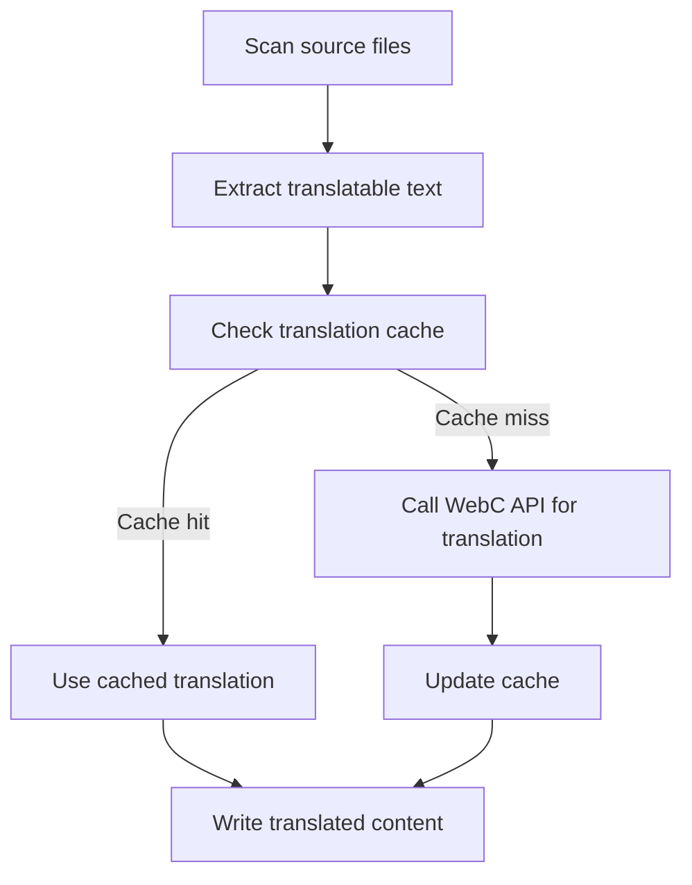
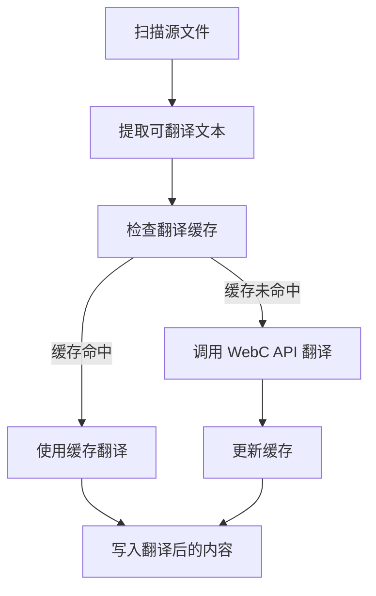

[English](#en) | [中文](#zh)

---

<a id="en"></a>
# @1-/tran : Command-line translation tool for i18n

- [@1-/tran : Command-line translation tool for i18n](#1-tran-command-line-translation-tool-for-i18n)
  - [Functionality](#functionality)
  - [Usage demonstration](#usage-demonstration)
  - [Design approach](#design-approach)
  - [Technology stack](#technology-stack)
  - [Code structure](#code-structure)
  - [Historical context](#historical-context)
  - [About](#about)

## Functionality

@1-/tran automates translation of content across multiple languages. It scans source files for translatable text, executes translation via the WebC translation API, and manages translation caches. The tool specifically supports Markdown and YAML files for internationalization processing, using `@1-/i18n_scan` for text extraction.

## Usage demonstration

Install globally:

```bash
npm install -g @1-/tran
```

Set required environment variables:

```bash
export WEBC_TOKEN="your-api-token"
export WEBC_API="https://api.webc.site/"
```

Or create a configuration file in your home directory `~/.config/webc.site.yml`:

```yaml
token: "your-api-token"
api: "https://api.webc.site/"
```

Create a `tran.yml` configuration file in your project root:

```yaml
tran:
  from: en
  to_li: [zh, ja, ko]
dir: ./src
```

Run the translation tool:

```bash
tran --dir ./src
```

## Design approach

The tool follows a pipeline architecture that implements the complete workflow of source file scanning, text extraction, API translation, and cache management.



## Technology stack

- Node.js runtime
- js-yaml for YAML parsing
- yargs for CLI argument parsing
- @1-/i18n_scan for text scanning
- @3-/lang for language code validation
- @3-/log for error and warning logging
- @3-/req for HTTP requests
- @3-/read for file reading

## Code structure

```
src/
├── _.js          # Main translation logic and API integration
├── cli.js        # Command-line interface entry point
├── conf.js       # Configuration loading and environment variable management
└── toLi.js       # Target language list processing (supports * wildcard)
```

## Historical context

In 1954, Georgetown University and IBM demonstrated the first public machine translation system, automatically translating Russian sentences into English. Using only 250 words and six grammar rules, this experiment marked the formal beginning of computational linguistics and automated translation. Modern tools like @1-/tran inherit this vision, leveraging neural networks and large language models to deliver high-accuracy, context-aware multilingual content processing.

## About

This library is developed by [WebC.site](https://webc.site).

[WebC.site](https://webc.site): A new paradigm of web development for AI


---

<a id="zh"></a>
# @1-/tran : 命令行国际化翻译工具

- [@1-/tran : 命令行国际化翻译工具](#1-tran-命令行国际化翻译工具)
  - [功能介绍](#功能介绍)
  - [使用演示](#使用演示)
  - [设计思路](#设计思路)
  - [技术栈](#技术栈)
  - [代码结构](#代码结构)
  - [历史故事](#历史故事)
  - [关于](#关于)

## 功能介绍

@1-/tran 自动化多语言内容翻译。它扫描源文件提取可翻译文本，通过 WebC 翻译 API 执行翻译，并管理翻译缓存。该工具专门支持 Markdown 和 YAML 文件的国际化处理，使用 `@1-/i18n_scan` 进行文本提取。

## 使用演示

全局安装：

```bash
npm install -g @1-/tran
```

设置必需的环境变量：

```bash
export WEBC_TOKEN="your-api-token"
export WEBC_API="https://api.webc.site/"
```

或在用户主目录创建配置文件 `~/.config/webc.site.yml`：

```yaml
token: "your-api-token"
api: "https://api.webc.site/"
```

在项目根目录创建 `tran.yml` 配置文件：

```yaml
tran:
  from: en
  to_li: [zh, ja, ko]
dir: ./src
```

运行翻译工具：

```bash
tran --dir ./src
```

## 设计思路

该工具采用流水线架构，实现源文件扫描、文本提取、API 翻译和缓存管理的完整工作流程。



## 技术栈

- Node.js 运行时
- js-yaml 用于 YAML 解析
- yargs 用于命令行参数解析
- @1-/i18n_scan 用于文本扫描
- @3-/lang 用于语言代码验证
- @3-/log 用于错误和警告日志
- @3-/req 用于 HTTP 请求
- @3-/read 用于文件读取

## 代码结构

```
src/
├── _.js          # 主翻译逻辑和 API 集成
├── cli.js        # 命令行接口入口点
├── conf.js       # 配置加载与环境变量管理
└── toLi.js       # 目标语言列表处理（支持 * 通配符）
```

## 历史故事

1954 年，乔治城大学与 IBM 合作完成首次公开的机器翻译演示，将俄语句子自动翻译为英语。该实验仅使用 250 个词汇和六条语法规则，却标志着计算语言学与自动化翻译的正式开端。现代工具如 @1-/tran 继承这一理念，依托神经网络与大语言模型，实现高精度、上下文感知的多语言内容处理。

## 关于

本库由 [WebC.site](https://webc.site) 开发。

[WebC.site](https://webc.site) : 面向人工智能的网站开发新范式

