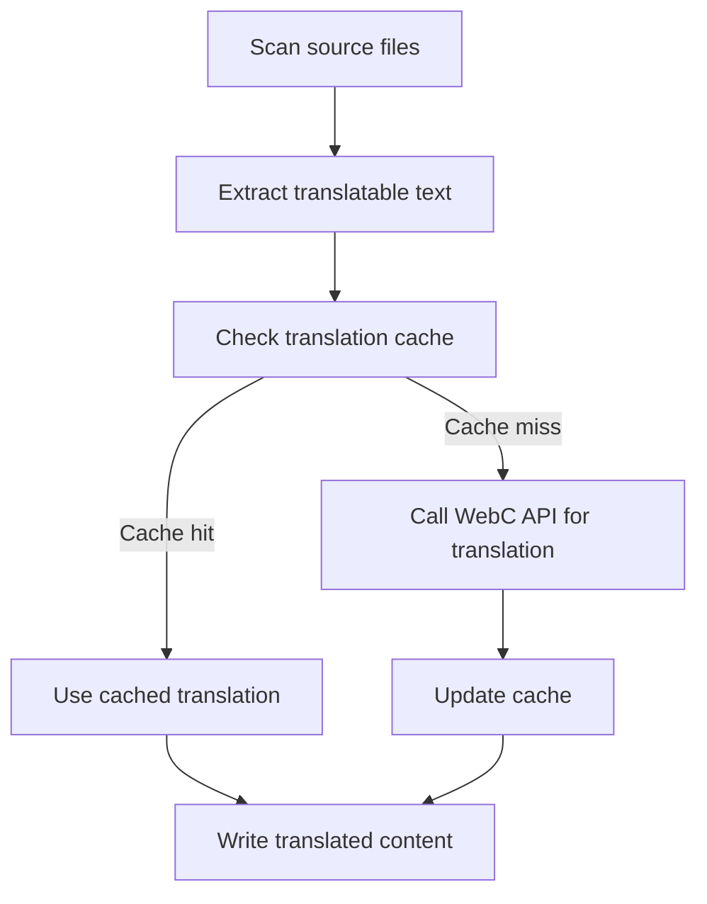

# @1-/tran : Command-line translation tool for i18n

## Functionality

@1-/tran automates translation of content across multiple languages. It scans source files for translatable text, executes translation via the WebC translation API, and manages translation caches. The tool specifically supports Markdown (.md) and YAML (.yml) files for internationalization processing, using `@1-/i18n_scan` for text extraction, with cache directory `.cache/scan/tran`.

## Usage demonstration

Install globally:

```bash
npm install -g @1-/tran
```

Set required environment variables:

```bash
export WEBC_TOKEN="your-api-token"
export WEBC_API="https://api.webc.site/"
```

Or create a configuration file in your home directory `~/.config/webc.site.yml`:

```yaml
token: "your-api-token"
api: "https://api.webc.site/"
```

Create a `tran.yml` configuration file in your project root:

```yaml
tran:
  from: en
  to_li: [zh, ja, ko]
dir: ./src
```

Run the translation tool:

```bash
tran --dir ./src
```

## Design approach

The tool follows a pipeline architecture that implements the complete workflow of source file scanning, text extraction, API translation, and cache management.



## Technology stack

- Node.js runtime
- js-yaml for YAML parsing
- yargs for CLI argument parsing
- @1-/i18n_scan for text scanning
- @3-/lang for language code validation
- @3-/log for error and warning logging
- @3-/req for HTTP requests
- @3-/read for file reading
- @3-/plimit for request limiting

## Code structure

```
src/
├── _.js          # Main translation logic and API integration
├── cli.js        # Command-line interface entry point
├── conf.js       # Configuration loading and environment variable management
├── limit.js      # Request limiter (concurrency limit of 32)
└── toLi.js       # Target language list processing (supports * wildcard)
```

## Historical context

In 1954, Georgetown University and IBM demonstrated the first public machine translation system, automatically translating Russian sentences into English. Using only 250 words and six grammar rules, this experiment marked the formal beginning of computational linguistics and automated translation. Modern tools like @1-/tran inherit this vision, leveraging neural networks and large language models to deliver high-accuracy, context-aware multilingual content processing.
