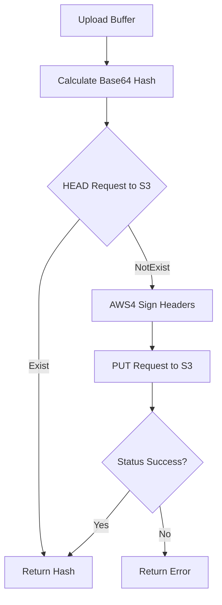
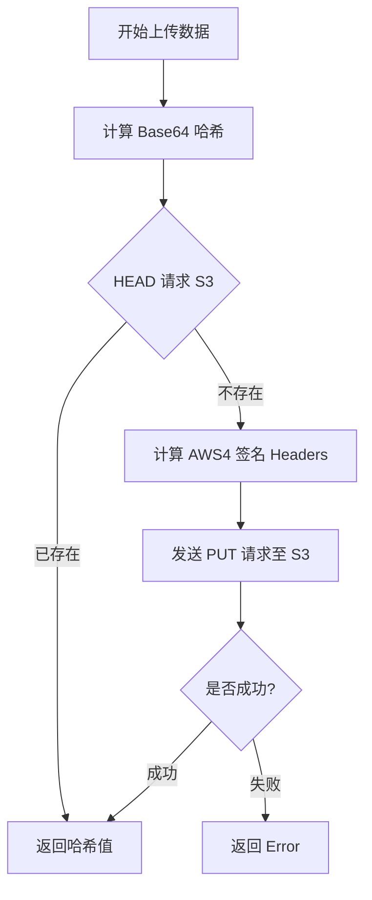

[English](#en) | [中文](#zh)

---

<a id="en"></a>
# upload : High-performance S3 client with content-addressable deduplication

- [upload : High-performance S3 client with content-addressable deduplication](#upload-high-performance-s3-client-with-content-addressable-deduplication)
  - [Features](#features)
  - [Usage](#usage)
  - [Design](#design)
  - [Tech Stack](#tech-stack)
  - [Directory Structure](#directory-structure)
  - [API Description](#api-description)
    - [`S3`](#s3)
      - [`S3::new`](#s3new)
      - [`S3::upload`](#s3upload)
      - [`S3::upload_xhash`](#s3upload_xhash)
      - [`S3::delete`](#s3delete)
    - [`Conf`](#conf)
    - [`Error`](#error)
  - [Historical Trivia](#historical-trivia)
  - [About](#about)

High-performance S3 client library. Uses content-addressable storage for client-side deduplication.

## Features

- **Content-Addressable (Optional)**: Generates unique Base64 hash from buffer as object key (requires `xhash` feature).
- **Client-Side Deduplication (Optional)**: Checks object existence via HEAD request; skips upload if present (requires `xhash` feature).
- **High Performance**: Built on `hipstr`, `xhash`, `reqwest`, `jiff` with zero runtime overhead design.
- **AWS4 Signature**: Built-in minimal implementation of AWS Signature Version 4.

## Usage

```rust
use upload::{Conf, S3};

#[tokio::main]
async fn main() -> Result<(), Box<dyn std::error::Error>> {
  let uploader = S3::new(
    "YOUR_S3_ID",
    "YOUR_S3_SK",
    "s3.us-west-004.backblazeb2.com",
    "my-bucket",
    "us-west-004",
    []
  );

  let data = b"hello world";
  // Basic upload to "hello-path" with MIME auto-detection
  uploader.upload("hello-path", "hello.txt", &data[..]).await?;

  // Delete file by path
  uploader.delete("hello-path").await?;
  Ok(())
}
```

## Design

Identifies objects using cryptographic hash of file content. Upload process:



## Tech Stack

- **HTTP Client**: `reqwest` (rustls)
- **Time Library**: `jiff`
- **Hash Algorithm**: `sha2`, `hmac`
- **Fast Hashing**: `xhash` (Base64 hash encoding)
- **Efficient Strings**: `hipstr` (static/shared string reference)
- **Error Handling**: `thiserror`
- **Timestamp Provider**: `ts_`

## Directory Structure

```text
.
├── Cargo.toml
├── src
│   ├── error.rs
│   ├── lib.rs
│   └── s3
│       ├── mod.rs
│       ├── sign.rs
│       └── upload_xhash.rs
└── tests
    └── main.rs
```

## API Description

### `S3`

S3 client structure.

```rust
pub struct S3 {
  pub s3_id: HipStr<'static>,
  pub s3_sk: HipStr<'static>,
  pub s3_region: HipStr<'static>,
  pub url_prefix: HipStr<'static>,
  pub cache_control: HipStr<'static>,
  pub client: reqwest::Client,
}
```

#### `S3::new`

Constructs S3 client.

Parameters:
- `s3_id`: Credentials identifier.
- `s3_sk`: Secret key.
- `s3_host`: S3 endpoint host.
- `s3_bucket`: Destination bucket.
- `s3_region`: S3 region.
- `conf_li`: List of client configurations (`Conf`).

#### `S3::upload`

Uploads buffer to specified path.

Parameters:
- `path`: Destination object path (`impl AsRef<str>`).
- `file_name`: File name (`impl AsRef<str>`, used to detect MIME type via `ext_mime`).
- `buf`: File content buffer.

#### `S3::upload_xhash`

Uploads buffer with content-addressable deduplication. Returns Base64 hash string (requires `xhash` feature).

Parameters:
- `file_name`: File name (`impl AsRef<str>`, used to detect MIME type via `ext_mime`).
- `buf`: File content buffer.

#### `S3::delete`

Deletes object by path.

Parameters:
- `path`: S3 object path (`impl AsRef<str>`).

### `Conf`

Optional configurations enum.

```rust
pub enum Conf {
  Client(reqwest::Client),
  CacheControl(HipStr<'static>),
  Timeout(Duration),
  ConnectTimeout(Duration),
}
```

### `Error`

Crate errors enum.

```rust
pub enum Error {
  Reqwest(reqwest::Error),
  Jiff(jiff::Error),
  InvalidHeaderValue(InvalidHeaderValue),
  RequestFailed(reqwest::StatusCode),
}
```

## Historical Trivia

Content-Addressable Storage (CAS) concept originated in 1955 when Dudley Allen Buck invented Content-Addressable Memory (CAM). In 2002, EMC released Centera, establishing modern CAS standard driven by Sarbanes-Oxley Act compliance requirements. Today, CAS forms structural basis of Git, Docker, and IPFS.

## About

This library is developed by [WebC.site](https://webc.site).

[WebC.site](https://webc.site): A new paradigm of web development for AI


---

<a id="zh"></a>
# upload : 极简高性能内容寻址去重 S3 文件上传库

- [upload : 极简高性能内容寻址去重 S3 文件上传库](#upload-极简高性能内容寻址去重-s3-文件上传库)
  - [项目功能介绍](#项目功能介绍)
  - [使用演示](#使用演示)
  - [设计思路](#设计思路)
  - [技术堆栈](#技术堆栈)
  - [目录结构](#目录结构)
  - [API 说明](#api-说明)
    - [`S3`](#s3)
      - [`S3::new`](#s3new)
      - [`S3::upload`](#s3upload)
      - [`S3::upload_xhash`](#s3upload_xhash)
      - [`S3::delete`](#s3delete)
    - [`Conf`](#conf)
    - [`Error`](#error)
  - [历史小故事](#历史小故事)
  - [关于](#关于)

高性能 S3 客户端。采用内容寻址存储设计，支持客户端去重。

## 项目功能介绍

- **内容寻址（可选）**：根据数据内容生成唯一 Base64 哈希值作为键值（需要 `xhash` 特性）。
- **客户端去重（可选）**：上传前发送 HEAD 请求；文件若已存在则直接返回，避免重复上传（需要 `xhash` 特性）。
- **高性能设计**：基于 `hipstr`、`xhash`、`reqwest`、`jiff` 与 `ts_`，追求零运行时开销。
- **内置签名**：提供极简 AWS Signature Version 4 签名实现。

## 使用演示

```rust
use upload::{Conf, S3};

#[tokio::main]
async fn main() -> Result<(), Box<dyn std::error::Error>> {
  let uploader = S3::new(
    "YOUR_S3_ID",
    "YOUR_S3_SK",
    "s3.us-west-004.backblazeb2.com",
    "my-bucket",
    "us-west-004",
    []
  );

  let data = b"hello world";
  // 纯上传数据至 "hello-path"，自动检测媒体类型
  uploader.upload("hello-path", "hello.txt", &data[..]).await?;

  // 删除文件
  uploader.delete("hello-path").await?;
  Ok(())
}
```

## 设计思路

根据数据内容哈希值标识对象。上传流程如下：



## 技术堆栈

- **HTTP 客户端**：`reqwest` (rustls)
- **时间处理**：`jiff`
- **签名算法**：`sha2`、`hmac`
- **快速哈希**：`xhash` (Base64 编码)
- **高效字符串**：`hipstr` (静态/共享引用)
- **错误定义**：`thiserror`
- **时间戳源**：`ts_`

## 目录结构

```text
.
├── Cargo.toml
├── src
│   ├── error.rs
│   ├── lib.rs
│   └── s3
│       ├── mod.rs
│       ├── sign.rs
│       └── upload_xhash.rs
└── tests
    └── main.rs
```

## API 说明

### `S3`

S3 客户端结构体。

```rust
pub struct S3 {
  pub s3_id: HipStr<'static>,
  pub s3_sk: HipStr<'static>,
  pub s3_region: HipStr<'static>,
  pub url_prefix: HipStr<'static>,
  pub cache_control: HipStr<'static>,
  pub client: reqwest::Client,
}
```

#### `S3::new`

创建 S3 客户端实例。

参数：
- `s3_id`：凭证标识符。
- `s3_sk`：私钥。
- `s3_host`：S3 终端节点主机。
- `s3_bucket`：目标存储桶。
- `s3_region`：S3 区域。
- `conf_li`：客户端配置项列表 (`Conf`)。

#### `S3::upload`

上传字节流至指定路径。

参数：
- `path`：目标对象路径 (`impl AsRef<str>`)。
- `file_name`：文件名 (`impl AsRef<str>`，用于检测媒体类型)。
- `buf`：上传数据缓冲区。

#### `S3::upload_xhash`

采用内容寻址去重上传。返回 Base64 编码哈希值（需要 `xhash` 特性）。

参数：
- `file_name`：文件名 (`impl AsRef<str>`，用于检测媒体类型)。
- `buf`：上传数据缓冲区。

#### `S3::delete`

根据路径删除对象。

参数：
- `path`：S3 对象路径 (`impl AsRef<str>`)。

### `Conf`

可选配置项枚举。

```rust
pub enum Conf {
  Client(reqwest::Client),
  CacheControl(HipStr<'static>),
  Timeout(Duration),
  ConnectTimeout(Duration),
}
```

### `Error`

库级错误枚举。

```rust
pub enum Error {
  Reqwest(reqwest::Error),
  Jiff(jiff::Error),
  InvalidHeaderValue(InvalidHeaderValue),
  RequestFailed(reqwest::StatusCode),
}
```

## 历史小故事

内容寻址存储 (CAS) 概念源于 1955 年 Dudley Allen Buck 发明的内容寻址内存 (CAM)。2002 年，EMC 发布 Centera，确立现代 CAS 标准，主要满足 Sarbanes-Oxley 法案的合规数据归档需求。如今，CAS 成为 Git、Docker、IPFS 的底层基石。

## 关于

本库由 [WebC.site](https://webc.site) 开发。

[WebC.site](https://webc.site) : 面向人工智能的网站开发新范式

