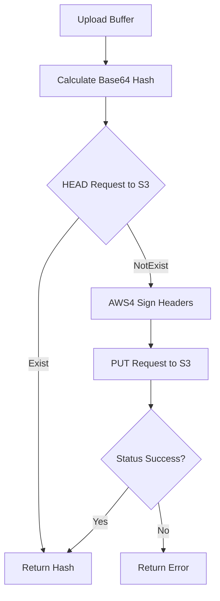

# upload : High-performance S3 client with content-addressable deduplication

High-performance S3 client library. Uses content-addressable storage for client-side deduplication.

## Features

- **Content-Addressable (Optional)**: Generates unique Base64 hash from buffer as object key (requires `xhash` feature).
- **Client-Side Deduplication (Optional)**: Checks object existence via HEAD request; skips upload if present (requires `xhash` feature).
- **High Performance**: Built on `hipstr`, `xhash`, `reqwest`, `jiff` with zero runtime overhead design.
- **AWS4 Signature**: Built-in minimal implementation of AWS Signature Version 4.

## Usage

```rust
use upload::{Conf, S3};

#[tokio::main]
async fn main() -> Result<(), Box<dyn std::error::Error>> {
  let uploader = S3::new(
    "YOUR_S3_ID",
    "YOUR_S3_SK",
    "s3.us-west-004.backblazeb2.com",
    "my-bucket",
    "us-west-004",
    []
  );

  let data = b"hello world";
  // Basic upload to "hello-path" with MIME auto-detection
  uploader.upload("hello-path", "hello.txt", &data[..]).await?;

  // Delete file by path
  uploader.delete("hello-path").await?;
  Ok(())
}
```

## Design

Identifies objects using cryptographic hash of file content. Upload process:



## Tech Stack

- **HTTP Client**: `reqwest` (rustls)
- **Time Library**: `jiff`
- **Hash Algorithm**: `sha2`, `hmac`
- **Fast Hashing**: `xhash` (Base64 hash encoding)
- **Efficient Strings**: `hipstr` (static/shared string reference)
- **Error Handling**: `thiserror`
- **Timestamp Provider**: `ts_`

## Directory Structure

```text
.
├── Cargo.toml
├── src
│   ├── error.rs
│   ├── lib.rs
│   └── s3
│       ├── mod.rs
│       ├── sign.rs
│       └── upload_xhash.rs
└── tests
    └── main.rs
```

## API Description

### `S3`

S3 client structure.

```rust
pub struct S3 {
  pub s3_id: HipStr<'static>,
  pub s3_sk: HipStr<'static>,
  pub s3_region: HipStr<'static>,
  pub url_prefix: HipStr<'static>,
  pub cache_control: HipStr<'static>,
  pub client: reqwest::Client,
}
```

#### `S3::new`

Constructs S3 client.

Parameters:
- `s3_id`: Credentials identifier.
- `s3_sk`: Secret key.
- `s3_host`: S3 endpoint host.
- `s3_bucket`: Destination bucket.
- `s3_region`: S3 region.
- `conf_li`: List of client configurations (`Conf`).

#### `S3::upload`

Uploads buffer to specified path.

Parameters:
- `path`: Destination object path (`impl AsRef<str>`).
- `file_name`: File name (`impl AsRef<str>`, used to detect MIME type via `ext_mime`).
- `buf`: File content buffer.

#### `S3::upload_xhash`

Uploads buffer with content-addressable deduplication. Returns Base64 hash string (requires `xhash` feature).

Parameters:
- `file_name`: File name (`impl AsRef<str>`, used to detect MIME type via `ext_mime`).
- `buf`: File content buffer.

#### `S3::delete`

Deletes object by path.

Parameters:
- `path`: S3 object path (`impl AsRef<str>`).

### `Conf`

Optional configurations enum.

```rust
pub enum Conf {
  Client(reqwest::Client),
  CacheControl(HipStr<'static>),
  Timeout(Duration),
  ConnectTimeout(Duration),
}
```

### `Error`

Crate errors enum.

```rust
pub enum Error {
  Reqwest(reqwest::Error),
  Jiff(jiff::Error),
  InvalidHeaderValue(InvalidHeaderValue),
  RequestFailed(reqwest::StatusCode),
}
```

## Historical Trivia

Content-Addressable Storage (CAS) concept originated in 1955 when Dudley Allen Buck invented Content-Addressable Memory (CAM). In 2002, EMC released Centera, establishing modern CAS standard driven by Sarbanes-Oxley Act compliance requirements. Today, CAS forms structural basis of Git, Docker, and IPFS.