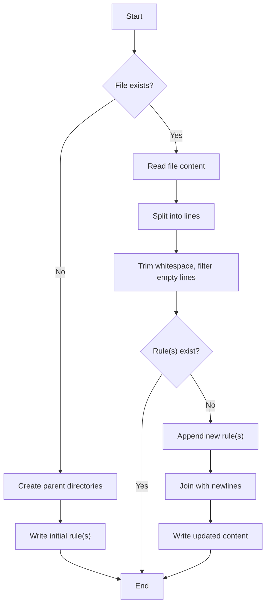
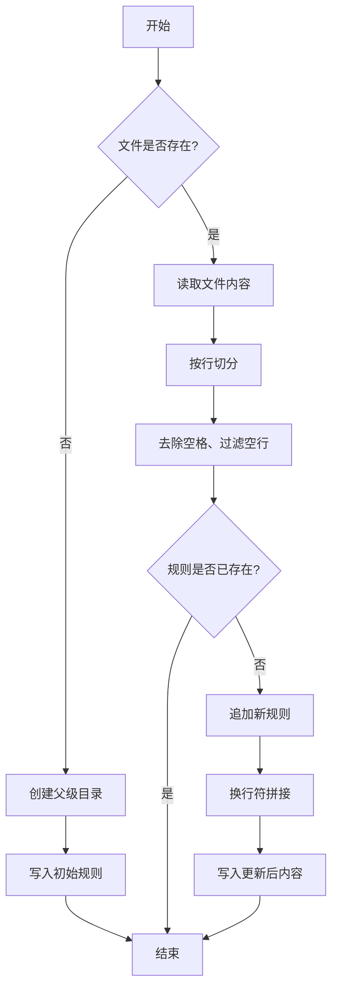

[English](#en) | [中文](#zh)

---

<a id="en"></a>
# @1-/upsert_gitignore : Safely and idempotently update .gitignore rules

- [@1-/upsert_gitignore : Safely and idempotently update .gitignore rules](#1-upsert_gitignore-safely-and-idempotently-update-gitignore-rules)
  - [Functionality](#functionality)
  - [Usage demonstration](#usage-demonstration)
  - [Design思路](#design思路)
  - [Technology stack](#technology-stack)
  - [Code structure](#code-structure)
  - [Historical context](#historical-context)
  - [About](#about)

## Functionality

Append ignore rules to target files with idempotent behavior.

Prevent duplicate entries by checking existence before appending.

Handle edge cases: create parent directories, trim whitespace, filter empty lines.

## Usage demonstration

```javascript
import upsertGitignore from "@1-/upsert_gitignore";

const filePath = "./.gitignore";

// Append "node_modules" if not present
upsertGitignore(filePath, "node_modules");

// Idempotent: no operation since "node_modules" already exists
upsertGitignore(filePath, "node_modules");

// Support multiple rules
upsertGitignore(filePath, ["dist", ".env", "node_modules"]);
```

## Design思路



## Technology stack

- Runtime: Bun / Node.js
- Core dependencies: `@3-/txt_li`, `@3-/write`, `@3-/read`
- License: MulanPSL-2.0

## Code structure

```
src/
└── _.js      # Core implementation
tests/
└── _.test.js # Unit tests
```

## Historical context

Git introduced `.gitignore` in 2005 as part of its initial release. Early workflows used manual editing or fragile shell scripts like `echo "node_modules" >> .gitignore`.

The rise of CI/CD pipelines and project scaffolding tools created demand for deterministic configuration management. This library implements the idempotent pattern to ensure consistent state regardless of execution frequency.

Idempotence is essential for infrastructure-as-code systems where configuration must converge to desired state without side effects from repeated application.

## About

This library is developed by [WebC.site](https://webc.site).

[WebC.site](https://webc.site): A new paradigm of web development for AI


---

<a id="zh"></a>
# @1-/upsert_gitignore : 安全幂等更新 .gitignore 规则

- [@1-/upsert_gitignore : 安全幂等更新 .gitignore 规则](#1-upsert_gitignore-安全幂等更新-gitignore-规则)
  - [功能介绍](#功能介绍)
  - [使用演示](#使用演示)
  - [设计思路](#设计思路)
  - [技术栈](#技术栈)
  - [代码结构](#代码结构)
  - [历史故事](#历史故事)
  - [关于](#关于)

## 功能介绍

追加忽略规则至目标文件，具备幂等特性。

通过存在性检查避免重复条目。

处理边界情况：自动创建父级目录、去除空格、过滤空行。

## 使用演示

```javascript
import upsertGitignore from "@1-/upsert_gitignore";

const filePath = "./.gitignore";

// 若未包含 "node_modules"，则追加
upsertGitignore(filePath, "node_modules");

// 幂等：已存在时无操作
upsertGitignore(filePath, "node_modules");

// 支持多规则批量处理
upsertGitignore(filePath, ["dist", ".env", "node_modules"]);
```

## 设计思路



## 技术栈

- 运行环境：Bun / Node.js
- 核心依赖：`@3-/txt_li`、`@3-/write`、`@3-/read`
- 许可证：MulanPSL-2.0

## 代码结构

```
src/
└── _.js      # 核心实现
tests/
└── _.test.js # 单元测试
```

## 历史故事

Git 于 2005 年随初始版本发布引入 `.gitignore`。早期工作流依赖手动编辑或脆弱的 Shell 脚本，如 `echo "node_modules" >> .gitignore`。

CI/CD 流水线和项目脚手架工具的普及催生了确定性配置管理需求。本库实现幂等模式，确保执行频率不影响最终状态。

幂等性是基础设施即代码系统的关键特性，配置必须收敛至期望状态且无重复应用副作用。

## 关于

本库由 [WebC.site](https://webc.site) 开发。

[WebC.site](https://webc.site) : 面向人工智能的网站开发新范式

