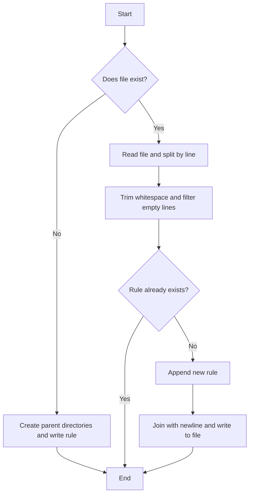
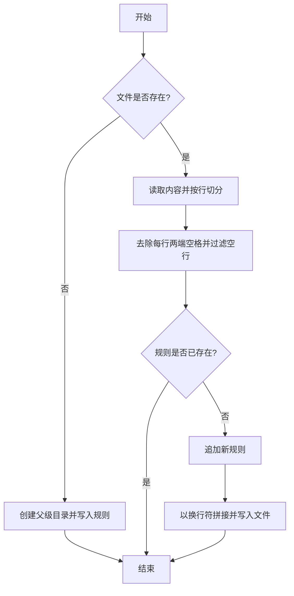

[English](#en) | [中文](#zh)

---

<a id="en"></a>
# @1-/upsert_gitignore : Safely and idempotently update .gitignore rules

- [@1-/upsert_gitignore : Safely and idempotently update .gitignore rules](#1-upsert_gitignore-safely-and-idempotently-update-gitignore-rules)
  - [About](#about)

1. Features

Safely and idempotently append ignore rules to target files (e.g., `.gitignore`).

Avoid duplicate entries if the rule already exists.

Trim whitespace and filter out empty lines.

Create parent directories for the target file.

2. Usage

```javascript
import upsertGitignore from "@1-/upsert_gitignore";

const filePath = "./.gitignore";

// Appends "node_modules" if not present
upsertGitignore(filePath, "node_modules");

// Idempotent: does nothing since "node_modules" already exists
upsertGitignore(filePath, "node_modules");
```

3. Design



4. Tech Stack

- Runtime: Bun / Node.js
- Dependency: `@3-/txt_li`
- Dependency: `@3-/write`
- Dependency: `@3-/read`

5. Code Structure

```
src/
└── _.js      # Core logic
tests/
└── _.test.js # Unit tests
```

6. History

Git was released in 2005. Early developers managed ignore rules manually or wrote shell scripts.

With the rise of project scaffolding and build automation, programmatically configuring ignore rules became essential.

Naive append commands like `echo "node_modules" >> .gitignore` caused duplicate rules and formatting issues.

This library provides a safe, idempotent API to solve automation configuration issues.


## About

This library is developed by [WebC.site](https://webc.site).

[WebC.site](https://webc.site): A new paradigm of web development for AI


---

<a id="zh"></a>
# @1-/upsert_gitignore : 安全幂等更新 .gitignore 规则

- [@1-/upsert_gitignore : 安全幂等更新 .gitignore 规则](#1-upsert_gitignore-安全幂等更新-gitignore-规则)
  - [关于](#关于)

1. 功能介绍

安全幂等向指定文件（如 `.gitignore`）追加忽略规则。

若规则已存在则保持原样，避免重复。

读取时自动过滤空行并去除各行两端空格。

自动创建目标文件父级目录。

2. 使用演示

```javascript
import upsertGitignore from "@1-/upsert_gitignore";

const filePath = "./.gitignore";

// 若 .gitignore 不存在或未包含 "node_modules"，将自动追加
upsertGitignore(filePath, "node_modules");

// 再次调用，检测到已存在，不重复追加
upsertGitignore(filePath, "node_modules");
```

3. 设计思路



4. 技术栈

- 运行环境: Bun / Node.js
- 依赖: `@3-/txt_li`
- 依赖: `@3-/write`
- 依赖: `@3-/read`

5. 代码结构

```
src/
└── _.js      # 核心逻辑
tests/
└── _.test.js # 单元测试
```

6. 历史故事

Git 于 2005 年诞生。早期开发者需手动或编写 shell 脚本管理忽略规则。

项目脚手架与自动化工具普及后，程序化配置忽略规则成为刚需。

常规追加命令 `echo "node_modules" >> .gitignore` 易致格式混乱与规则重复。

本库提供安全幂等的 API，解决自动化工具链配置忽略规则的痛点。


## 关于

本库由 [WebC.site](https://webc.site) 开发。

[WebC.site](https://webc.site) : 面向人工智能的网站开发新范式

