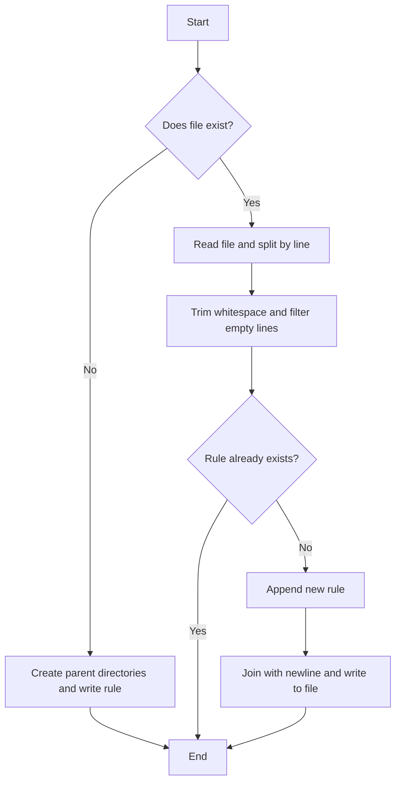

# @1-/upsert_gitignore : Safely and idempotently update .gitignore rules

1. Features

Safely and idempotently append ignore rules to target files (e.g., `.gitignore`).

Avoid duplicate entries if the rule already exists.

Trim whitespace and filter out empty lines.

Create parent directories for the target file.

2. Usage

```javascript
import upsertGitignore from "@1-/upsert_gitignore";

const filePath = "./.gitignore";

// Appends "node_modules" if not present
upsertGitignore(filePath, "node_modules");

// Idempotent: does nothing since "node_modules" already exists
upsertGitignore(filePath, "node_modules");
```

3. Design



4. Tech Stack

- Runtime: Bun / Node.js
- Dependency: `@3-/txt_li`
- Dependency: `@3-/write`
- Dependency: `@3-/read`

5. Code Structure

```
src/
└── _.js      # Core logic
tests/
└── _.test.js # Unit tests
```

6. History

Git was released in 2005. Early developers managed ignore rules manually or wrote shell scripts.

With the rise of project scaffolding and build automation, programmatically configuring ignore rules became essential.

Naive append commands like `echo "node_modules" >> .gitignore` caused duplicate rules and formatting issues.

This library provides a safe, idempotent API to solve automation configuration issues.
