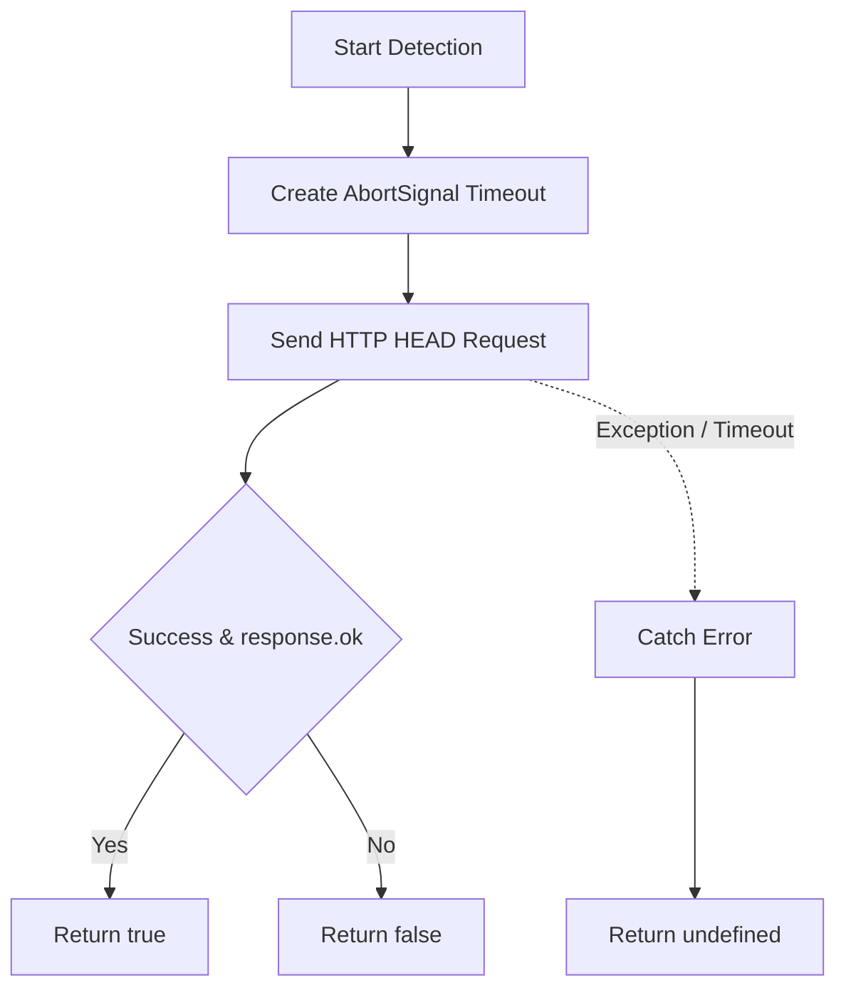
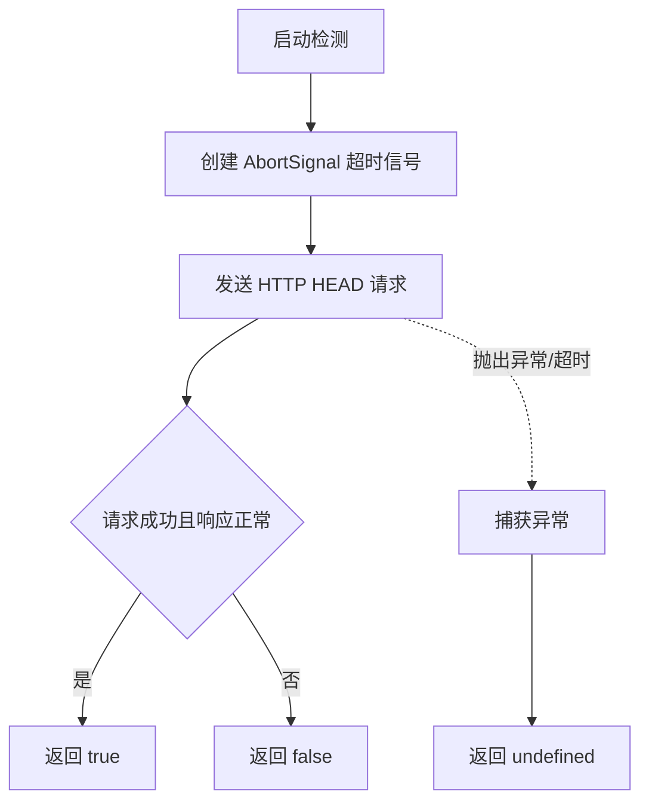

[English](#en) | [中文](#zh)

---

<a id="en"></a>

# @1-/url_exist : Detect URL existence via HTTP HEAD request with timeout control

- [@1-/url_exist : Detect URL existence via HTTP HEAD request with timeout control](#1-url_exist-detect-url-existence-via-http-head-request-with-timeout-control)
  - [1. Features](#1-features)
  - [2. Usage](#2-usage)
  - [3. Design](#3-design)
  - [4. Tech Stack](#4-tech-stack)
  - [5. Code Structure](#5-code-structure)
  - [6. History](#6-history)
  - [About](#about)

## 1. Features

Detect target URL existence.

Send HTTP HEAD request via Fetch API.

Support custom timeout, defaulting to 3000 milliseconds.

Return boolean or `undefined`.

Avoid downloading response body to minimize bandwidth usage and latency.

## 2. Usage

Install dependency:

```bash
npm install @1-/url_exist
```

Code example:

```javascript
import urlExist from "@1-/url_exist";

// Check URL existence with default timeout (3000ms)
const ok = await urlExist("https://example.com");
console.log(ok); // true or false

// Customize timeout (1000ms)
const exist = await urlExist("https://example.com", 1000);
console.log(exist);
```

## 3. Design

Send HTTP HEAD request to retrieve response status.

Determine URL existence based on `response.ok`.

Use `AbortSignal.timeout` to handle request timeouts.

Catch exceptions (network error, timeout, DNS failure) and return `undefined`.



## 4. Tech Stack

- Runtime: Bun / Node.js
- Language Standard: ECMAScript (ES Module)
- Networking: Native Fetch API, AbortSignal

## 5. Code Structure

```
url_exist/
├── src/
│   └── _.js          # Core detection logic
├── test/
│   └── _.test.js     # Unit test
├── package.json      # Configuration file
└── README.md         # Entry document
```

## 6. History

HTTP HEAD method was defined in 1999 within RFC 2616 (HTTP/1.1 specification). It retrieved resource metadata without transferring message body.

Historically, checking URL validity required downloading full contents via HTTP GET, causing network overhead and latency.

HEAD method turned link validation into low-cost network operation.

After Fetch API gained popularity, lack of native timeout support forced developers to combine `Promise.race` and `AbortController` manually.

Native support for `AbortSignal.timeout` in modern runtimes (Node.js, Bun, browsers) simplified timeout handling.

## About

This library is developed by [WebC.site](https://webc.site).

[WebC.site](https://webc.site): A new paradigm of web development for AI

---

<a id="zh"></a>

# @1-/url_exist : 基于 HTTP HEAD 请求与超时控制的 URL 存在性检测

- [@1-/url_exist : 基于 HTTP HEAD 请求与超时控制的 URL 存在性检测](#1-url_exist-基于-http-head-请求与超时控制的-url-存在性检测)
  - [1. 功能介绍](#1-功能介绍)
  - [2. 使用演示](#2-使用演示)
  - [3. 设计思路](#3-设计思路)
  - [4. 技术栈](#4-技术栈)
  - [5. 代码结构](#5-代码结构)
  - [6. 历史故事](#6-历史故事)
  - [关于](#关于)

## 1. 功能介绍

检测目标 URL 存在性。

基于 Fetch API 发送 HTTP HEAD 请求。

支持自定义超时，默认 3000 毫秒。

返回布尔值或 `undefined`。

避免下载响应体，减少带宽消耗与网络延迟。

## 2. 使用演示

安装依赖：

```bash
npm install @1-/url_exist
```

代码示例：

```javascript
import urlExist from "@1-/url_exist";

// 默认超时 (3000ms) 检测
const ok = await urlExist("https://example.com");
console.log(ok); // true 或 false

// 自定义超时 (1000ms) 检测
const exist = await urlExist("https://example.com", 1000);
console.log(exist);
```

## 3. 设计思路

通过发送 HTTP HEAD 请求获取响应状态。

响应正常 (`response.ok` 为 `true`) 则判定 URL 存在。

利用 `AbortSignal.timeout` 实施超时控制。

捕获异常 (网络错误、请求超时、DNS 解析失败等) 并返回 `undefined`。



## 4. 技术栈

- 运行环境：Bun / Node.js
- 语言标准：ECMAScript (ES Module)
- 网络通信：原生 Fetch API, AbortSignal

## 5. 代码结构

```
url_exist/
├── src/
│   └── _.js          # 核心检测逻辑
├── test/
│   └── _.test.js     # 单元测试
├── package.json      # 配置文件
└── README.md         # 引导文件
```

## 6. 历史故事

HTTP HEAD 方法定义于 1999 年 RFC 2616 (HTTP/1.1 规范)。设计初衷为获取资源元数据而无需传输主体内容。

早期检测链接存在性需下载完整网页内容 (HTTP GET)，产生额外网络开销与高延迟。

HEAD 方法使链接校验成为低开销网络操作。

Fetch API 普及初期，因缺乏内置超时机制，开发者需手动组合 `Promise.race` 与 `AbortController` 实现中断。

`AbortSignal.timeout` 获得主流运行时 (Node.js、Bun、浏览器) 原生支持后，超时控制得以极大简化。

## 关于

本库由 [WebC.site](https://webc.site) 开发。

[WebC.site](https://webc.site) : 面向人工智能的网站开发新范式
