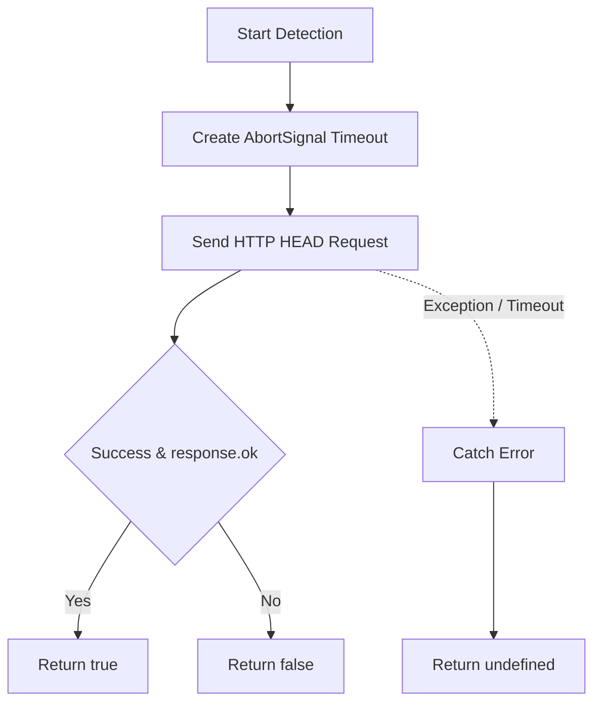

# @1-/url_exist : Detect URL existence via HTTP HEAD request with timeout control

## 1. Features

Detect target URL existence.

Send HTTP HEAD request via Fetch API.

Support custom timeout, defaulting to 3000 milliseconds.

Return boolean or `undefined`.

Avoid downloading response body to minimize bandwidth usage and latency.

## 2. Usage

Install dependency:

```bash
npm install @1-/url_exist
```

Code example:

```javascript
import urlExist from "@1-/url_exist";

// Check URL existence with default timeout (3000ms)
const ok = await urlExist("https://example.com");
console.log(ok); // true or false

// Customize timeout (1000ms)
const exist = await urlExist("https://example.com", 1000);
console.log(exist);
```

## 3. Design

Send HTTP HEAD request to retrieve response status.

Determine URL existence based on `response.ok`.

Use `AbortSignal.timeout` to handle request timeouts.

Catch exceptions (network error, timeout, DNS failure) and return `undefined`.



## 4. Tech Stack

- Runtime: Bun / Node.js
- Language Standard: ECMAScript (ES Module)
- Networking: Native Fetch API, AbortSignal

## 5. Code Structure

```
url_exist/
├── src/
│   └── _.js          # Core detection logic
├── tests/
│   └── _.test.js     # Unit tests
├── package.json      # Configuration file
└── README.md         # Entry document
```

## 6. History

HTTP HEAD method was defined in 1999 within RFC 2616 (HTTP/1.1 specification). It retrieved resource metadata without transferring message body.

Historically, checking URL validity required downloading full contents via HTTP GET, causing network overhead and latency.

HEAD method turned link validation into low-cost network operation.

After Fetch API gained popularity, lack of native timeout support forced developers to combine `Promise.race` and `AbortController` manually.

Native support for `AbortSignal.timeout` in modern runtimes (Node.js, Bun, browsers) simplified timeout handling.
