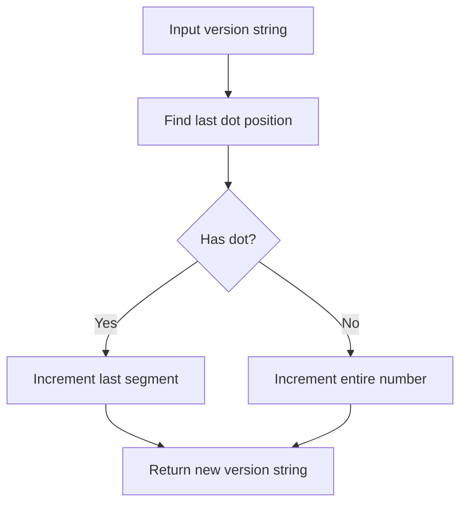
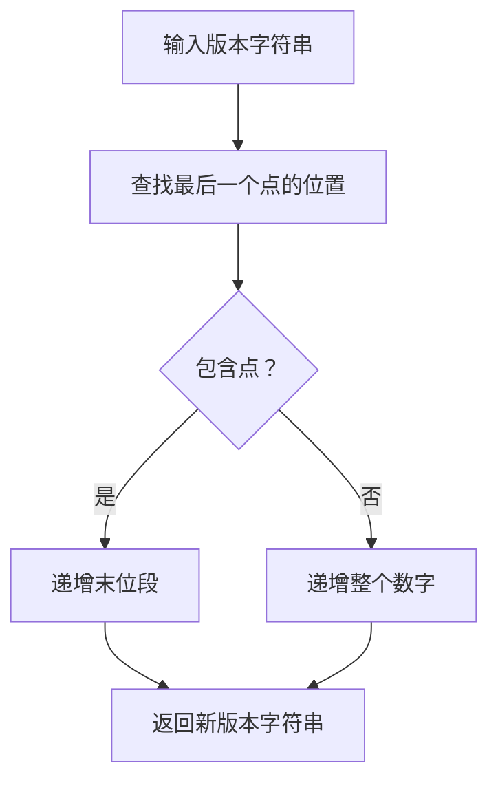

[English](#en) | [中文](#zh)

---

<a id="en"></a>

# @1-/vernext : Increment semantic version number last segment

- [@1-/vernext : Increment semantic version number last segment](#1-vernext-increment-semantic-version-number-last-segment)
  - [Functionality](#functionality)
  - [Usage demonstration](#usage-demonstration)
  - [Design rationale](#design-rationale)
  - [Technology stack](#technology-stack)
  - [Code structure](#code-structure)
  - [Historical context](#historical-context)
  - [About](#about)

## Functionality

This library solves the problem of programmatically incrementing the last numeric segment of a semantic version string. Given a version string (e.g., "1.2.3", "2.0", or "5"), it increments the final digit field by 1 and returns the updated version string.

## Usage demonstration

Install the package:

```bash
npm install @1-/vernext
```

Use in your JavaScript code:

```javascript
import vernext from "@1-/vernext";

console.log(vernext("1.2.3")); // '1.2.4'
console.log(vernext("2.0")); // '2.1'
console.log(vernext("5")); // '6'
```

## Design rationale

The implementation uses a simple string-based approach to locate and increment the last segment of the version number. This avoids dependency on complex version parsing libraries while maintaining reliability for standard semantic versioning patterns.



## Technology stack

- JavaScript (ES modules)
- No external dependencies
- Compatible with Node.js and modern browsers

## Code structure

```
src/
└── _.js  # Main module exporting the version increment function
```

The core functionality is implemented in a single, concise file that exports a default function.

## Historical context

Semantic versioning was introduced in 2012 by Tom Preston-Werner, creator of GitHub, to provide a clear and consistent way to communicate the nature of changes between software versions. The concept of version numbers dates back to the early days of computing, with IBM's OS/360 in 1964 using version numbers to track software releases. This library implements a fundamental operation in the semantic versioning workflow — incrementing the patch version for bug fixes.

## About

This library is developed by [WebC.site](https://webc.site).

[WebC.site](https://webc.site): A new paradigm of web development for AI

---

<a id="zh"></a>

# @1-/vernext : 递增语义化版本号末位段

- [@1-/vernext : 递增语义化版本号末位段](#1-vernext-递增语义化版本号末位段)
  - [功能介绍](#功能介绍)
  - [使用演示](#使用演示)
  - [设计思路](#设计思路)
  - [技术栈](#技术栈)
  - [代码结构](#代码结构)
  - [历史故事](#历史故事)
  - [关于](#关于)

## 功能介绍

该库解决程序化递增语义化版本号末位数字的问题。给定版本字符串（例如 "1.2.3"、"2.0" 或 "5"），它将末位数字字段加 1 并返回更新后的版本字符串。

## 使用演示

安装包：

```bash
npm install @1-/vernext
```

在 JavaScript 代码中使用：

```javascript
import vernext from "@1-/vernext";

console.log(vernext("1.2.3")); // '1.2.4'
console.log(vernext("2.0")); // '2.1'
console.log(vernext("5")); // '6'
```

## 设计思路

实现采用基于字符串的简单方法定位并递增版本号的末位段。此方法避免依赖复杂的版本解析库，同时保持对标准语义化版本模式的可靠性。



## 技术栈

- JavaScript（ES 模块）
- 无外部依赖
- 兼容 Node.js 和现代浏览器

## 代码结构

```
src/
└── _.js  # 主模块，导出版本递增函数
```

核心功能实现在单个简洁文件中，导出默认函数。

## 历史故事

语义化版本控制规范于 2012 年由 GitHub 创始人 Tom Preston-Werner 提出，旨在为软件版本变更提供清晰一致的沟通方式。版本号概念可追溯至计算早期，IBM 的 OS/360 系统于 1964 年即使用版本号追踪软件发布。本库实现了语义化版本工作流中的基础操作——为修复缺陷而递增补丁版本号。

## 关于

本库由 [WebC.site](https://webc.site) 开发。

[WebC.site](https://webc.site) : 面向人工智能的网站开发新范式
