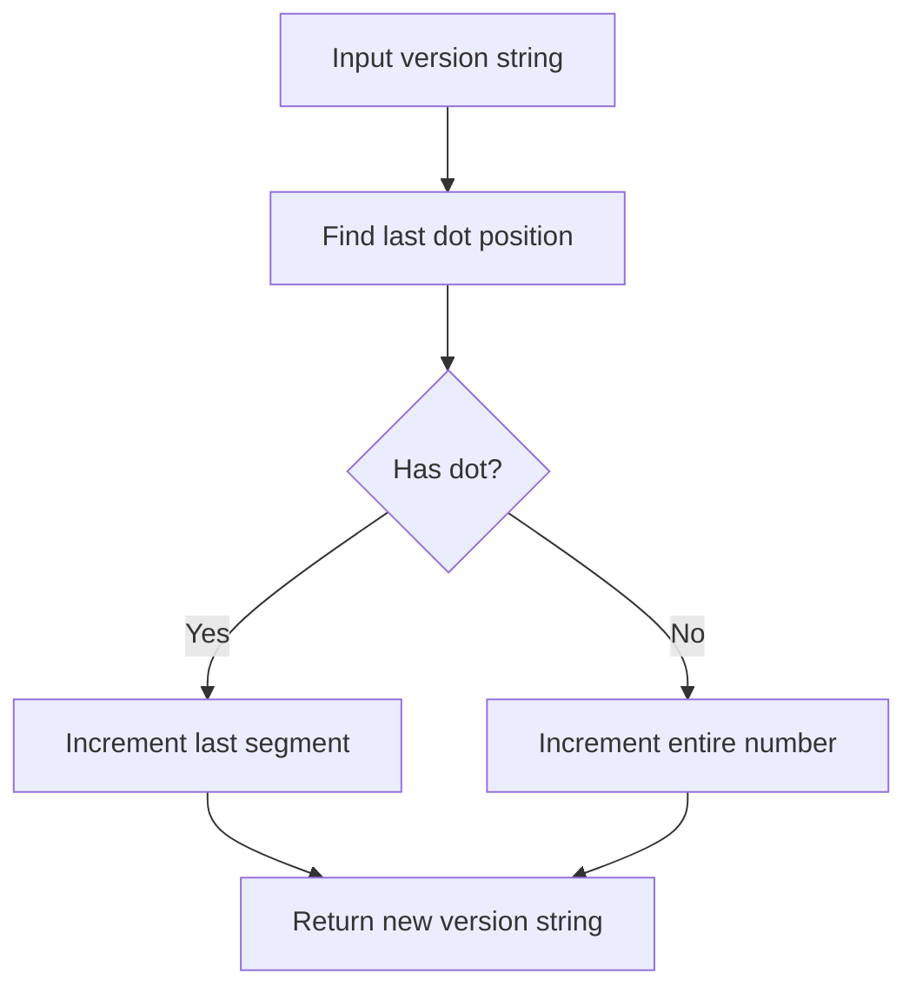

# @1-/vernext : Increment semantic version number last segment

## Functionality

This library solves the problem of programmatically incrementing the last numeric segment of a semantic version string. Given a version string (e.g., "1.2.3", "2.0", or "5"), it increments the final digit field by 1 and returns the updated version string.

## Usage demonstration

Install the package:

```bash
npm install @1-/vernext
```

Use in your JavaScript code:

```javascript
import vernext from "@1-/vernext";

console.log(vernext("1.2.3")); // '1.2.4'
console.log(vernext("2.0")); // '2.1'
console.log(vernext("5")); // '6'
```

## Design rationale

The implementation uses a simple string-based approach to locate and increment the last segment of the version number. This avoids dependency on complex version parsing libraries while maintaining reliability for standard semantic versioning patterns.



## Technology stack

- JavaScript (ES modules)
- No external dependencies
- Compatible with Node.js and modern browsers

## Code structure

```
src/
└── _.js  # Main module exporting the version increment function
```

The core functionality is implemented in a single, concise file that exports a default function.

## Historical context

Semantic versioning was introduced in 2012 by Tom Preston-Werner, creator of GitHub, to provide a clear and consistent way to communicate the nature of changes between software versions. The concept of version numbers dates back to the early days of computing, with IBM's OS/360 in 1964 using version numbers to track software releases. This library implements a fundamental operation in the semantic versioning workflow — incrementing the patch version for bug fixes.
