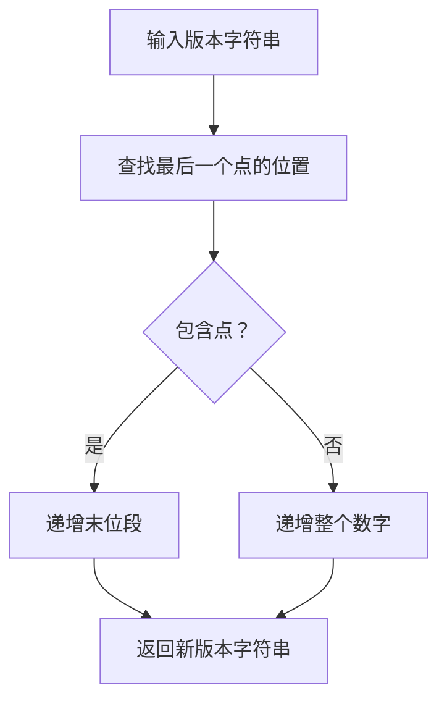

# @1-/vernext : 递增语义化版本号末位段

## 功能介绍

该库解决程序化递增语义化版本号末位数字的问题。给定版本字符串（例如 "1.2.3"、"2.0" 或 "5"），它将末位数字字段加 1 并返回更新后的版本字符串。

## 使用演示

安装包：

```bash
npm install @1-/vernext
```

在 JavaScript 代码中使用：

```javascript
import vernext from "@1-/vernext";

console.log(vernext("1.2.3")); // '1.2.4'
console.log(vernext("2.0")); // '2.1'
console.log(vernext("5")); // '6'
```

## 设计思路

实现采用基于字符串的简单方法定位并递增版本号的末位段。此方法避免依赖复杂的版本解析库，同时保持对标准语义化版本模式的可靠性。



## 技术栈

- JavaScript（ES 模块）
- 无外部依赖
- 兼容 Node.js 和现代浏览器

## 代码结构

```
src/
└── _.js  # 主模块，导出版本递增函数
```

核心功能实现在单个简洁文件中，导出默认函数。

## 历史故事

语义化版本控制规范于 2012 年由 GitHub 创始人 Tom Preston-Werner 提出，旨在为软件版本变更提供清晰一致的沟通方式。版本号概念可追溯至计算早期，IBM 的 OS/360 系统于 1964 年即使用版本号追踪软件发布。本库实现了语义化版本工作流中的基础操作——为修复缺陷而递增补丁版本号。
