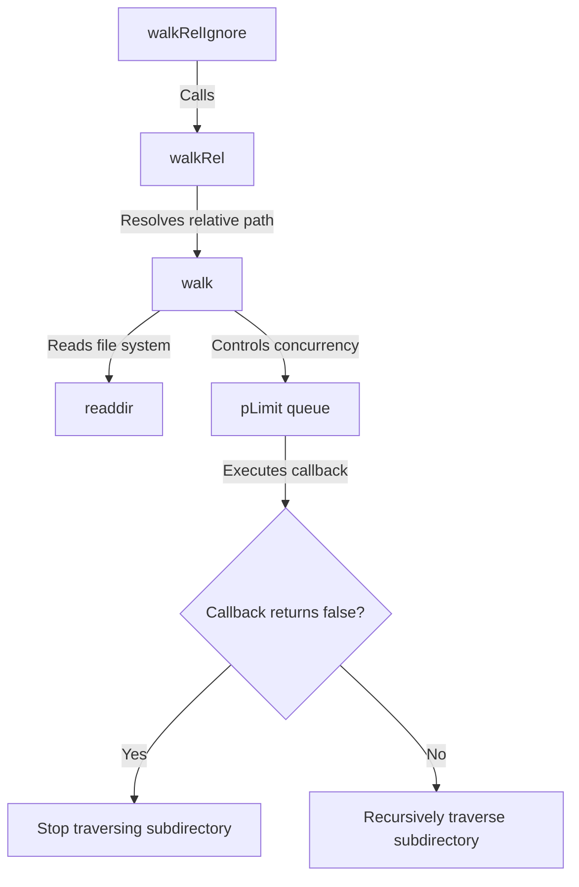
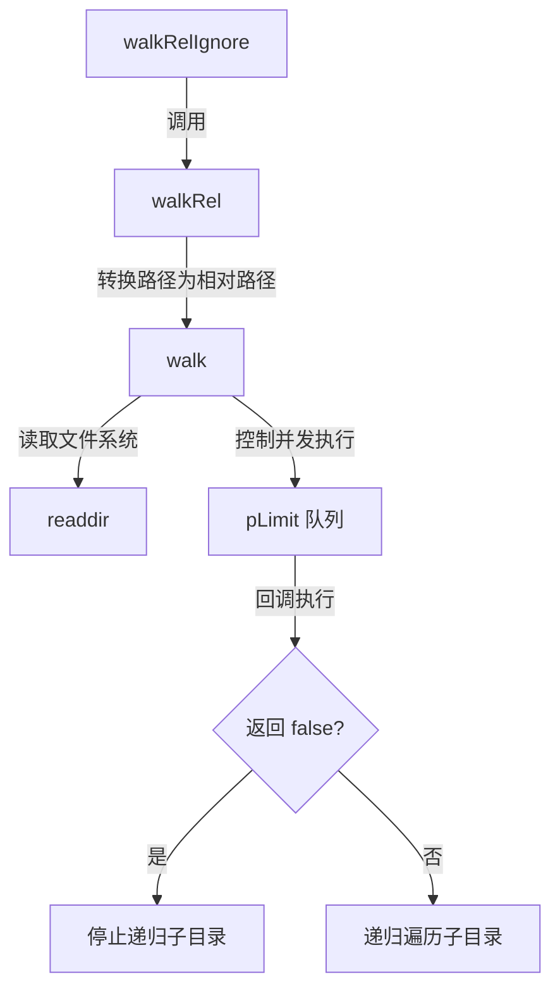

[English](#en) | [中文](#zh)

---

<a id="en"></a>

# @1-/walk : Fast directory walker with concurrency limit and directory skipping

Directory traversal library with concurrency control, directory skipping, and path filtering.

## Features

- **Concurrency Control**: Restricts concurrent file system operations to prevent resource exhaustion.
- **Directory Skipping**: Stops recursive traversal of specific subdirectories by returning `false` in callbacks.
- **Relative Path Support**: Resolves and outputs paths relative to the starting directory.
- **Ignore Presets**: Excludes `node_modules` and hidden files/directories (starting with `.`) automatically.

## Usage

### Absolute Path Traversal (`walk`)

```javascript
import walk, { DIR, FILE } from "@1-/walk";

await walk(
  "/path/to/dir",
  async (kind, path) => {
    if (kind === DIR && path.endsWith("/temp")) {
      return false; // Skip this directory
    }
    console.log(kind === FILE ? "File:" : "Dir:", path);
  },
  4,
); // Concurrency limit of 4
```

### Relative Path Traversal (`walkRel`)

```javascript
import walkRel from "@1-/walk/walkRel.js";

await walkRel("/path/to/dir", async (kind, relPath) => {
  console.log(relPath);
});
```

### Traversal with Ignore Presets (`walkRelIgnore`)

Filters `node_modules` and hidden files/directories automatically.

```javascript
import walkRelIgnore from "@1-/walk/walkRelIgnore.js";

await walkRelIgnore("/path/to/dir", async (kind, relPath) => {
  console.log(relPath);
});
```

## Design Flow

Execution flow of the modules is shown below:



## Tech Stack

- **Runtime**: Node.js / Bun
- **Dependencies**: `@3-/plimit` (Concurrency limiter)

## Directory Structure

```
.
├── src/
│   ├── _.js               # Core traversal logic (walk)
│   ├── walkRel.js         # Traversal with relative paths
│   └── walkRelIgnore.js   # Traversal ignoring dotfiles and node_modules
├── tests/
│   └── _.test.js          # Unit tests
└── package.json
```

## Historical Trivia

In 1974, Dick Haight at AT&T Bell Laboratories designed the `find` command for Version 5 Unix. As hierarchical file systems grew, recursive directory traversal became essential infrastructure for operating systems.

With modern application growth, file system operations risk resource limit exhaustion such as file descriptor limits. `@1-/walk` adopts Unix traversal design, utilizing modern JavaScript asynchronous concurrency mechanisms (such as Promises and concurrency limits) to achieve fast and safe traversal under resource control.
../doc/en/about.md

---

<a id="zh"></a>

# @1-/walk : 并发受控且支持目录跳过的快速文件遍历工具

提供并发限制、目录跳过及路径过滤功能的文件系统遍历库。

## 功能介绍

- **并发控制**：限制文件系统并发操作数量，防止系统资源耗尽。
- **目录跳过**：支持通过回调函数返回 `false` 动态终止特定子目录递归。
- **相对路径**：支持解析并输出相对于起始目录的相对路径。
- **内置忽略**：支持自动排除 `node_modules` 与隐藏文件（以 `.` 开头的文件/目录）。

## 使用演示

### 绝对路径遍历 (`walk`)

```javascript
import walk, { DIR, FILE } from "@1-/walk";

await walk(
  "/path/to/dir",
  async (kind, path) => {
    if (kind === DIR && path.endsWith("/temp")) {
      return false; // 跳过此目录
    }
    console.log(kind === FILE ? "File:" : "Dir:", path);
  },
  4,
); // 并发限制为 4
```

### 相对路径遍历 (`walkRel`)

```javascript
import walkRel from "@1-/walk/walkRel.js";

await walkRel("/path/to/dir", async (kind, relPath) => {
  console.log(relPath);
});
```

### 忽略预设遍历 (`walkRelIgnore`)

自动过滤 `node_modules` 及 `.` 开头的隐藏文件。

```javascript
import walkRelIgnore from "@1-/walk/walkRelIgnore.js";

await walkRelIgnore("/path/to/dir", async (kind, relPath) => {
  console.log(relPath);
});
```

## 设计思路

相关模块的调用流程如下所示：



## 技术栈

- **运行时**：Node.js / Bun
- **核心依赖**：`@3-/plimit` (并发限制)

## 目录结构

```
.
├── src/
│   ├── _.js               # 核心遍历逻辑 (walk)
│   ├── walkRel.js         # 相对路径遍历
│   └── walkRelIgnore.js   # 忽略特定文件与目录的遍历
├── tests/
│   └── _.test.js          # 单元测试
└── package.json
```

## 历史故事

1974年，AT&T 贝尔实验室的 Dick Haight 为 Version 5 Unix 引入了 `find` 命令。随着分层文件系统的普及，递归目录遍历逐渐成为操作系统的重要基础设施。

随着现代应用规模的增长，文件系统操作容易遇到文件描述符耗尽等瓶颈。`@1-/walk` 继承了 Unix 目录遍历的思想，并通过现代 JavaScript 的异步并发机制（如 Promise 与并发限制器），在确保资源可控的前提下实现高效遍历。
../doc/zh/about.md
