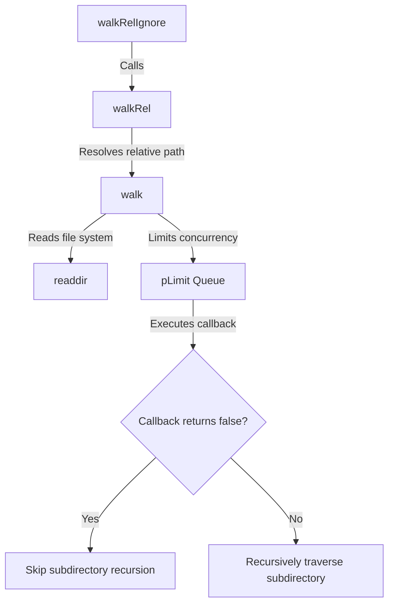

[English](#en) | [中文](#zh)

---

<a id="en"></a>
# @1-/walk : Concurrency-controlled directory traversal library with directory skipping

- [@1-/walk : Concurrency-controlled directory traversal library with directory skipping](#1-walk-concurrency-controlled-directory-traversal-library-with-directory-skipping)
  - [Features](#features)
  - [Usage](#usage)
    - [Absolute Path Traversal (`walk`)](#absolute-path-traversal-walk)
    - [Relative Path Traversal (`walkRel`)](#relative-path-traversal-walkrel)
    - [Traversal with Ignore Presets (`walkRelIgnore`)](#traversal-with-ignore-presets-walkrelignore)
  - [Design Flow](#design-flow)
  - [Tech Stack](#tech-stack)
  - [Code Structure](#code-structure)
  - [Historical Trivia](#historical-trivia)
  - [About](#about)

Directory traversal library for Node.js and Bun with concurrency limit and directory skipping.

## Features

- **Concurrency Control**: Limits concurrent file system operations to prevent resource exhaustion.
- **Directory Skipping**: Skips subdirectories dynamically when callbacks return `false`.
- **Relative Path Resolution**: Resolves and outputs paths relative to the starting directory.
- **Preconfigured Ignore**: Excludes `node_modules` and hidden files/directories (starting with `.`) automatically.

## Usage

### Absolute Path Traversal (`walk`)

```javascript
import walk, { DIR, FILE } from "@1-/walk";

await walk(
  "/path/to/dir",
  async (kind, path) => {
    if (kind === DIR && path.endsWith("/temp")) {
      return false; // Skip traversing this directory
    }
    console.log(kind === FILE ? "File:" : "Dir:", path);
  },
  4,
); // Concurrency limit of 4
```

### Relative Path Traversal (`walkRel`)

```javascript
import walkRel from "@1-/walk/walkRel.js";

await walkRel("/path/to/dir", async (kind, relPath) => {
  console.log(relPath);
});
```

### Traversal with Ignore Presets (`walkRelIgnore`)

Automatically excludes `node_modules` and hidden directories/files starting with a dot (`.`).

```javascript
import walkRelIgnore from "@1-/walk/walkRelIgnore.js";

await walkRelIgnore("/path/to/dir", async (kind, relPath) => {
  console.log(relPath);
});
```

## Design Flow

The system coordinates module calls, concurrency control, and recursive checks.



## Tech Stack

- Runtime: Node.js / Bun
- Dependencies: `@3-/plimit`

## Code Structure

```
.
├── src/
│   ├── _.js               # Core walk implementation
│   ├── walkRel.js         # Relative path wrapper
│   └── walkRelIgnore.js   # Ignore preset wrapper
├── tests/
│   └── _.test.js          # Unit tests
└── package.json
```

## Historical Trivia

In 1974, Dick Haight at AT&T Bell Laboratories designed the `find` command for Version 5 Unix. As hierarchical file systems grew, recursive directory traversal became essential infrastructure for operating systems.

With modern application scales, file system operations risk resource limit exhaustion such as file descriptor limits. `@1-/walk` adopts Unix traversal design, utilizing modern JavaScript asynchronous concurrency mechanisms to achieve fast and safe traversal under resource control.

## About

This library is developed by [WebC.site](https://webc.site).

[WebC.site](https://webc.site): A new paradigm of web development for AI


---

<a id="zh"></a>
# @1-/walk : 并发受控且支持目录跳过的快速文件遍历工具

- [@1-/walk : 并发受控且支持目录跳过的快速文件遍历工具](#1-walk-并发受控且支持目录跳过的快速文件遍历工具)
  - [功能介绍](#功能介绍)
  - [使用演示](#使用演示)
    - [绝对路径遍历 (`walk`)](#绝对路径遍历-walk)
    - [相对路径遍历 (`walkRel`)](#相对路径遍历-walkrel)
    - [忽略预设遍历 (`walkRelIgnore`)](#忽略预设遍历-walkrelignore)
  - [设计思路](#设计思路)
  - [技术栈](#技术栈)
  - [代码结构](#代码结构)
  - [历史故事](#历史故事)
  - [关于](#关于)

提供并发限制、目录跳过及路径过滤功能的文件系统遍历库。

## 功能介绍

- **并发控制**：限制文件系统并发操作数，防止资源耗尽。
- **目录跳过**：回调函数返回 `false` 时跳过子目录递归。
- **相对路径**：支持解析并输出相对于起始目录的相对路径。
- **内置忽略**：自动排除 `node_modules` 及以 `.` 开头的隐藏文件与目录。

## 使用演示

### 绝对路径遍历 (`walk`)

```javascript
import walk, { DIR, FILE } from "@1-/walk";

await walk(
  "/path/to/dir",
  async (kind, path) => {
    if (kind === DIR && path.endsWith("/temp")) {
      return false; // 跳过此目录的递归
    }
    console.log(kind === FILE ? "File:" : "Dir:", path);
  },
  4,
); // 并发限制为 4
```

### 相对路径遍历 (`walkRel`)

```javascript
import walkRel from "@1-/walk/walkRel.js";

await walkRel("/path/to/dir", async (kind, relPath) => {
  console.log(relPath);
});
```

### 忽略预设遍历 (`walkRelIgnore`)

自动过滤 `node_modules` 文件夹与隐藏文件。

```javascript
import walkRelIgnore from "@1-/walk/walkRelIgnore.js";

await walkRelIgnore("/path/to/dir", async (kind, relPath) => {
  console.log(relPath);
});
```

## 设计思路

相关模块的调用流程如下：


## 技术栈

- 运行时：Node.js / Bun
- 核心依赖：`@3-/plimit`

## 代码结构

```
.
├── src/
│   ├── _.js               # 核心 walk 实现
│   ├── walkRel.js         # 相对路径封装
│   └── walkRelIgnore.js   # 忽略预设封装
├── tests/
│   └── _.test.js          # 单元测试
└── package.json
```

## 历史故事

1974年，AT&T 贝尔实验室的 Dick Haight 为 Version 5 Unix 引入 `find` 命令。随着分层文件系统普及，递归目录遍历成为操作系统重要基础设施。

现代应用规模增长，文件系统操作容易遇到文件描述符耗尽等瓶颈。`@1-/walk` 继承 Unix 目录遍历思想，通过现代 JavaScript 异步并发机制（Promise 与并发限制器），控制系统资源并进行遍历。

## 关于

本库由 [WebC.site](https://webc.site) 开发。

[WebC.site](https://webc.site) : 面向人工智能的网站开发新范式

