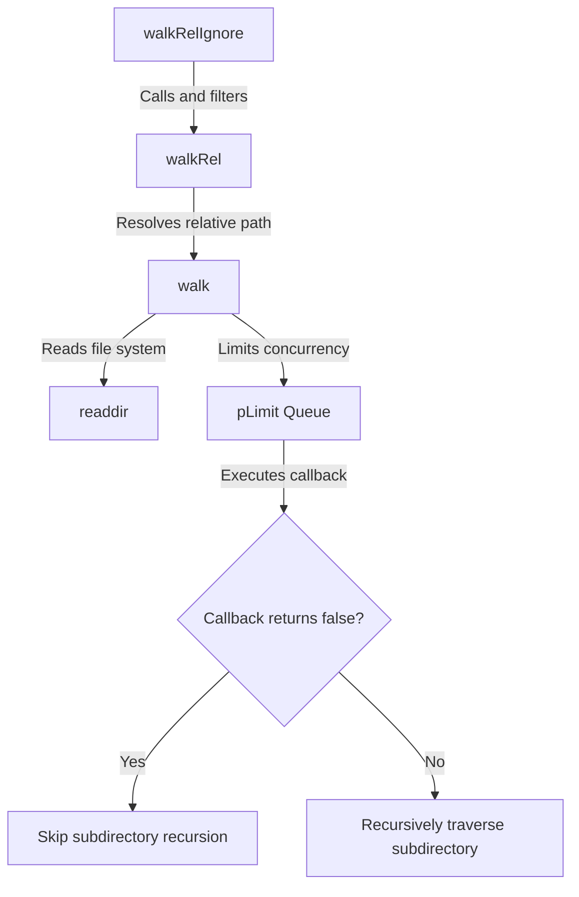

# @1-/walk : Concurrency-controlled directory traversal library with directory skipping

Directory traversal library for Node.js and Bun with concurrency limit and directory skipping.

## Features

- **Concurrency Control**: Limits concurrent file system operations to prevent resource exhaustion. Default concurrency is system available parallelism (`availableParallelism()`).
- **Directory Skipping**: Skips subdirectories dynamically when callbacks return `false`.
- **Relative Path Resolution**: Resolves and outputs paths relative to the starting directory.
- **Preconfigured Ignore**: `walkRelIgnore` provides preset filtering, automatically excluding `node_modules` directories and hidden files/directories (starting with `.`) based on basename.

## Usage

### Installation

```bash
npm install @1-/walk
# or
bun add @1-/walk
```

### Absolute Path Traversal (`walk`)

```javascript
import walk, { DIR, FILE } from "@1-/walk";

await walk(
  "/path/to/dir",
  async (kind, path) => {
    if (kind === DIR && path.endsWith("/temp")) {
      return false; // Skip traversing this directory
    }
    console.log(kind === FILE ? "File:" : "Dir:", path);
  },
  4, // Optional: concurrency limit, defaults to availableParallelism()
); // Concurrency limit of 4
```

### Relative Path Traversal (`walkRel`)

```javascript
import walkRel from "@1-/walk/walkRel.js";

await walkRel("/path/to/dir", async (kind, relPath) => {
  console.log(relPath);
}, 4); // Optional: concurrency limit
```

### Preconfigured Ignore Traversal (`walkRelIgnore`)

Automatically excludes `node_modules` directories and hidden files/directories (starting with `.`).

```javascript
import walkRelIgnore from "@1-/walk/walkRelIgnore.js";

await walkRelIgnore("/path/to/dir", async (kind, relPath) => {
  console.log(relPath);
}, 4); // Optional: concurrency limit
```

## Design Flow

The system coordinates module calls, concurrency control, and recursive checks.



## Tech Stack

- Runtime: Node.js / Bun
- Dependencies: `@3-/plimit`
- Standard libraries: `node:fs/promises`, `node:path`, `node:os`

## Code Structure

```
.
├── src/
│   ├── _.js               # Core walk implementation
│   ├── walkRel.js         # Relative path wrapper
│   └── walkRelIgnore.js   # Preconfigured ignore wrapper
├── test/
│   └── _.test.js          # Unit test
└── package.json
```

## Historical Trivia

In 1974, Dick Haight at AT&T Bell Laboratories designed the `find` command for Version 5 Unix. As hierarchical file systems grew, recursive directory traversal became essential infrastructure for operating systems.

With modern application scales, file system operations risk resource limit exhaustion such as file descriptor limits. `@1-/walk` adopts Unix traversal design, utilizing modern JavaScript asynchronous concurrency mechanisms to achieve fast and safe traversal under resource control.