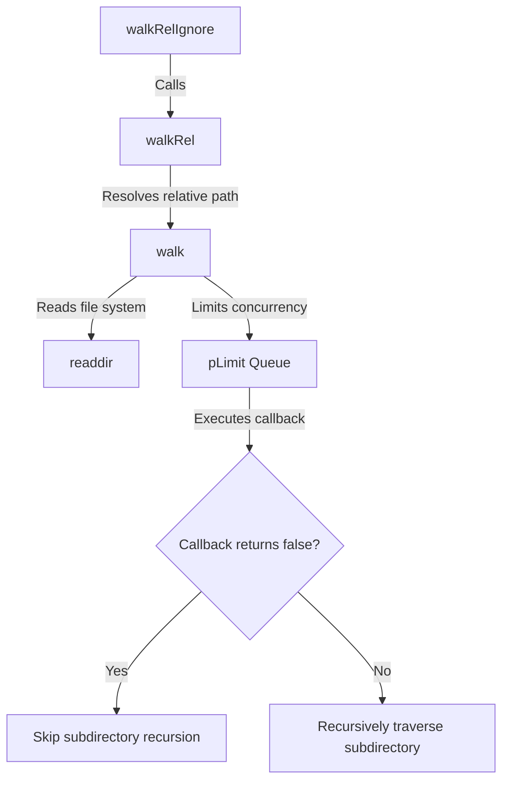

# @1-/walk : Concurrency-controlled directory traversal library with directory skipping

Fast directory walker for Node.js and Bun. Restricts concurrency to prevent resource exhaustion and supports directory skipping to optimize traversal.

## Features

- **Concurrency Control**: Restricts concurrent file system operations.
- **Directory Skipping**: Skips subdirectories dynamically when callbacks return `false`.
- **Relative Path Resolution**: Resolves paths relative to the root directory.
- **Preconfigured Ignore**: Excludes `node_modules` and hidden files/directories (dotfiles).

## Usage

### Absolute Path Traversal (`walk`)

```javascript
import walk, { DIR, FILE } from "@1-/walk";

await walk("/path/to/dir", async (kind, path) => {
  if (kind === DIR && path.endsWith("/temp")) {
    return false; // Skip traversing this directory
  }
  console.log(kind === FILE ? "File:" : "Dir:", path);
}, 4); // Concurrency limit of 4
```

### Relative Path Traversal (`walkRel`)

```javascript
import walkRel from "@1-/walk/walkRel.js";

await walkRel("/path/to/dir", async (kind, relPath) => {
  console.log(relPath);
});
```

### Ignore Presets Traversal (`walkRelIgnore`)

Automatically excludes `node_modules` and hidden directories/files starting with a dot (`.`).

```javascript
import walkRelIgnore from "@1-/walk/walkRelIgnore.js";

await walkRelIgnore("/path/to/dir", async (kind, relPath) => {
  console.log(relPath);
});
```

## Design Flow

The system coordinates module calls, concurrency control, and recursive checks.



## Tech Stack

- **Runtime**: Node.js / Bun
- **Dependencies**: `@3-/plimit`

## Directory Structure

```
.
├── src/
│   ├── _.js               # Core walk implementation
│   ├── walkRel.js         # Relative path wrapper
│   └── walkRelIgnore.js   # Ignore preset wrapper
├── tests/
│   └── _.test.js          # Unit tests
└── package.json
```

## Historical Trivia

In 1974, Dick Haight at AT&T Bell Laboratories designed the `find` command for Version 5 Unix. As hierarchical file systems grew, recursive directory traversal became essential infrastructure for operating systems.

With modern web application scales, file system operations risk resource limit exhaustion such as file descriptor limits. `@1-/walk` adopts Unix traversal design, utilizing modern JavaScript asynchronous concurrency mechanisms to achieve fast and safe traversal under resource control.
