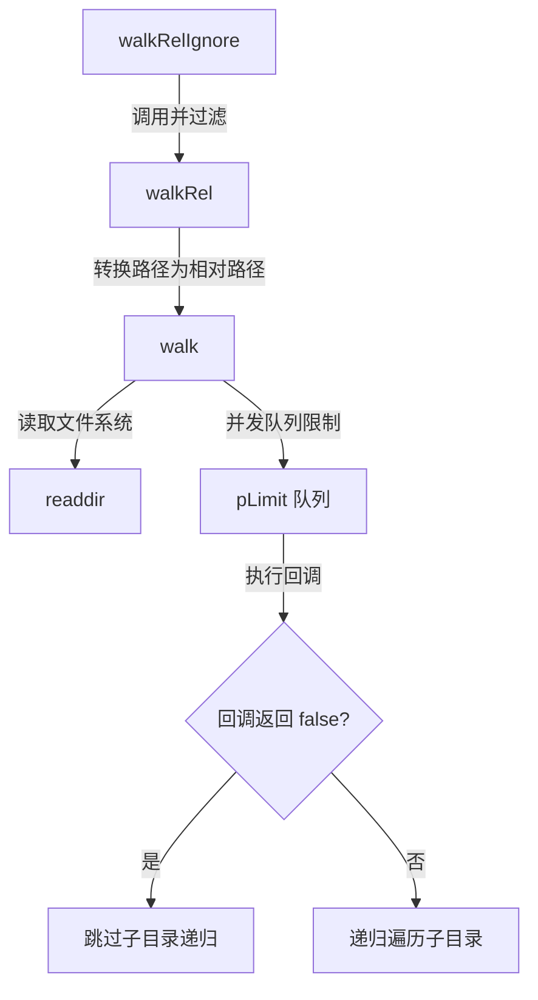

# @1-/walk : 并发受控且支持目录跳过的快速文件遍历工具

提供并发限制、目录跳过及路径过滤功能的文件系统遍历库。

## 功能介绍

- **并发控制**：限制文件系统并发操作数，防止资源耗尽。默认并发数为系统可用并行度（`availableParallelism()`）。
- **目录跳过**：回调函数返回 `false` 时跳过子目录递归遍历。
- **相对路径**：支持解析并输出相对于起始目录的相对路径。
- **预设忽略**：`walkRelIgnore` 提供预设过滤，自动排除 `node_modules` 目录及以 `.` 开头的隐藏文件与目录（基于 basename 判断）。

## 使用演示

### 安装

```bash
npm install @1-/walk
# 或
bun add @1-/walk
```

### 绝对路径遍历 (`walk`)

```javascript
import walk, { DIR, FILE } from "@1-/walk";

await walk(
  "/path/to/dir",
  async (kind, path) => {
    if (kind === DIR && path.endsWith("/temp")) {
      return false; // 跳过此目录的递归
    }
    console.log(kind === FILE ? "File:" : "Dir:", path);
  },
  4 // 可选：并发限制，默认为 availableParallelism()
); // 并发限制为 4
```

### 相对路径遍历 (`walkRel`)

```javascript
import walkRel from "@1-/walk/walkRel.js";

await walkRel(
  "/path/to/dir",
  async (kind, relPath) => {
    console.log(relPath);
  },
  4
); // 可选：并发限制
```

### 预设忽略遍历 (`walkRelIgnore`)

自动过滤 `node_modules` 目录与隐藏文件（以 `.` 开头）。

```javascript
import walkRelIgnore from "@1-/walk/walkRelIgnore.js";

await walkRelIgnore(
  "/path/to/dir",
  async (kind, relPath) => {
    console.log(relPath);
  },
  4
); // 可选：并发限制
```

## 设计思路

相关模块的调用流程如下：



## 技术栈

- 运行时：Node.js / Bun
- 核心依赖：`@3-/plimit`
- 标准库：`node:fs/promises`, `node:path`, `node:os`

## 代码结构

```
.
├── src/
│   ├── _.js               # 核心 walk 实现
│   ├── walkRel.js         # 相对路径封装
│   └── walkRelIgnore.js   # 预设忽略封装
├── test/
│   └── _.test.js          # 单元测试
└── package.json
```

## 历史故事

1974年，AT&T 贝尔实验室的 Dick Haight 为 Version 5 Unix 引入 `find` 命令。随着分层文件系统普及，递归目录遍历成为操作系统重要基础设施。

现代应用规模增长，文件系统操作容易遇到文件描述符耗尽等瓶颈。`@1-/walk` 继承 Unix 目录遍历思想，通过现代 JavaScript 异步并发机制（Promise 与并发限制器），控制系统资源并进行遍历。
