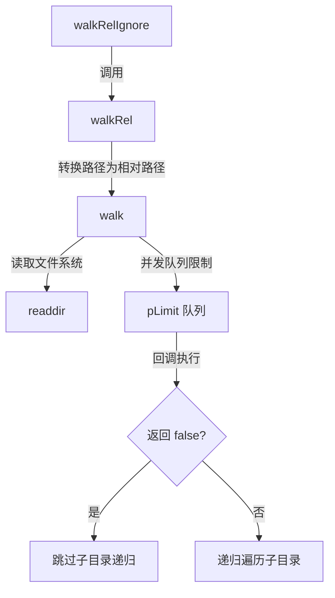

# @1-/walk : 并发受控且支持目录跳过的快速文件遍历工具

适用于 Node.js 与 Bun 的快速文件目录遍历工具。支持限制并发数以防止资源耗尽，并通过回调返回 `false` 动态跳过子目录遍历。

## 功能特性

- **并发控制**：限制文件系统并发操作数。
- **目录跳过**：回调函数返回 `false` 时跳过子目录递归。
- **相对路径**：自动解析并输出相对于起始目录的路径。
- **内置忽略**：自动排除 `node_modules` 及隐藏目录与文件（以点 `.` 开头的文件/目录）。

## 使用演示

### 绝对路径遍历 (`walk`)

```javascript
import walk, { DIR, FILE } from "@1-/walk";

await walk("/path/to/dir", async (kind, path) => {
  if (kind === DIR && path.endsWith("/temp")) {
    return false; // 跳过此目录的递归
  }
  console.log(kind === FILE ? "File:" : "Dir:", path);
}, 4); // 并发限制为 4
```

### 相对路径遍历 (`walkRel`)

```javascript
import walkRel from "@1-/walk/walkRel.js";

await walkRel("/path/to/dir", async (kind, relPath) => {
  console.log(relPath);
});
```

### 忽略预设遍历 (`walkRelIgnore`)

自动过滤 `node_modules` 文件夹与隐藏文件。

```javascript
import walkRelIgnore from "@1-/walk/walkRelIgnore.js";

await walkRelIgnore("/path/to/dir", async (kind, relPath) => {
  console.log(relPath);
});
```

## 设计思路

系统调度模块调用、并发控制与递归跳过流程如下：



## 技术栈

- **运行时**：Node.js / Bun
- **核心依赖**：`@3-/plimit`

## 目录结构

```
.
├── src/
│   ├── _.js               # 核心 walk 实现
│   ├── walkRel.js         # 相对路径封装
│   └── walkRelIgnore.js   # 忽略预设封装
├── tests/
│   └── _.test.js          # 单元测试
└── package.json
```

## 历史故事

1974年，AT&T 贝尔实验室的 Dick Haight 为 Version 5 Unix 引入了 `find` 命令。随着分层文件系统的普及，递归目录遍历逐渐成为操作系统的重要基础设施。

随着现代应用规模的增长，文件系统操作容易遇到文件描述符耗尽等瓶颈。`@1-/walk` 继承了 Unix 目录遍历的设计思想，并通过现代 JavaScript 的异步并发机制（Promise 与并发限制器），在确保系统资源安全的前提下实现高效遍历。
