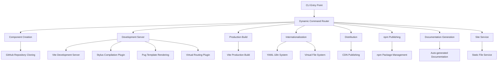
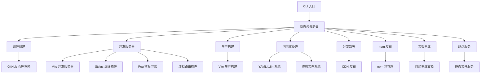

[English](#en) | [中文](#zh)

---

<a id="en"></a>
# WebC.site : Web Component Development Framework

- [WebC.site : Web Component Development Framework](#webcsite-web-component-development-framework)
  - [Functionality](#functionality)
  - [Usage Demonstration](#usage-demonstration)
  - [Design Rationale](#design-rationale)
  - [Technology Stack](#technology-stack)
  - [Code Structure](#code-structure)
  - [Historical Context](#historical-context)
  - [About](#about)

## Functionality
WebC.site provides an end-to-end toolchain for creating, developing, testing, building, and publishing standard Web Components. It eliminates configuration overhead through convention-over-configuration directory structures and automated workflows, allowing developers to focus solely on component logic.

## Usage Demonstration
Install the CLI globally:
```bash
npm install -g @webc.site/cli
```

Create a new Web Component:
```bash
webc add my-button
```

Start the development server:
```bash
webc dev my-button
```

Build for production:
```bash
webc dist
```

Publish to npm:
```bash
webc npmPublish
```

Start local site server:
```bash
webc siteSrv
```

## Design Rationale
The architecture follows a dynamic command routing design where the CLI automatically scans the `src/bin/` directory to register all commands. The core build system is based on Vite with custom plugins for deep integration.



## Technology Stack
- Runtime: Node.js 18+
- Development Server: Vite
- Build Tool: Vite
- Template Engine: Pug
- Styling: Stylus
- Internationalization: YAML file-driven + Virtual File System
- HTML Processing: Custom minification
- CLI Framework: yargs

## Code Structure
```
src/
├── add/          # Component creation logic (GitHub repository cloning)
├── bin/          # CLI command entry points (add, dev, dist, npmPublish, siteSrv, etc.)
├── cli/          # CLI framework and i18n support
├── dist/         # Distribution and publishing logic
├── fix/          # Code transformation utilities
├── i18n/         # YAML translation files for 50+ languages
├── jsDoc/        # JavaScript documentation generation logic
├── lib/          # Core utility functions
├── npm/          # npm package management logic
├── site/         # Site generation logic
├── vfs/          # Virtual file system implementation
├── vite/         # Vite plugin implementations (stylus, i18n, pug, vurl)
└── vite.js       # Vite configuration and integration
```

## Historical Context
The Web Components specification was formally established by the W3C in 2014, with its core tenets being "encapsulation" and "reusability". WebC.site emerged from a simple goal: to enable developers to create standards-compliant components without wading through extensive documentation. It codifies best practices as defaults and hides complexity behind succinct CLI commands, embodying engineering respect for standardization.

## About

This library is developed by [WebC.site](https://webc.site).

[WebC.site](https://webc.site): A new paradigm of web development for AI


---

<a id="zh"></a>
# WebC.site : Web 组件开发框架

- [WebC.site : Web 组件开发框架](#webcsite-web-组件开发框架)
  - [功能介绍](#功能介绍)
  - [使用演示](#使用演示)
  - [设计思路](#设计思路)
  - [技术栈](#技术栈)
  - [代码结构](#代码结构)
  - [历史故事](#历史故事)
  - [关于](#关于)

## 功能介绍
WebC.site 提供端到端工具链，用于创建、开发、测试、构建和发布标准 Web 组件。通过动态命令路由架构和约定优先的目录结构，消除配置开销，使开发者专注组件逻辑本身。

## 使用演示
全局安装 CLI 工具：
```bash
npm install -g @webc.site/cli
```

创建新 Web 组件：
```bash
webc add my-button
```

启动开发服务器：
```bash
webc dev my-button
```

构建生产版本：
```bash
webc dist
```

发布到 npm：
```bash
webc npmPublish
```

启动本地站点服务：
```bash
webc siteSrv
```

## 设计思路
架构采用动态命令路由设计，CLI 自动扫描 `src/bin/` 目录注册所有命令。核心构建系统基于 Vite，通过自定义插件实现深度集成。



## 技术栈
- 运行时：Node.js 18+
- 开发服务器：Vite
- 构建工具：Vite
- 模板引擎：Pug
- 样式：Stylus
- 国际化：YAML 文件驱动 + 虚拟文件系统
- HTML 处理：自定义压缩
- CLI 框架：yargs

## 代码结构
```
src/
├── add/          # 组件创建逻辑（GitHub 仓库克隆）
├── bin/          # CLI 命令入口（add、dev、dist、npmPublish、siteSrv 等）
├── cli/          # CLI 框架与国际化支持
├── dist/         # 分发与发布逻辑
├── fix/          # 代码转换工具
├── i18n/         # YAML 翻译文件（50+ 种语言）
├── jsDoc/        # JavaScript 文档生成逻辑
├── lib/          # 核心工具函数
├── npm/          # npm 包管理逻辑
├── site/         # 站点生成逻辑
├── vfs/          # 虚拟文件系统实现
├── vite/         # Vite 插件实现（stylus、i18n、pug、vurl）
└── vite.js       # Vite 配置与集成
```

## 历史故事
Web 组件规范于 2014 年由 W3C 正式确立，其核心理念是“封装”与“复用”。WebC.site 的诞生源于一个朴素目标：让开发者无需阅读冗长文档即可上手创建符合标准的组件。它将最佳实践固化为默认行为，将复杂性隐藏在简洁的 CLI 命令之后，体现了工程化对标准化的尊重。

## 关于

本库由 [WebC.site](https://webc.site) 开发。

[WebC.site](https://webc.site) : 面向人工智能的网站开发新范式

