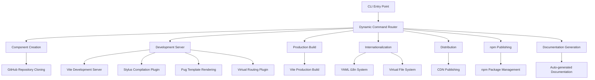

# WebC.site : Web Component Development Framework

## Functionality
WebC.site provides an end-to-end toolchain for creating, developing, testing, building, and publishing standard Web Components. It eliminates configuration overhead through convention-over-configuration directory structures and automated workflows, allowing developers to focus solely on component logic.

## Usage Demonstration
Install the CLI globally:
```bash
npm install -g @webc.site/cli
```

Create a new Web Component:
```bash
webc add my-button
```

Start the development server:
```bash
webc dev my-button
```

Build for production:
```bash
webc dist
```

Publish to npm:
```bash
webc npmPublish
```

Start local site server:
```bash
webc siteSrv
```

## Design Rationale
The architecture follows a dynamic command routing design where the CLI automatically scans the `src/bin/` directory to register all commands. The core build system is based on Vite with custom plugins for deep integration.



## Technology Stack
- Runtime: Node.js 18+
- Development Server: Vite
- Build Tool: Vite
- Template Engine: Pug
- Styling: Stylus
- Internationalization: YAML file-driven + Virtual File System
- HTML Processing: Custom minification
- CLI Framework: yargs

## Code Structure
```
src/
├── add/          # Component creation logic (GitHub repository cloning)
├── bin/          # CLI command entry points (add, dev, dist, npmPublish, siteSrv, etc.)
├── cli/          # CLI framework and i18n support
├── dist/         # Distribution and publishing logic
├── fix/          # Code transformation utilities
├── i18n/         # YAML translation files for 50+ languages
├── lib/          # Core utility functions
├── npm/          # npm package management logic
├── site/         # Site generation logic
├── vfs/          # Virtual file system implementation
├── vite/         # Vite plugin implementations (stylus, i18n, pug, vurl)
└── vite.js       # Vite configuration and integration
```

## Historical Context
The Web Components specification was formally established by the W3C in 2014, with its core tenets being "encapsulation" and "reusability". WebC.site emerged from a simple goal: to enable developers to create standards-compliant components without wading through extensive documentation. It codifies best practices as defaults and hides complexity behind succinct CLI commands, embodying engineering respect for standardization.