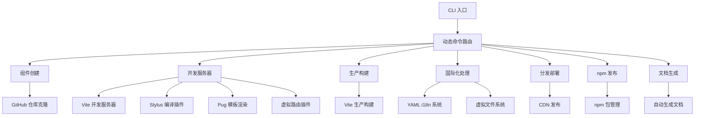

# WebC.site : Web 组件开发框架

## 功能介绍
WebC.site 提供端到端工具链，用于创建、开发、测试、构建和发布标准 Web 组件。通过动态命令路由架构和约定优先的目录结构，消除配置开销，使开发者专注组件逻辑本身。

## 使用演示
全局安装 CLI 工具：
```bash
npm install -g @webc.site/cli
```

创建新 Web 组件：
```bash
webc add my-button
```

启动开发服务器：
```bash
webc dev my-button
```

构建生产版本：
```bash
webc dist
```

发布到 npm：
```bash
webc npmPublish
```

启动本地站点服务：
```bash
webc siteSrv
```

## 设计思路
架构采用动态命令路由设计，CLI 自动扫描 `src/bin/` 目录注册所有命令。核心构建系统基于 Vite，通过自定义插件实现深度集成。



## 技术栈
- 运行时：Node.js 18+
- 开发服务器：Vite
- 构建工具：Vite
- 模板引擎：Pug
- 样式：Stylus
- 国际化：YAML 文件驱动 + 虚拟文件系统
- HTML 处理：自定义压缩
- CLI 框架：yargs

## 代码结构
```
src/
├── add/          # 组件创建逻辑（GitHub 仓库克隆）
├── bin/          # CLI 命令入口（add、dev、dist、npmPublish、siteSrv 等）
├── cli/          # CLI 框架与国际化支持
├── dist/         # 分发与发布逻辑
├── fix/          # 代码转换工具
├── i18n/         # YAML 翻译文件（50+ 种语言）
├── lib/          # 核心工具函数
├── npm/          # npm 包管理逻辑
├── site/         # 站点生成逻辑
├── vfs/          # 虚拟文件系统实现
├── vite/         # Vite 插件实现（stylus、i18n、pug、vurl）
└── vite.js       # Vite 配置与集成
```

## 历史故事
Web 组件规范于 2014 年由 W3C 正式确立，其核心理念是“封装”与“复用”。WebC.site 的诞生源于一个朴素目标：让开发者无需阅读冗长文档即可上手创建符合标准的组件。它将最佳实践固化为默认行为，将复杂性隐藏在简洁的 CLI 命令之后，体现了工程化对标准化的尊重。